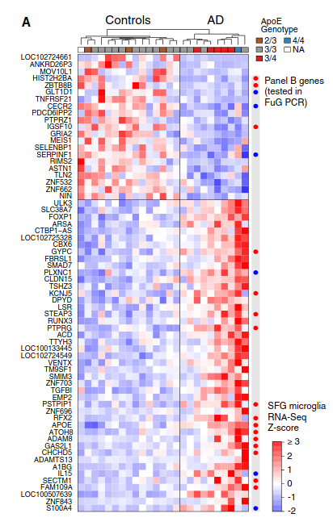
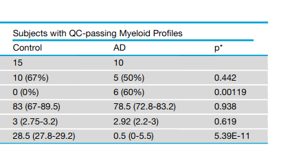

```{r setup, include=FALSE}
knitr::opts_chunk$set(echo = TRUE, 
                      message = FALSE, 
                      warning = FALSE, 
                      comment = NA)
```

# **Things to Remember When Writing This Report**

## **4 Main points to hit on**

**1. Have a question**:

I noticed when reading the paper that different methods than we learned were used to determine gene enrichment data from a fairly large AD cohort with an interesting cell extraction method, and was curious if I could recapitulate the findings with the methods we have learned in the course, such findings are:

-   APOE and other differentially expressed genes define thehuman Alzheimer's microglia state
-   A notable caveat of our methodis the low quality of the RNA after its purification from thecollected cell types because of unavoidable aspects of preparing fixed cell suspensions from frozen and thawed post-mortemtissue samples.
-   Despite this caveat, we succeeded in usingfrozen specimens of human frontal cortex to characterize a human Alzheimer's microglia (HAM) profile, which bore almost no resemblance to the damage-associated microglia (DAM) profiledefined in mouse AD models.
-   Only APOE upregulation in microglia remained significant after correction for genome-wide testing (foldchange = 4.1, adjusted p = 0.0004)
-   AD Microglia Display an Enhanced Human Aging Phenotype (As defined by what?) 
- RNA-Seq data processing and QC for whole tissue samples and bulk cell type samples: Sorted cell and whole tissue RNA-Seq data were analyzed using the `GSNAP` aligner and `HTSeqGenie` -- not familiar with these QC methods, wondering how FastQC will handle the data when I look closely at QC results 


‘‘Pass’’ or ‘‘Fail’’ status for our sorted cell RNA-Seq profiles was determined primarily using tSNE analysis (perplexity = 14, theta =0.4) colored by cell type to visualize how profiles clustered (Figure S2A). tSNE clustering of profiles was generally confirmed by sam-ple similarity heatmaps (not shown). Interpretation of tSNE clusters was informed by gene versus sample heatmaps (similar to theheatmap inFigure S2B but with unbiased hierarchical clustering of the 500 most variable genes, and blinded to AD diagnosis), whichenabled us to see which tSNE clusters contained libraries with neat cell type-specific expression profiles and which clusters con-tained libraries with degenerate features including reduced specificity of cell type expression markers (seeFigure S2B). Comparedto ‘‘Pass’’ libraries, ‘‘Fail’’ libraries generally showed higher percentages of intergenic reads and lower percentages of exonic andintronic reads (seeFigure S2C). We discarded 1/43 neuron libraries, 19/38 astrocyte libraries, 14/41 endothelial cell libraries, and18/43 microglia libraries from original frozen tissues, and 16/16 microglia libraries from twice frozen tissues (which underscoredthe liabilities of the freeze-thaw process).Principal Component Analysis (Figure 1C) was performed on Z-score normalized matrix of 1000 most variable genes by IQR usingthe R function prcomp().

DE between AD and controls for this study’s sorted cell populations was first attempted using voom+limma, which identified only 12DE genes (adjusted p%0.05) in myeloid cells and none in the other cell types. We then used DESeq2 instead (adjusted p%0.05), butwe used the DESeq2-provided Cook’s distances to filter out genes likely driven by outlier samples. Any gene for which the Cook’sdistance was greater than thea= 0.01 critical value of theFdistribution was omitted from our DE genes lists. The Cook’s distancefilter eliminated 6/10 neuronal DE genes, 9/75 myeloid DE genes, and 382/517 endothelial DE genes from consideration, leaving 4 DEgenes in neurons, 66 in myeloid cells, and 135 in endothelial cells. The absence of any voom+limma hits for neurons and endothelialcells, the high fraction of DESeq2 hits driven by outliers in these two cell types, and the lack of other human AD datasets available atthe time for cross-comparison led us to set these cell types aside (taking a conservative position) and focus on the whether thechanges in myeloid cells could be validated. In the myeloid cells, 11/12 DE genes identified by voom+limma were also identifiedby DESeq2, withCD44being the only exception (p = 0.113 in DESeq2). We includedCD44in our panel of genes tested by qPCRin FuG myeloid cell sorts, and it was again increased in the AD samples (unadjusted p = 0.041), so we consider its DE to be genuinethough we did not include it in our HAM-Up gene set analyses, other than visualizing it inFigure S6A

**Other covariates: Post-mortem interval, sex, APOE genotype**

Differential expression analysis (Data S4, panel 1) revealed that the expression of about 80 genes was significantly increased in microglia from subjects with larger post-mortem interval (PMI). This seemed to be largely driven by elevated mitochondrial gene expression in a subset of the samples with large PMI. However, the distribution of PMI in our AD and control samples was similar (Figure S2C;Data S4, panel 1A, inset), there was no overlap between the AD-related DE genes and the PMI-associated genes, and adding PMI to our statistical model for AD-associated DE gave very similar results. Therefore, we did not include PMI in subsequent analyses. Sex-associated DE in microglia was almost entirely restricted to X and Y chromosome genes. For APOE genotype, we only detected one DE gene, ACY3, in AD microglia between APOE-ε4 carriers versus non-carriers. It showed variable expression levels in the Controls (all non-carriers), so it may be a false positive.





**2. Have an idea of how to answer it**

I could answer this question by:

-   Downloading the data
-   Performing QC at every step of analysis
-   Use `DESeq2` on `featureCounts` data to perform differential expression analysis and gene-set enrichment analysis.

**3. Generate the answer(s) in a way that others can reproduce your analsysis and results**

Yes, have been doing this all along.

Might be better to store scripts on Github and link to them from the report, only including the very important aspects of the code like calling `STAR` or QC analysis. I think I will favor a longer report with more code in it than usual

**4. Put a strong emphasis on data processing, QC, and how the way the data was processed and QC results contribute to our understanding of the data**

## **Sections of the report**

**Introduction**: A brief paragraph summarizing the scientific background and/or why that particular question is interesting (you should cite at least 3-5 papers). Of course, you should clearly state the question you're going to investigate as well as the specific hypothesis you set out to test.

**Results**: Another brief paragraph summarizing your key insights and possible future experiments/analyses that might enhance your own analysis. Make sure to include a discussion of the limits that your data set has!

**Methods**: A detailed verbose description of all the steps you took to arrive at the conclusion including how and where the data was downloaded, pre-processed and analyzed. This should also include some brief reasoning of why you chose certain tools/solutions and what the results of the QC tell you about the data at hand.

**Discussion** A brief description/list of issues/problems/limitations you encountered along the way and how you addressed them.

**Table**: A table that summarizes the key data sets that you have generated during the analyses and decided to keep.

## **Figures**

The report should have at least 3 figures that illustrate some aspects of your analysis, either the ones you find most difficult to explain without a graph or the points that are most important in your opinion -- there is no upper limit on the number of figures to include, but make sure to describe/reference every single one! In addition, we want all the code (and data) that one would need to recreate those images.

Consider what information or story you are trying to communicate with your figure

-   Have color/shape legends
-   Properly labeled axes
-   Legible labels (big enough!)
-   Informative labels (sample names/gene names/etc)
-   Appropriate color schemes (avoid red/green combinations) 
  -   ColorBrewer2 is a great resource for appropriate color combinations
    

## **Presentation**

You will give a 10-15 minute presentation that should be a condensed version of your report. Be prepared to answer questions at the end (5 minutes Q&A).

# **Introduction**

A brief paragraph summarizing the scientific background and/or why that particular question is interesting (you should cite at least 3-5 papers). Of course, you should clearly state the question you're going to investigate as well as the specific hypothesis you set out to test.

Honestly this is probably going to be one of the last things I write as it is pretty self-contained and it is more important to get the analysis work done first.

The flavor of this section will be that Alzheimer's is an important disesease to study as so many people experience issues related to Alzheimer's, as well as how reserach has sort of stagnated as it has not been a largely profitable model to study recently, and the paper that I am going off of is very recent (2019).

**Publication**: [Alzheimer's Patient Microglia Exhibit Enhanced Aging and Unique Transcriptional Activation](https://pubmed.ncbi.nlm.nih.gov/32610143/)

> <font size=2.5> All subjects had been characterized clinically and neuropathologically by the Arizona Study of Aging and Neurodegenerative Dis-ease/Brain and Body Donation Program (Beach et al., 2015). All AD subjects were clinically diagnosed with AD in life and brains wereneuropathologically confirmed to have ''frequent'' CERAD neuritic plaque densities (Mirra et al., 1991) and Braak score V or VI (Braakand Braak, 1991). Controls did not have dementia, AD or other neurological disease diagnoses in life. </font>

> <font size=2.5> We began with frozen samples of frontal cortex, which is affected by tau pathology in the later stages of disease (Braak stages Vand VI) that roughly coincide with onset and progression of dementia. Tissue samples were excised from the superior frontalgyrus (SFG), which has been linked with visuospatial cognition both in AD and in lesion studies (du Boisgueheneuc et al.,2006; Valde ́s Herna ́ndez et al., 2018). To maximize the likelihood of observing differences between AD and control, we selectedonly AD specimens with high scores for amyloid and tau neuropathology in frontal cortex, and we selected only control specimens with negligible amounts of these pathologies in this region (see sample metadata in Data S2). AD and control groups hadroughly matching distributions of age, sex, and post-mortem interval (PMI). </font>

> <font size=2.5> Although the fixation adversely affects RNA integrity (RIN), italso permeabilizes the cells and enables labeling of intracellularmarkers for sorting. Labeling nuclei with DAPI helps ensure thatonly singlet cell bodies are collected, because doublets with ahigher DAPI signal and cell fragments that lack nuclei are easilyexcluded. Using this method, we established a FACS gatingstrategy for collecting NeuN+neurons, GFAP+astrocytes, CD31+endothelial cells, and CD11b+ microglia/myeloid cells </font>

> <font size=2.5> However, the RIN of the collected populationswas poor, with Bioanalyzer RIN scores in the range of 1--3. Attempts to obtain better-quality RNA samples using alternativeconditions for tissue digestion and cell fixation (see STAR Methods) were unsuccessful and usually counterproductive. We presume that damage from the freeze-thaw process led to cellular disintegration when cells remained unfixed for toolong or were incubated at 37C. Only brief dissociation at 4C and fixation immediately thereafter permitted cell populationsto suitably endure the subsequent immunolabeling and FACSprocedures. We completed this process for 22 AD and 21 control SFG tissues <font>

> <font size=2.5> We next prepared cDNA libraries using a kit with randomprimers, because the RNA was highly fragmented. After prepar-ing and sequencing the libraries, we examined the RNA-seq datato determine whether our method had generated usable expres-sion profiles. Although several unacceptable RNA profiles had tobe discarded (seeFigure S2, Data S1, andSTAR Methods), weobtained 113 cell-type-specific expression profiles, includingmicroglia cell profiles from 15 control and 10 AD subjects (Fig-ures 1B and 1C;Data S2). Cell-type-specific marker expressionsuggested that the RNA-seq profiles we retained representedthe intended cell populations with reasonable fidelity (Figure 1D).Comparisons with recently published datasets indicated that ourbulk-sorted microglia profiles from frozen tissues displayedcoverage of the transcriptome similar to that of bulk-sorted mi-croglia from fresh post-mortem tissues (Galatro et al., 2017;Gosselin et al., 2017) and better coverage than snRNA-seq pro-files (combining all microglial nuclei from a given patient into apseudobulk profile) obtained from frozen tissues (Mathys et al.,2019)(Figure 1E). </font>

> <font size=2.5> We examined the expression of twenty-five genes known orpostulated to be associated with AD risk or progression ... Similar to our analysis of a pub-lished human RNA-seq dataset that profiled cell types purifiedfrom freshly resected brain tissue ..., most AD risk genes in our cell types purified from frozen brain tissues showed preferential expression in microglia compared with other brain cell types (Figure 2A). We also examined whether any of these genes displayed altered expression levels in AD versus control cells, and we observed that APOE, ABCA7, GPR141, PTK2B, SPI1, and ZYX appeared upregulated in AD microglia, whereas MEF2C appeared downregulated (un-adjusted p \< 0.05) (Figure 2B). Using these criteria, we also observed downregulation of CD2AP and SORL1 in AD neurons and of CR1 in AD endothelial cells (Figure 2B).Genome-wide analysis of DE using DESeq2 identified 45 genes increased and 21 genes decreased in AD microglia relative to controls (Figure 3A; for genome-wide expression valuesand DE statistics, see Data S2 and S3 for individual samplesand group summaries, respectively). Of the changes in AD riskgenes mentioned earlier, **only APOE upregulation in microglia remained significant after correction for genome-wide testing (foldchange = 4.1, adjusted p = 0.0004)**. We tested for contributions of age, sex, PMI, and APOE genotype to the DE profile, but none of these covariates accounted for the DE observed between AD and control groups (although a small number of other genes un-related to AD status showed DE with age, sex, PMI, or APOE genotype) (see Data S4 and STAR Methods). We refer to the pattern of DE as the HAM profile. </font>

APOE -- Michaelson, D.M., APOE epsilon4: the most prevalent yet understudied risk factor for Alzheimer's disease. Alzheimers Dement, 2014. 10(6): p. 861-8.

[What APOE Means for Your Health](https://www.alzdiscovery.org/cognitive-vitality/blog/what-apoe-means-for-your-health#ref-2)

-   Alzheimer's studies have proven to be difficult
-   This is a large dataset that is well annotated

# **Results**


**Key Insights**: 


**Possible future experiments / analyses**: 

* Evaluating all cell types 
* More / better data 
* Include more analysis of genes from literature

Another brief paragraph summarizing your key insights and possible future experiments/analyses that might enhance your own analysis. Make sure to include a discussion of the limits that your data set has!

-   Dataset is from frozen tissue, and upon further analysis it seemed as if a lot of Mitochondrial RNA and long Non-coding RNAs (which degrade slower) were more present than other transcripts

-   Lead to me having to filter my dataset to only protein coding genes in order to get decent normalization across all samples in the project.

-   A few of the samples were not annotated with sex, causing me to not use this data as I would like to control for this possibly confounding factor.

# **Methods**


**TODO: Make a flow chart describing the whole methods process to make understanding how these tools tie together easier to understand.**

A detailed verbose description of all the steps you took to arrive at the conclusion including how and where the data was downloaded, pre-processed and analyzed. This should also include some brief reasoning of why you chose certain tools/solutions and what the results of the QC tell you about the data at hand.

## **Downloads**

### **Data Background**

Information the `fastq` files used in this study can be found [here](https://www.ncbi.nlm.nih.gov/Traces/study/?page=3&acc=PRJNA515044&o=diagnosis_sam_s%3Ad%253Bacc_s%3Bacc_s%3Aa) as well as [NCBI GEO](https://www.ncbi.nlm.nih.gov//geo/query/acc.cgi?acc=GSE125050)

### **Downloading Myeloid/Microglia Data**

For the first iteration, I have chosen to proceed with one of the four available cell types, being **myeloid** / microglia cells. However, the script below can be easily be adapted to download all `cell_types` with a simple `for` loop.

```{bash, eval=FALSE}
alzheimers_dataset="/Genomic_Data_Storage/Alzheimers_Project"
mkdir ${alzheimers_dataset}/accession_tables

wget https://raw.githubusercontent.com/jakesauter/Next_Gen_Sequencing_Project/main/accession_tables/Sra_run_table.txt \
    --output-document="${alzheimers_dataset}/accession_tables/Sra_run_table.txt"

unique_cell_types=$(cat ${alzheimers_dataset}/accession_tables/Sra_run_table.txt | cut -d',' -f9 | sort | uniq)


cell_type='myeloid'
echo "Downloading dat for cell type: ${cell_type}"
output_dir=${alzheimers_dataset}/${cell_type}_fastq_files
acc_nums=$(cat ${alzheimers_dataset}/accession_tables/Sra_run_table.txt | grep $cell_type | cut -d',' -f1)

for acc_num in "${acc_nums[@]}" ; do 
  fasterq-dump --outdir $output_dir $acc_num
  gzip ${output_dir}/${acc_num}.fastq

```

Note that for microglia data specifically, author's have included the following table, found in the `Experimental model and subject details` section of the publication:


### **Downloading STAR resources**

In order to generate a STAR index for later mapping, we will first need to download the human reference genome, as well as the human reference annotation of genes that is compatible with this version of the human reference genome.

```{bash, eval=FALSE}
mkdir human_genome_38
cd human_genome_38
wget ftp://hgdownload.cse.ucsc.edu/goldenPath/hg38/bigZips/hg38.fa.gz
wget ftp://ftp.ebi.ac.uk/pub/databases/gencode/Gencode_human/release_36/gencode.v36.annotation.gtf.gz
gunzip * 
```

Now that we have both the reference genome and our features of interest, we can generate our `STAR` index using the command below, saving our index to the `--genomeDir` directory of `human_genome_38_STAR_index`.

```{bash, eval=FALSE}
STAR --runMode  genomeGenerate \
--runThreadN 16 \
--genomeDir human_genome_38_STAR_index \
--genomeFastaFiles human_genome_38/hg38.fa \
--sjdbGTFfile human_genome_38/gencode.v36.annotation.gtf.gz \
--sjdbOverhang 49 
```

## **Data Processing**

### **`FastQC` and `MultiQC`**

[FastQC](https://www.bioinformatics.babraham.ac.uk/projects/fastqc/) is an industry standard Next-Generation Sequencing Quality Control tool written and maintained by the Bioinformatics Group at the [Babraham Institute](http://www.babraham.ac.uk/).

We can see the goal and mission of `FastQC` from an excerpt on their [website](https://www.bioinformatics.babraham.ac.uk/projects/fastqc/): 

>   <font size=2.5>  FastQC aims to provide a simple way to do some quality control checks on raw sequence data coming from high throughput sequencing pipelines. It provides a modular set of analyses which you can use to give a quick impression of whether your data has any problems of which you should be aware before doing any further analysis. </font>

`FastQC` in the following analyses will be used for providing a quick, easy   to generate overview of FastQ file quality to indicate potential problem areas in the project data, in the form of HTML based permanent reports, containing summary graphs and tables describing different aspects of the input data. 

Example [quality control passing](https://www.bioinformatics.babraham.ac.uk/projects/fastqc/good_sequence_short_fastqc.html) and [quality control failing](https://www.bioinformatics.babraham.ac.uk/projects/fastqc/bad_sequence_fastqc.html) can be found on [FastQC's website](https://www.bioinformatics.babraham.ac.uk/projects/fastqc/) as well. 

[`MultiQC`](https://multiqc.info/) is a useful tool to use in this context as well, 
as it is a tool that aggregates results from analyses across many samples (processed by `FastQC` in this case) into a single report. As seen below, the `MultiQC` command is very simple, and if all `FastQC` results are located in the same directory, that directory can be provided as input for `MultiQC` to aggregate all reports in the directory.

**Key FastQC and MultiQC Commands**

```{bash, eval = FALSE}
fastqc $fastq_file --noextract \
     --outdir=$fastqc_outdir \
     --threads=14 \
     $fastq_files

multiqc $fastqc_outdir
```


### **`TrimGalore`**

Found later in this report, after observing the first application of `FastQC` to the raw FastQ data files, highly repeated sequences were found. In order to both detect and remove these sequences from the raw input FastQ data, we can use the [`TrimGalore`](https://www.bioinformatics.babraham.ac.uk/projects/trim_galore/). Also written an maintained by the Bioinformatics Group at the [Babraham Institute](http://www.babraham.ac.uk/). 

`TrimGalore` is a wrapper tool, providing the functionality of both `Cutadapt` and `FastQC` to provided adapter trimming and quality control to FastQ files. This report does not make use of the `FastQC` functionality of `TrimGalore` in order to seperate the QC and raw data files in an easier to understand way, calling `FastQC` directly with the required arguments.

**Key TrimGalore Commands**

```{bash, eval=FALSE}
$trim_galore $fastq_files \
--output_dir="${trim_galore_outdir}" \
--cores 14 --phred33 --gzip 
```


### **`STAR`**

With over **16,787** citations on [Google Scholar](https://scholar.google.com/scholar?hl=en&as_sdt=0%2C33&q=+STAR%3A+ultrafast+universal+RNA-seq+aligner+&btnG=), `STAR` (Spliced Transcripts Alignment to a Reference) has proven to be a great tool for RNA-seq alignment. 

It is best to first assemble a reference built upon your organism - gene model of interest with `STAR --runMode genomeGenerate`, followed by mapping your RNA-seq reads with `STAR --runMode alignReads`. Durning alignment, `STAR` takes as input single-end or pair-end fastq files, with the output file being in `SAM` (Spliced Alignment/Mapping) format. The `sam` file should then usually be converted into `BAM` (Binary Alignment/Mapping) file, a binary file of sam, for shortening computation time in further analyzing differential expression within RNA-seq data.


**Key STAR Commands**: 

Earlier in this report, we have generated our `STAR` reference index with the following command:

```{bash, eval=FALSE}
STAR --runMode  genomeGenerate \
--runThreadN 16 \
--genomeDir human_genome_38_STAR_index \
--genomeFastaFiles human_genome_38/hg38.fa \
--sjdbGTFfile human_genome_38/gencode.v36.annotation.gtf.gz \
--sjdbOverhang 49 
```
 

Given the raw or adapter-trimmed FastQ files, as well as the reference index we have generated in the previous command, we can align reads in the following way:

```{bash, eval=FALSE}
STAR --runMode  alignReads \
  --runThreadN 12 \
  --genomeDir  human_genome_38_STAR_index \
  --readFilesIn  $fastq_file \
  --readFilesCommand  zcat \
  --outSAMtype  BAM  SortedByCoordinate \
  --outFileNamePrefix $prefix  \
  --outSAMattributes All \
  --outReadsUnmapped="Fastx" \
  --outTmpKeep="None"
```


### **`featureCounts`**

`featureCounts` is an ["efficient general purpose program for assigning sequence reads to genomic features"](https://pubmed.ncbi.nlm.nih.gov/24227677/) and serves as a great [software program developed for counting reads to genomic features such as genes, exons, promoters and genomic bins](http://subread.sourceforge.net/) 

**Key featureCounts Command**

```{bash, eval=FALSE}
featureCounts \
-a $annot_file \
-o $out_file \
-T 14 $bam_files
```


### **Data Processing Script**

In the script below, once all of the files are trimmed and saved, `FastQC` (paired with `multiqc` aggregation) is used to facilitate sequence quality control.

**Script for data processing:**

```{bash, eval=FALSE}
#!/bin/bash 

data_storage_dir="/Genomic_Data_Storage/Alzheimers_Project"
trim_galore="/home/t730/TrimGalore/TrimGalore-0.6.6/trim_galore"

cell_type="myeloid"
fastq_files=$(ls "${data_storage_dir}/${cell_type}_fastq_files"/*.fastq.gz)

trim_galore_outdir="${data_storage_dir}/trimmed_${cell_type}_fastqs"
mkdir $trim_galore_outdir

fastqc_outdir="${data_storage_dir}/trimmed_${cell_type}_fastqc"
mkdir $fastqc_outdir

$trim_galore $fastq_files \
--output_dir="${trim_galore_outdir}" \
--cores 14 --phred33 --gzip 

trimmed_files=$(ls $trim_galore_outdir/*.fq.gz)

fastqc $trimmed_files \
--outdir=$fastqc_outdir \
--threads=14 --noextract

cd $fastqc_outdir
multiqc .

for fastq_file in $trimmed_files; do
  base=$(basename $fastq_file)
  prefix=$(echo $fastq_file | egrep -o "SRR[0-9]+")
  prefix="trimmed_${cell_type}_alignments/${prefix}_trimmed."
  
  STAR --runMode  alignReads \
  --runThreadN 12 \
  --genomeDir  human_genome_38_STAR_index \
  --readFilesIn  $fastq_file \
  --readFilesCommand  zcat \
  --outSAMtype  BAM  SortedByCoordinate \
  --outFileNamePrefix $prefix  \
  --outSAMattributes All \
  --outReadsUnmapped="Fastx" \
  --outTmpKeep="None"
  
  samtools index ${prefix}.Aligned.sortedByCoord.out.bam
done

annot_file=${data_storage_dir}/human_genome_38/gencode.v36.annotation.gtf
out_dir=${data_storage_dir}/featureCounts
alignment_dir=${data_storage_dir}/trimmed_${cell_type}_alignments
out_file=${out_dir}/featCounts_genes.txt
bam_files=$(ls ${alignment_dir}/SRR???????_trimmed.Aligned.sortedByCoord.out.bam)

mkdir $out_dir

featureCounts \
-a $annot_file \
-o $out_file \
-T 14 $bam_files
```


[Trimmed MultiQC HTML Report](https://jakesauter.github.io/Next_Gen_Sequencing_Project/trimmed_myeloid_multiqc_report.html)

## **Quality Control**

### **`FastQC` Raw Data QC**

Signs of cyclic GC content for some runs are present in the dataset, however fastq tile coordinates **are not available** in the GEO dataset to allow for selective tile filtering.

[Github issue showing that SRA does not store this information](https://github.com/ncbi/sra-tools/issues/130)

Particularly these issues were seen in three of the samples, with the effects occurring with varying degree. These samples were 

* `SRR8440539` [FastQC Report](https://jakesauter.github.io/Next_Gen_Sequencing_Project/SRR8440539_fastqc.html)
* `SRR8440524` [FastQC Report](https://jakesauter.github.io/Next_Gen_Sequencing_Project/SRR8440524_fastqc.html)
* `SRR8440538` [FastQC Report](https://jakesauter.github.io/Next_Gen_Sequencing_Project/SRR8440538_fastqc.html)

An example of this failing behavior: 

{width="50%"}

### **`STAR` Alignment QC**

In order to determine the percentage of reads mapped, we have used the `--outReadsUnmapped="Fastx"` parameter while running `STAR`, and now can compare the number of reads in our mapped files, versus the number of reads in our unmapped files. A `bash` function for performing this operation (`calculate_unampped_reads`) is applied to all of the `BAM` files generated in the `STAR` alignment phase of the report.

```{bash, eval=FALSE}
#!/bin/bash

data_storage_dir=/Genomic_Data_Storage/Alzheimers_Project

trim_fastq_dir=${data_storage_dir}/trimmed_myeloid_fastqs
trim_align_dir=${data_storage_dir}/trimmed_myeloid_alignments
bam_files=$(ls ${data_storage_dir}/trimmed_myeloid_alignments/*.bam)
parallel_tmp_dir=$(mktemp -d)

calculate_unampped_reads() {
  base=$(basename $1)
  prefix=$(echo $base | egrep -o "SRR[0-9]+")
  
  unammped_reads_file=${trim_align_dir}/${prefix}_trimmed.Unmapped.out.mate1
  total_reads_file=${trim_fastq_dir}/${prefix}_trimmed.fq.gz
  num_lines=$(cat $unammped_reads_file | wc -l)
  num_total_lines=$(zcat $total_reads_file | wc -l)
  perc_unmapped_reads=$(echo -e "(${num_lines}/${num_total_lines})*100" | bc -l | xargs printf %.2f)
  echo -e "Percentage of unmapped reads for ${prefix}: ${perc_unmapped_reads}%" > ${parallel_tmp_dir}/${prefix}.out
}

for bam_file in $bam_files; do
  calculate_unampped_reads $bam_file &
done 

cat $parallel_tmp_dir/*.out
```

Results of executing this code can be found below.

```{bash, eval=FALSE}
Percentage of unmapped reads for SRR8440443: 5.90%
Percentage of unmapped reads for SRR8440447: 4.17%
Percentage of unmapped reads for SRR8440448: 4.04%
Percentage of unmapped reads for SRR8440449: 8.38%
Percentage of unmapped reads for SRR8440463: 33.79%
Percentage of unmapped reads for SRR8440477: 5.14%
Percentage of unmapped reads for SRR8440482: 6.54%
Percentage of unmapped reads for SRR8440484: 3.65%
Percentage of unmapped reads for SRR8440486: 8.13%
Percentage of unmapped reads for SRR8440488: 5.19%
Percentage of unmapped reads for SRR8440501: 6.98%
Percentage of unmapped reads for SRR8440511: 5.47%
Percentage of unmapped reads for SRR8440513: 6.79%
Percentage of unmapped reads for SRR8440514: 4.97%
Percentage of unmapped reads for SRR8440517: 5.76%
Percentage of unmapped reads for SRR8440518: 5.02%
Percentage of unmapped reads for SRR8440524: 11.28%
Percentage of unmapped reads for SRR8440525: 9.51%
Percentage of unmapped reads for SRR8440527: 7.05%
Percentage of unmapped reads for SRR8440529: 6.67%
Percentage of unmapped reads for SRR8440531: 10.64%
Percentage of unmapped reads for SRR8440536: 7.61%
Percentage of unmapped reads for SRR8440538: 7.43%
Percentage of unmapped reads for SRR8440539: 12.34%
Percentage of unmapped reads for SRR8440542: 8.16%
```

From the about output, we see that `SRR8440463` as an unusually high amount of unmapped reads compared to all other samples in the study. When cross-referenceing our previously generated `MultiQC` report from earlier, we can see that the GC content of this sample appears to be off compared to all other samples as well, possibly indicating contamination or other library quality issues.


**Problematic cyclic GC samples from before**: `SRR8440524`, `SRR8440538`, and `SRR8440539` **NOT** `SRR8440463` that we see with GC-rich contamination above.

**FastQC Reports**: 

* [SRR8440524_fastqc.html](https://jakesauter.github.io/Next_Gen_Sequencing_Project/SRR8440524_fastqc.html)
* [SRR8440538_fastqc.html](https://jakesauter.github.io/Next_Gen_Sequencing_Project/SRR8440538_fastqc.html)
* [SRR8440539_fastqc.html](https://jakesauter.github.io/Next_Gen_Sequencing_Project/SRR8440539_fastqc.html)
* [SRR8440463_fastqc.html](https://jakesauter.github.io/Next_Gen_Sequencing_Project/SRR8440463_fastqc.html)

We will keep these QC issues in mind moving forward, and remove the samples before analysis in `R`.

## **Data Analysis**

### **`DESeq2` Analysis of `featureCounts` Results**

Below we will use the `DESeq2` R package to make a `DESeqDataSet` from our resultant files from running featureCounts. At this step, I have chosen to remove our **4** samples with QC issues after preliminary analysis.


**Required Libraries**: 

```{r}
library(tidyr)        # pivot_longer
library(knitr)        # Rmarkdown chunk options and kable
library(dplyr)        # filter, summarise
library(DESeq2)       # EDS and DE
library(ggplot2)      # Plotting
library(stringr)      # String searching and extraction
library(magrittr)     # Piping
library(patchwork)    # Image layout
library(plyranges)    # gtf file manipulation
library(rtracklayer)  # gtf file manipulation
```

```{r, echo=FALSE}
filter <- dplyr::filter
select <- dplyr::select
```


**Importing `featureCounts` Data into `DESeq2`**

```{r}
read_counts <- read.table(
  '../featCounts/featCounts_genes.txt', 
  header = TRUE, stringsAsFactors = FALSE) 

orig_names <- colnames(read_counts)
colnames(read_counts) <- gsub(".*(SRR[0-9]+).*", "\\1", orig_names)
row.names(read_counts) <- make.names(read_counts$Geneid)
read_counts <- read_counts[,-c(1:6)]
read_counts <- as.matrix(read_counts)
```

**Filtering failed QC Samples**

TODO: list why each sample is being filtered out here

* SRR8440524, SRR8440463, SRR8440538, SRR8440539, SRR8440484, SRR8440488, SRR8440447, SRR8440517: Failed QC because x,y,z reason

```{r}
keep_samples <- 
  colnames(read_counts) %in% 
  c('SRR8440524', 'SRR8440463',
    'SRR8440538', 'SRR8440539', 
    "SRR8440484", "SRR8440488", 
    "SRR8440447", "SRR8440517"
    ) %>% 
  not()

read_counts <- 
  read_counts[ , keep_samples]

read_counts %>% 
  .[1:4, 1:5] %>% 
  kable()    
```

**Converting gene count Ensembl IDs to cannoncical gene names using gene-data from gtf files**

**NOTE**: Below we are filtering for only protein-coding genes
for proper size-factor normalization results, though 

**NOTE** : Some gencode ids map to the same gene symbol 

**TODO**: Peform parallel analysis for long-non-coding RNAs
or incoroporate into this analysis? 


```{r}
if (!exists('genes_df')) {
  genes_df <- 
    read_gff("../gtf/gencode.v36.annotation.gtf.gz", 
             genome_info="hg38") %>% 
    select(gene_id, gene_type, gene_name) %>% 
    as.data.frame()
}


gene_info_df <-
  data.frame(gencode_id = rownames(read_counts)) %>% 
  left_join(., genes_df, 
            by = c('gencode_id' = 'gene_id')) %>% 
  select(gencode_id, gene_name, gene_type) %>% 
  filter(#not(gene_type %in% c('lncRNA', 'Mt_rRNA', 'Mt_tRNA')), 
         # TODO: going to move forward with only protein coding genes
         #      genes for now as long-non-coding RNAs and MT-rna
         #      seem to really be messing up my sizefactor normalization
         gene_type == 'protein_coding', 
         !str_detect(gene_name, '^MT-')) %>%
  distinct() 

read_counts <- 
  read_counts[gene_info_df$gencode_id, ]
```

**Filtering mitochondrial reads**

Now that we have our raw read counts, lets gather information about our samples to supply to the `colData` parameter of `DESeqDataSetFromMatrix`.

```{r}
accession_table <-
  read.table('../accession_tables/Sra_run_table.txt', 
             header = TRUE, sep = ',', stringsAsFactors = FALSE) %>% 
  as.data.frame() %>% 
  filter(Cell_type == 'myeloid', 
         !is.na(sex)) %>% 
  select(Run, Diagnosis, sex,
                expired_age, APOE, pmi, 
                Cell_type) %>%
  arrange(Diagnosis, sex)

accession_table %>% 
  kable()
```

From this accession table, we can map our accession ids to any clinical variable we like, such as `Diagnosis`, which is our main experimental group condition in this analysis. `Diagnosis` in our case tells us whether or not the diseased patient showed signs of Alzheimer's disease or not (control).

```{r}
conditions <- 
  colnames(read_counts) %>% 
  lapply(function(run_name) 
      accession_table[accession_table['Run'] == run_name, ]) %>% 
  bind_rows() 


sample_info <-
  DataFrame(conditions,
            row.names = conditions$Run)


DESeq.ds <- 
  DESeqDataSetFromMatrix(
    countData = as.matrix(read_counts),
    colData = sample_info,
    rowData = gene_info_df, 
    design = ~ Diagnosis + sex)
    # design = ~ Diagnosis + sex)
    # design = ~ Diagnosis + sex + APOE + pmi)


DESeq.ds %>% 
  colData() %>% 
  head() %>% 
  kable()
```


```{r}
DESeq.ds %>% 
  counts() %>% 
  head() %>% 
  .[,1:5] %>% 
  kable()
```

**Read Mapping Quality Assessment**

**Number of reads sequenced per sample**

```{r}
colSums(counts(DESeq.ds)) %>% 
  data.frame(sample = str_extract(names(.), '[0-9]{3}$'), reads = .) %>% 
  ggplot() + 
  geom_col(aes(x = sample, y = reads)) + 
  theme(axis.text.x = element_text(angle=-35))
```

Moving forward, we will filter our `DESeqDataSet` as to only include genes that have a read mapped for at least one sample.

```{r}
dim(DESeq.ds)

keep_genes <- rowSums(counts(DESeq.ds)) > 0
DESeq.ds <- DESeq.ds[keep_genes, ]
dim(DESeq.ds)
```

**Normalizing read counts for Sequencing Depth**

**Question**: Why does `estimateSizeFactors` remove some genes?

```{r}
print(nrow(DESeq.ds))

DESeq.ds %>% 
  rownames() %>% 
  duplicated() %>% 
  any()

DESeq.ds <- estimateSizeFactors(DESeq.ds)

print(nrow(DESeq.ds))

DESeq.ds %>% 
  rownames() %>% 
  duplicated() %>% 
  any()


plot(sizeFactors(DESeq.ds), colSums(counts(DESeq.ds)), 
     ylab = 'library sizes', xlab = 'size factors')
```

Assumptions:

-   Most genes are not changing across conditions

-   Size factors should be around 1

**Why does this appear to be random? Could there be some outlier genes that are taking up a large proportion of the reads in some of the samples?**

```{r, eval = F}
raw_read_counts <- read.table(
  '../featCounts/featCounts_genes.txt', 
  header = TRUE, stringsAsFactors = FALSE)

orig_names <- colnames(raw_read_counts)
colnames(raw_read_counts) <- gsub(".*(SRR[0-9]+).*", "\\1", orig_names)
row.names(raw_read_counts) <- make.names(raw_read_counts$Geneid)
raw_read_counts <- raw_read_counts[,-c(1:6)]


gene_name_df <-
  data.frame(gencode = ensembl_ids) %>% 
  left_join(., gene_info_df, 
          by = c('ensemble_id' = 'gencode_id')) %>% 
  mutate(hgnc_symbol = 
           if_else(hgnc_symbol == "" | is.na(hgnc_symbol), 
                   ensemble_id, hgnc_symbol)) %>% 
  group_by(ensemble_id) %>% 
  filter(row_number() == 1) %>% 
  ungroup()

raw_read_counts <- 
  as.matrix(raw_read_counts)

rownames(raw_read_counts) <- 
        gene_name_df$hgnc_symbol

samples <- 
  DESeq.ds %>%
  counts() %>% 
  colnames()

for (sample in samples) {
  print(sample) 
  
  raw_read_counts[, sample] %>% 
    .[. > 1000] %>% 
    round(-5) %>% 
    table() %>% 
    kable() %>% 
    print()
}
```

**Is is the same few genes in every sample that have these high counts?**

Lets print the name of every gene that gets above 50,000 reads for each sample

**IT WAS MITOCHONDRIAL READS**, maybe it would be best to filter out `read_counts` matrix columns to remove mitochondrial reads before making our DESeq2 dataset.

```{r, eval = F}
for (sample in samples) {
  print(sample)
  
  raw_read_counts[, sample] %>% 
  as.data.frame(., row.names = rownames(raw_read_counts)) %>% 
  filter(`.` > 30e3) %>% 
  kable() %>% 
  print()
}
```

We see that our size factors are varying a bit more than around 1, though at this time we will continue with `rlog` normaliztion.

```{r, fig.width = 10}
p1 <-
  DESeq.ds %>% 
  counts() %>% 
  {. + 1} %>% 
  log2() %>% 
  as.data.frame() %>% 
  pivot_longer(cols = everything()) %>%
  mutate(name = str_extract(name, '[0-9]{3}$')) %>% 
  ggplot() + 
    geom_boxplot(aes(x = name, y = value)) +
    ggtitle("Non-normalized read counts") +
    xlab('Sample') + ylab("log2(read counts + 1)") + 
    theme(axis.text.x = element_text(angle = -30))


p2 <-
  DESeq.ds %>% 
  counts(normalize= TRUE) %>% 
  {. + 1} %>% 
  log2() %>% 
  as.data.frame() %>% 
  pivot_longer(cols = everything()) %>%
  mutate(name = str_extract(name, '[0-9]{3}$')) %>% 
  ggplot() + 
    geom_boxplot(aes(x = name, y = value)) +
    ggtitle("Size-factor-normalized read counts") +
    xlab('Sample') + ylab("log2(read counts + 1)") + 
    theme(axis.text.x = element_text(angle = -30))

p1 + p2
```

```{r}
if (!exists('DESeq.rlog')) {
  DESeq.rlog <- rlog(DESeq.ds, blind = TRUE)
}


log.norm.counts <-
  DESeq.ds %>% 
  counts(normalized=TRUE) %>% 
  {.+1} %>% 
  log2()


p1 <-
  data.frame('SRR8440518' = log.norm.counts[,'SRR8440518'], 
           'SRR8440529' = log.norm.counts[,'SRR8440529']) %>% 
  ggplot() + 
  geom_point(aes(x = SRR8440518, y = SRR8440529), 
             alpha = 0.01) + 
  geom_abline(slope = 1, intercept = 0, 
              lty = 2, col = 'red') + 
  ggtitle("size factor and log2-transformed") + 
  xlab('SRR8440518') + ylab('SRR8440529')

## the rlog-transformed counts are stored in the accessor "assay"
p2 <-
  data.frame('SRR8440518' = assay(DESeq.rlog)[,'SRR8440518'], 
           'SRR8440529' = assay(DESeq.rlog)[,'SRR8440529']) %>% 
  ggplot() + 
  geom_point(aes(x = SRR8440518, y = SRR8440529), 
             alpha = 0.01) + 
  geom_abline(slope = 1, intercept = 0, 
              lty = 2, col = 'red') + 
  ggtitle("rlog transformed") + 
  xlab('SRR8440518') + ylab('SRR8440529') 


p1 + p2

```

**Mean vs Stdev before `rlog`**

```{r}
log.norm.counts <- 
  DESeq.ds %>% 
  counts(normalized=TRUE) %>% 
  log2()

par(mfrow=c(1,1))

msd_plot <- 
  vsn::meanSdPlot(log.norm.counts,
                  ranks=FALSE, 
                  plot=FALSE)
msd_plot$gg + 
  ggtitle("Sequencing depth normalized log2(read counts)") + 
  ylab("standard deviation")
```

**Mean vs Stdev after `rlog`**

```{r}
rlog.norm.counts <- 
  DESeq.rlog %>% 
  assay()

msd_plot <- 
  vsn::meanSdPlot(rlog.norm.counts, 
                  ranks=FALSE, 
                  plot = FALSE)

msd_plot$gg + 
  ggtitle("rlog transformation") + 
  coord_cartesian(ylim = c(0,3))
```

### **Possible Confounders**

> <font size=2.5> To maximize the likelihood of observing differences between AD and control, we selectedonly AD specimens with high scores for amyloid and tau neuro-pathology in frontal cortex, and we selected only control speci-mens with negligible amounts of these pathologies in this region(see sample metadata in Data S2). AD and control groups had roughly matching distributions of age, sex, and post-mortem interval (PMI). <font>

-- [Alzheimer's Patient Microglia Exhibit Enhanced Aging and Unique Transcriptional Activation](https://pubmed.ncbi.nlm.nih.gov/32610143/)

-   **APOE**:

> <font size=2.5> There are three types of the APOE gene, called alleles: APOE2, E3 and E4. Everyone has two copies of the gene and the combination determines your APOE "genotype"---E2/E2, E2/E3, E2/E4, E3/E3, E3/E4, or E4/E4. The E2 allele is the rarest form of APOE and carrying even one copy appears to reduce the risk of developing Alzheimer's by up to 40%. APOE3 is the most common allele and doesn't seem to influence risk. The APOE4 allele, present in approximately 10-15% of people, increases the risk for Alzheimer's and lowers the age of onset. Having one copy of E4 (E3/E4) can increase your risk by 2 to 3 times while two copies (E4/E4) can increase the risk by 12 times [2]. </font>

-- [What APOE Means for Your Health](https://www.alzdiscovery.org/cognitive-vitality/blog/what-apoe-means-for-your-health#ref-2)

-   **Post-Mortem Interval (PMI)** --

-   **Expired Age**

```{r}
# TODO: histograms p1 + p2 with 
# p1 = histogram of age in controls 
# p2 = histogram of age in AD 
```

-   **Sex**

```{r}
# TODO: How many males/females in control vs AD? 
```

**Male vs Female Counfounding Analysis**

First in order to check that there isn't large differences between our male and female patient cohorts, we will generate a correlation heatmap using Pearson correlation.

```{r, fig.show='hold', out.width="50%"}
par(mfrow = c(1, 2))

corr_coeff <- cor(rlog.norm.counts, method = "pearson")

new_names <- rownames(corr_coeff) %>% 
  sapply(function(run_name) 
    accession_table[accession_table['Run'] == run_name, 'sex']) 

new_names <- 
  paste0(new_names, '_', 
         str_extract(rownames(corr_coeff), '[0-9]{3}$'))

rownames(corr_coeff) <- new_names
colnames(corr_coeff) <- new_names

as.dist(1-corr_coeff, upper = TRUE) %>%
  as.matrix %>% 
  pheatmap::pheatmap(., main = "Pearson correlation")

plotPCA(DESeq.rlog, intgroup = 'sex')
```

We now see a much clearer distinction between clinical groups.

We don't see males and females clustering too closely together here, showing support that sex should not be a confounding factor moving forward.

### **Control vs AD Group Analysis**

**AD vs Control Correlation Heatmap** We can now generate the same Pearson correlation heatmap from above, though this time seperating by our true varible of interest: AD vs Control.

```{r, fig.show='hold', out.width="50%"}
corr_coeff <- cor(rlog.norm.counts, method = "pearson")

new_names <- rownames(corr_coeff) %>% 
  sapply(function(run_name) 
      accession_table[accession_table['Run'] == run_name, 'Diagnosis']) 

new_names <- 
  paste0(new_names, '_', 
         str_extract(rownames(corr_coeff), '[0-9]{3}$'))

rownames(corr_coeff) <- new_names
colnames(corr_coeff) <- new_names

as.dist(1-corr_coeff, upper = TRUE) %>%
  as.matrix %>% 
  pheatmap::pheatmap(., main = "Pearson correlation")

# DESeq.rlog.subset <- subset(DESeq.rlog, rownames(DESeq.rlog) %in% genes)ds
plotPCA(DESeq.rlog, intgroup = 'Diagnosis')
```

We can also evaluate the similarity of samples with simple hierarchical clustering:

```{r}
rlog_corr_coeff <- 
  rlog.norm.counts %>% 
  cor(method = "pearson") %>% 
  set_rownames(new_names) %>% 
  set_colnames(new_names)

as.dist(1-rlog_corr_coeff) %>% 
  hclust() %>%
  plot(., 
       main = "rlog transformed read counts")
```

From the heatmap and clustering results above, it does not seem like our patient samples are easily seperable by overall expression profiles. In order to ensure that our conditions truly do show different gene expression profiles, we will only select genes that were found to be differentially expressed between the conditions in the paper. We can convert our `ensemblID` s to Gene-Ontology format through the use of the `biomaRt` Bioconductor package.

```{r}
## Determine 1000 most variable genes
genes <-
  assay(DESeq.rlog) %>%  
  apply(1, var) %>% 
  sort(decreasing = TRUE) %>% 
  names(.) %>% 
  head(1000)

study_counts <- 
  rlog.norm.counts[rownames(rlog.norm.counts) %in% genes, ]

new_names <- colnames(study_counts) %>% 
  sapply(function(run_name) 
    accession_table[accession_table['Run'] == run_name, 'Diagnosis']
  ) 

new_names <- 
  paste0(new_names, '_', 
         str_extract(rownames(corr_coeff), '[0-9]{3}$'))


corr_coeff <- 
  study_counts %>% 
  cor(method = "pearson") %>%
  set_rownames(new_names) %>% 
  set_colnames(new_names)


as.dist(1-corr_coeff, upper = TRUE) %>%
  as.matrix() %>% 
  pheatmap::pheatmap(., main = "Pearson correlation")
```

```{r}
rlog_corr_coeff <- 
  study_counts %>% 
  cor(method = "pearson") %>% 
  set_rownames(new_names) %>% 
  set_colnames(new_names)

as.dist(1-rlog_corr_coeff) %>% 
  hclust() %>%
  
  plot(., 
       main = "rlog transformed read counts")
```

Now we see much more distict grouping between our clinical groups, a good sign for differential expression analysis down the line.


### **Differential Expression Analysis**

**Filtering Genes using Cook's Distance**

**TODO/NOTE**: In the original study, Cook's distance was used to filter out outlier genes: 

Any gene for which the Cook’s distance was greater than theta = 0.01 critical value of the F distribution was omitted from our DE genes lists.


From the [DESeq2 User's Guide](https://www.bioconductor.org/packages/devel/bioc/vignettes/DESeq2/inst/doc/DESeq2.html) it seems like this is already the default, and the author's were just ensuring reader's unfamiliar with `DESeq2` would be able to replicate their results.

> <font size=2.5> The default Cook’s distance cutoff for the two behaviors described above depends on the sample size and number of parameters to be estimated. The default is to use the 99% quantile of the F(p,m-p) distribution (with p the number of parameters including the intercept and m number of samples). The default for gene flagging can be modified using the cooksCutoff argument to the results function. For outlier replacement, DESeq preserves the original counts in counts(dds) saving the replacement counts as a matrix named replaceCounts in assays(dds). Note that with continuous variables in the design, outlier detection and replacement is not automatically performed, as our current methods involve a robust estimation of within-group variance which does not extend easily to continuous covariates. However, users can examine the Cook’s distances in assays(dds)[["cooks"]], in order to perform manual visualization and filtering if necessary. </font>


[Good DESeq2 differential expression tutorial](https://dputhier.github.io/jgb71e-polytech-bioinfo-app/practical/rna-seq_R/rnaseq_diff_Snf2.html)


```{r}
# determine DE genes
DESeq.ds <- DESeq(DESeq.ds)

DGE.results <-
  results(DESeq.ds, # extract gene-wise metrics
          independentFiltering = TRUE, 
          alpha = 0.05)

# BiocManager::install('apeglm')


# shrink logFC values
DGE.results <-
  lfcShrink(DESeq.ds, 
            coef = length(resultsNames(DESeq.ds)), 
            res = DGE.results,
            type = "apeglm")

DGEgenes <- 
  DGE.results %>% 
  subset(padj < 0.05) %>% 
  rownames()

head(DGEgenes)
```


```{r}
# TODO: DESeq2 differential expression analysis, 
# hoping to find some of the same genes identified
# in the study 

dds.disp <- estimateDispersions(DESeq.ds)
plotDispEsts(dds.disp)
```


```{r}
alpha <- 0.0001
waldTestResult <- nbinomWaldTest(dds.disp)

resultDESeq2 <- 
          results(waldTestResult,
                   alpha = alpha, 
                   pAdjustMethod="BH")

ensembl_id_to_gene_symbol <- 
  function(ensembl_id) {
    gene_info_df %>% 
      .[.$gencode_id == ensembl_id, 
        'gene_name'] 
  }


resultDESeq2 %>% 
  .[order(.$padj), ] %>% 
  head() %>% 
  set_rownames(sapply(rownames(.), 
                      ensembl_id_to_gene_symbol)) %>% 
  kable()

```

```{r}
resultDESeq2 %>% 
  as.data.frame() %>% 
  filter(padj < 0.95) %>% 
  ggplot() + 
    geom_histogram(aes(x = padj), 
                   color = 'black', 
                   fill = 'skyblue') + 
    xlab('Nominal P-value') + 
    ylab('Number of genes') + 
    ggtitle('DESeq2 P-value Distribution')
```


```{r}
resultDESeq2 %>% 
  as.data.frame() %>% 
  filter(padj < 0.05) %>% 
  ggplot() + 
    geom_histogram(aes(x = padj), 
                   color = 'black', 
                   fill = 'skyblue') + 
    xlab('Nominal P-value') + 
    ylab('Number of genes') + 
    ggtitle('DESeq2 P-value Distribution')
```

```{r}
diff_exp_df <- 
  resultDESeq2 %>% 
  as.data.frame() %>% 
  mutate(gene_name = 
           sapply(rownames(.), ensembl_id_to_gene_symbol)) 

diff_exp_df %>% 
  filter(padj < 0.05) %>% 
  set_rownames(.$gene_name) %>% 
  select(-c(gene_name)) %>% 
  kable()
```


**Where do the study-selected genes fall in our differential expression table?**

```{r}
study_selected_genes <- c(
    'LOC102724661', 'ANKRD26P3', 'MOV10L1', 'HIST2H2BA', 
    'ZBTB8B', 'GLT1D1', 'TNFRSF21', 'CECR2', 'PDD6IPP2', 
    'PTPRZ1', 'IGSF10', 'GRIA2', 'MEIS1', 'SELENBP1', 
    'SERPINF1', 'RIMS2', 'ASTN1', 'TLN2', 'ZNF532', 
    'ZNF662', 'NIN', 'ULK3', 'SLC38A7', 'FOXP1', 'ARSA', 
    'CTBP1-AS', 'LOC102725328', 'CBX6', 'GYPC', 'FBRSL1', 
    'SMAD7', 'PLXNC1', 'CLDN15', 'TSHZ3', 'KCNJ5', 
    'DPYD', 'STEAP3', 'RUNX3', 'PTPRG', 'ACD', 'TTYH3', 
    'LOC100133445', 'LOC102724549', 'VENTX', 'TM9SF1', 
    'SMIM3', 'ZNF703', 'TGFBI', 'EMP2', 'PSTPIP1', 
    'ZNF696', 'RFX2', 'APOE', 'ATOH8', 'ADAM8', 'GAS2L1', 
    'CHCHD5', 'ADAMTS13', 'A1BG', 'IL15', 'SECTM1', 
    'FAM109A', 'LOC100507639', 'ZNF843', 'S100A4', 'LSR')


diff_exp_df %>% 
  filter(gene_name %in% study_selected_genes) %>% 
  arrange(padj) %>% 
  kable()
```

```{r}
diff_exp_df %>% 
  filter(gene_name %in% study_selected_genes, 
         padj < 0.05) %>% 
  arrange(padj) %>% 
  kable()
```


```{r}
alpha <- 0.05

cols <- densCols(resultDESeq2$log2FoldChange, 
                 -log10(resultDESeq2$padj))

# cols[resultDESeq2$pvalue == 0] <- "purple"
# resultDESeq2$pch <- 19
# resultDESeq2$pch[resultDESeq2$pvalue == 0] <- 6

plot(resultDESeq2$log2FoldChange, 
     -log10(resultDESeq2$padj), 
     col=cols, panel.first=grid(),
     main="Differential Expression Volcano plot", 
     xlab="Effect size: log2(fold-change)",
     ylab="-log10(adjusted p-value)",
     pch=resultDESeq2$pch, cex=0.4)
abline(v=0)
abline(v=c(-1,1), col="brown")# de_genes %in% selected_genes
abline(h=-log10(alpha), col="brown")

## Plot the names of a reasonable number of genes, by selecting those begin not only significant but also having a strong effect size
genes_to_plot <- 
  sapply(abs(resultDESeq2$log2FoldChange) > 2 & 
          resultDESeq2$padj < alpha, isTRUE)

labels <-
  genes_to_plot %>% 
  {rownames(resultDESeq2)[.]} %>% 
  data.frame(query_gencode_id = .) %>% 
  left_join(gene_info_df, by = c('query_gencode_id' = 'gencode_id')) %>% 
  .$gene_name
  

if (length(labels) > 0) {
  text(resultDESeq2$log2FoldChange[genes_to_plot] - 0.5,
       -log10(resultDESeq2$padj[genes_to_plot]),
       lab=labels, cex = 0.6)
}
```


**Results**

# **Discussion**

## **Issues, Problems and Limitations**

Discussion A brief description/list of issues/problems/limitations you encountered along the way and how you addressed them.

A brief description/list of issues/problems/limitations you encountered along the way and how you addressed them. A table that summarizes the key data sets that you have generated during the analyses and decided to keep.

## **Key Datasets Generated**

```{r, echo=FALSE}
data.frame(Dataset_Name = c('Dataset 1', 
                            'Dataset 2', 
                            'Dataset 3', 
                            'Dataset 4'), 
           Generated_By = c('TrimGalore', 
                            'STAR', 
                            'featureCounts', 
                            'DESeq2'), 
           Dataset_Type = c('Trimmed Reads', 
                            'Aligned Samples', 
                            'featureCounts', 
                            'Differentially Expressed Genes'), 
           Description = c('Description 1', 
                           'Description 2', 
                           'Description 3', 
                           'Description 4')) %>% 
  kable()
```


