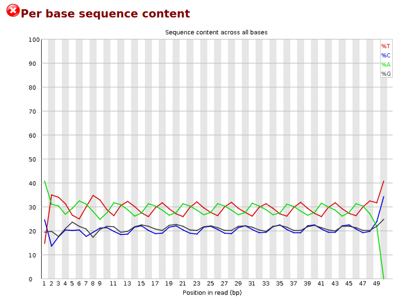
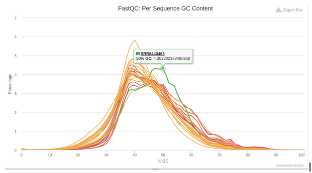

```{=html}
<style type="text/css">
.table {
    width: 80%;
    margin-left: auto;
    margin-right: auto;
}
</style>
```

```{r setup, include=FALSE}
library(knitr)
opts_chunk$set(echo = TRUE, 
               message = FALSE, 
               warning = FALSE, 
               comment = NA)
```

```{r, echo=FALSE}
study_selected_genes <- c(
    'LOC102724661', 'ANKRD26P3', 'MOV10L1', 'HIST2H2BA', 
    'ZBTB8B', 'GLT1D1', 'TNFRSF21', 'CECR2', 'PDD6IPP2', 
    'PTPRZ1', 'IGSF10', 'GRIA2', 'MEIS1', 'SELENBP1', 
    'SERPINF1', 'RIMS2', 'ASTN1', 'TLN2', 'ZNF532', 
    'ZNF662', 'NIN', 'ULK3', 'SLC38A7', 'FOXP1', 'ARSA', 
    'CTBP1-AS', 'LOC102725328', 'CBX6', 'GYPC', 'FBRSL1', 
    'SMAD7', 'PLXNC1', 'CLDN15', 'TSHZ3', 'KCNJ5', 
    'DPYD', 'STEAP3', 'RUNX3', 'PTPRG', 'ACD', 'TTYH3', 
    'LOC100133445', 'LOC102724549', 'VENTX', 'TM9SF1', 
    'SMIM3', 'ZNF703', 'TGFBI', 'EMP2', 'PSTPIP1', 
    'ZNF696', 'RFX2', 'APOE', 'ATOH8', 'ADAM8', 'GAS2L1', 
    'CHCHD5', 'ADAMTS13', 'A1BG', 'IL15', 'SECTM1', 
    'FAM109A', 'LOC100507639', 'ZNF843', 'S100A4', 'LSR')
```

```{r, echo=FALSE}
study_selected_genes_df <- structure(list(padj = c("0.000041", "0.000041", "0.004718", "0.005319", 
"0.019995", "0.019995", "0.019995", "0.019995", "0.037131", "0.041758", 
"0.042672", "0.044855", "0.048952", "0.048952", "0.059128", "0.059128", 
"0.091389", "0.091389", "0.093845", "0.107681", "0.233903", "0.240712", 
"0.240922", "0.240922", "0.272270", "0.302060", "0.351846", "0.361383", 
"0.365492", "0.379506", "0.382818", "0.405825", "0.428732", "0.440109", 
"0.446205", "0.461316", "0.504754", "0.508623", "0.510608", "0.539124", 
"0.549781", "0.553558", "0.561052", "0.567129", "0.588293", "0.664548", 
"0.701038", "0.735986", "0.827672", "0.828134", "0.878700", "0.886590", 
"0.896340", "0.912330", "0.982388", "0.992804"), log2FoldChange = c(" 1.7407", 
" 1.6923", "-1.9188", " 2.4133", "-1.2752", "-1.7361", "-3.5340", 
"-1.5115", " 2.5397", " 1.4381", "-1.8551", "-1.4818", " 1.5660", 
"-1.8852", " 1.6870", "-1.5431", " 1.9729", " 1.5837", "-1.2515", 
"-1.6002", "-1.3691", " 0.6251", " 0.7447", "-1.0323", "-1.0618", 
"-0.9980", "-2.1158", " 1.0546", "-0.8582", " 0.7173", " 1.2478", 
"-0.6839", " 1.6661", " 1.2523", " 0.6550", "-1.3041", "-1.0101", 
"-0.8394", "-0.6324", "-0.9036", "-0.6461", "-0.7312", "-0.4504", 
"-0.4916", "-0.4095", "-0.6452", "-0.5979", "-0.7492", "-0.4072", 
"-0.6446", "-0.4394", "-0.4055", "-0.4483", "-0.3390", "-0.0933", 
"-0.0474")), row.names = c("SERPINF1", "CECR2", "TGFBI", "GLT1D1", 
"ARSA", "PTPRG", "S100A4", "APOE", "MOV10L1", "ASTN1", "DPYD", 
"STEAP3", "IGSF10", "PSTPIP1", "MEIS1", "RFX2", "TNFRSF21", "SELENBP1", 
"PLXNC1", "SMIM3", "KCNJ5", "NIN", "TLN2", "ACD", "LSR", "VENTX", 
"SECTM1", "RIMS2", "IL15", "ZNF662", "PTPRZ1", "FOXP1", "ZBTB8B", 
"GRIA2", "ZNF532", "ADAM8", "TSHZ3", "TTYH3", "FBRSL1", "EMP2", 
"SMAD7", "RUNX3", "ULK3", "CBX6", "SLC38A7", "CLDN15", "GYPC", 
"ADAMTS13", "GAS2L1", "ATOH8", "TM9SF1", "ZNF703", "A1BG", "ZNF696", 
"ZNF843", "CHCHD5"), class = "data.frame")
```

```{r, echo=FALSE}
study_confirmed_genes_df <- structure(list(padj = c("0.000041", "0.000041", "0.004718", "0.005319", 
"0.019995", "0.019995", "0.019995", "0.019995", "0.037131", "0.041758", 
"0.042672", "0.044855", "0.048952", "0.048952"), log2FoldChange = c(" 1.74", 
" 1.69", "-1.92", " 2.41", "-1.28", "-1.74", "-3.53", "-1.51", 
" 2.54", " 1.44", "-1.86", "-1.48", " 1.57", "-1.89")), row.names = c("SERPINF1", 
"CECR2", "TGFBI", "GLT1D1", "ARSA", "PTPRG", "S100A4", "APOE", 
"MOV10L1", "ASTN1", "DPYD", "STEAP3", "IGSF10", "PSTPIP1"), class = "data.frame")
```

```{r, echo=FALSE}
my_de_genes_df <- structure(list(padj = c("0.000041", "0.000041", "0.004718", "0.005319", 
"0.011051", "0.011338", "0.019995", "0.019995", "0.019995", "0.019995", 
"0.019995", "0.019995", "0.019995", "0.035989", "0.037131", "0.037131", 
"0.037131", "0.037131", "0.037131", "0.037131", "0.037131", "0.037131", 
"0.041758", "0.041758", "0.042241", "0.042672", "0.042971", "0.044330", 
"0.044855", "0.044855", "0.048952", "0.048952", "0.048952", "0.048952", 
"0.048952", "0.048952", "0.048952", "0.048952"), log2FoldChange = c("1.74", 
" 1.69", "-1.92", " 2.41", " 4.16", " 2.21", "-3.53", " 4.98", 
"-1.74", " 4.22", " 4.52", "-1.51", "-1.28", " 3.28", " 5.31", 
" 2.05", " 2.85", " 5.73", " 4.85", " 3.36", " 2.54", " 1.36", 
" 1.44", " 1.77", " 2.26", "-1.86", " 2.90", " 1.86", "-1.48", 
" 1.29", " 2.56", " 1.90", " 1.57", " 1.14", " 2.66", " 2.79", 
" 1.50", "-1.89")), row.names = c("SERPINF1", "CECR2", "TGFBI", 
"GLT1D1", "MYOM3", "FGL1", "S100A4", "FMO1", "PTPRG", "PGC", 
"EVPL", "APOE", "ARSA", "KDR", "KLF18", "ESRRG", "TGM4", "TECTB", 
"KRT77", "EPPIN", "MOV10L1", "NEXMIF", "ASTN1", "STRIP2", "C2orf16", 
"DPYD", "EDAR", "DGKI", "STEAP3", "PLEKHG1", "USH2A", "CCDC121", 
"IGSF10", "MCF2L2", "OPRK1", "RGS22", "SORCS1", "PSTPIP1"), class = "data.frame")
```


# **Introduction**

Alzheimer's disease (AD) effects approximately 5.8 million people in the the United States ages 65 and older, with early sign and symptoms of the disease centering around forgetfulness, followed by impairment of memory until loss of ability to carry out everyday tasks. There is currently no treatment that cures AD or alters the disease process in the brain. [Mayo Clinic](https://www.mayoclinic.org/diseases-conditions/alzheimers-disease/symptoms-causes/syc-20350447).

Recent genetic studies of humans have identified brain specific myeloid cells (microglia) as a potential key cell type controlling an individual's risk of aquiring Alzheimer's Disease (AD):

-   (Genetics of Alzheimer's disease: where we are, and where we are going, Bellenguez et al, 2020)[<https://www.sciencedirect.com/science/article/pii/S0959438819301357>]
-   (Microglia in Alzheimer's disease, Hansen et al.,2018)[<https://rupress.org/jcb/article/217/2/459/52543/Microglia-in-Alzheimer-s-diseaseAlzheimer-s>]

In this report, I will be performing a differential expression (DE) analysis of RNA-seq data that has been derived from both Alzheimer's patient and control individual Microglia. This data is assosciated with the publication: [Alzheimer's Patient Microglia Exhibit Enhanced Aging and Unique Transcriptional Activation](https://pubmed.ncbi.nlm.nih.gov/32610143/), of which the graphical abstract is below:

{width="402"}

This study examined the expression of twenty-five genes known or proposed to be associated with AD risk or progression and found that most AD risk genes in their purified frozen brain tissue cell types showed preferential expression in microglia compared with other brain cell types. They have also examined whether any of these genes displayed altered expression levels in AD versus control cells, and observed that APOE, ABCA7, GPR141, PTK2B, SPI1, and ZYX appeared upregulated in AD microglia, whereas MEF2C appeared downregulated (un-adjusted p value \< 0.05). The indication of upregulation of APOE is specifically interesting, as previous studies have indicated to the potential importantance of the gene [APOE ε4: the most prevalent yet understudied risk factor for Alzheimer's disease](https://pubmed.ncbi.nlm.nih.gov/25217293/).

My aim specifically is to recapitulate the author's results, confirming that the prior mentioned set of genes **is** indeed upgregulaed in AD patient microglia in comparison to controls. Throughout this analysis I intend to hold this data to high quality control standards in order to ensure the correctness of the analysis findings. In order for this report to be reproducible and easily understood, I will make use of the industry-standard splice-aware RNA-seq aligner `STAR`, and differential expression profiling tool `DESeq2`.

# **Results**

{width="635"}

Of the **25** literature-selected genes identified in this study, I have confirmed **14** to be differentially expressed. A table containing the confirmed genes with their multiple-testing corrected p-value as well as log_2 fold change of expression can be found below. An extended list of genes found to be differntially expressed in this report can be found in the [Differential Expression Analysis](### differential-expression-analysis) section of this report.

```{r}
kable(study_confirmed_genes_df)
```

**Possible future experiments / analyses**:

-   Evaluating all cell types
-   More / better data
-   Include more analysis of genes from literature

Another brief paragraph summarizing:

-   key insights

-   possible future experiments

-   possible future analyses that might enhance your own analysis.

-   Discussion of the limits that your data set has!

-   Dataset is from frozen tissue, and upon further analysis it seemed as if a lot of Mitochondrial RNA and long Non-coding RNAs (which degrade slower) were more present than other transcripts

-   Lead to me having to filter my dataset to only protein coding genes in order to get decent normalization across all samples in the project.

-   A few of the samples were not annotated with sex, causing me to not use this data as I would like to control for this possibly confounding factor.

# **Methods**


## **Downloads**

### **Data Background**

Information the `fastq` files used in this study can be found [here](https://www.ncbi.nlm.nih.gov/Traces/study/?page=3&acc=PRJNA515044&o=diagnosis_sam_s%3Ad%253Bacc_s%3Bacc_s%3Aa) as well as [NCBI GEO](https://www.ncbi.nlm.nih.gov//geo/query/acc.cgi?acc=GSE125050)

### **Downloading Myeloid Data**

For this analysis, I have chosen to proceed with one of the four available cell types, being **myeloid** / microglia cells. However, the script below can be easily be adapted to download all `cell_types` with a simple `for` loop.

```{bash, eval=FALSE}
alzheimers_dataset="/Genomic_Data_Storage/Alzheimers_Project"
mkdir ${alzheimers_dataset}/accession_tables

wget https://raw.githubusercontent.com/jakesauter/Next_Gen_Sequencing_Project/main/accession_tables/Sra_run_table.txt \
    --output-document="${alzheimers_dataset}/accession_tables/Sra_run_table.txt"

unique_cell_types=$(cat ${alzheimers_dataset}/accession_tables/Sra_run_table.txt | cut -d',' -f9 | sort | uniq)


cell_type='myeloid'
echo "Downloading dat for cell type: ${cell_type}"
output_dir=${alzheimers_dataset}/${cell_type}_fastq_files
acc_nums=$(cat ${alzheimers_dataset}/accession_tables/Sra_run_table.txt | grep $cell_type | cut -d',' -f1)

for acc_num in "${acc_nums[@]}" ; do 
  fasterq-dump --outdir $output_dir $acc_num
  gzip ${output_dir}/${acc_num}.fastq

```

Note that for microglia data specifically, author's have included the following table, found in the `Experimental model and subject details` section of the publication:


### **Downloading STAR resources**

In order to generate a `STAR` index for later mapping, we will first need to download the human reference genome, as well as the human reference annotation of genes that is compatible with this version of the human reference genome. More background on `STAR` is provided later in this report.

```{bash, eval=FALSE}
mkdir human_genome_38
cd human_genome_38
wget ftp://hgdownload.cse.ucsc.edu/goldenPath/hg38/bigZips/hg38.fa.gz
wget ftp://ftp.ebi.ac.uk/pub/databases/gencode/Gencode_human/release_36/gencode.v36.annotation.gtf.gz
gunzip * 
```

Now that we have both the reference genome and our features of interest, we can generate our `STAR` index using the command below, saving our index to the `--genomeDir` directory of `human_genome_38_STAR_index`.

```{bash, eval=FALSE}
STAR --runMode  genomeGenerate \
--runThreadN 16 \
--genomeDir human_genome_38_STAR_index \
--genomeFastaFiles human_genome_38/hg38.fa \
--sjdbGTFfile human_genome_38/gencode.v36.annotation.gtf.gz \
--sjdbOverhang 49 
```

## **Data Processing**

### **`FastQC` and `MultiQC`**

[FastQC](https://www.bioinformatics.babraham.ac.uk/projects/fastqc/) is an industry standard Next-Generation Sequencing Quality Control tool written and maintained by the Bioinformatics Group at the [Babraham Institute](http://www.babraham.ac.uk/).

We can see the goal and mission of `FastQC` from an excerpt on their [website](https://www.bioinformatics.babraham.ac.uk/projects/fastqc/):

> <font size=2.5> FastQC aims to provide a simple way to do some quality control checks on raw sequence data coming from high throughput sequencing pipelines. It provides a modular set of analyses which you can use to give a quick impression of whether your data has any problems of which you should be aware before doing any further analysis. </font>

`FastQC` in the following analyses will be used for providing a quick, easy to generate overview of FastQ file quality to indicate potential problem areas in the project data, in the form of HTML based permanent reports, containing summary graphs and tables describing different aspects of the input data.

Example [quality control passing](https://www.bioinformatics.babraham.ac.uk/projects/fastqc/good_sequence_short_fastqc.html) and [quality control failing](https://www.bioinformatics.babraham.ac.uk/projects/fastqc/bad_sequence_fastqc.html) can be found on [FastQC's website](https://www.bioinformatics.babraham.ac.uk/projects/fastqc/) as well.

[`MultiQC`](https://multiqc.info/) is a useful tool to use in this context as well, as it is a tool that aggregates results from analyses across many samples (processed by `FastQC` in this case) into a single report. As seen below, the `MultiQC` command is very simple, and if all `FastQC` results are located in the same directory, that directory can be provided as input for `MultiQC` to aggregate all reports in the directory.

**Key FastQC and MultiQC Commands**

```{bash, eval = FALSE}
fastqc $fastq_file --noextract \
     --outdir=$fastqc_outdir \
     --threads=14 \
     $fastq_files

multiqc $fastqc_outdir
```

### **`TrimGalore`**

Found later in this report, after observing the first application of `FastQC` to the raw FastQ data files, highly repeated sequences were found. In order to both detect and remove these sequences from the raw input FastQ data, we can use the [`TrimGalore`](https://www.bioinformatics.babraham.ac.uk/projects/trim_galore/). Also written an maintained by the Bioinformatics Group at the [Babraham Institute](http://www.babraham.ac.uk/).

`TrimGalore` is a wrapper tool, providing the functionality of both `Cutadapt` and `FastQC` to provided adapter trimming and quality control to FastQ files. This report does not make use of the `FastQC` functionality of `TrimGalore` in order to seperate the QC and raw data files in an easier to understand way, calling `FastQC` directly with the required arguments.

**Key TrimGalore Commands**

```{bash, eval=FALSE}
$trim_galore $fastq_files \
--output_dir="${trim_galore_outdir}" \
--cores 14 --phred33 --gzip 
```

### **`STAR`**

With over **16,787** citations on [Google Scholar](https://scholar.google.com/scholar?hl=en&as_sdt=0%2C33&q=+STAR%3A+ultrafast+universal+RNA-seq+aligner+&btnG=), `STAR` (Spliced Transcripts Alignment to a Reference) has proven to be a great tool for RNA-seq alignment.

It is best to first assemble a reference built upon your organism - gene model of interest with `STAR --runMode genomeGenerate`, followed by mapping your RNA-seq reads with `STAR --runMode alignReads`. Durning alignment, `STAR` takes as input single-end or pair-end fastq files, with the output file being in `SAM` (Spliced Alignment/Mapping) format. The `sam` file should then usually be converted into `BAM` (Binary Alignment/Mapping) file, a binary file of sam, for shortening computation time in further analyzing differential expression within RNA-seq data.

**Key STAR Commands**:

Earlier in this report, we have generated our `STAR` reference index with the following command:

```{bash, eval=FALSE}
STAR --runMode  genomeGenerate \
--runThreadN 16 \
--genomeDir human_genome_38_STAR_index \
--genomeFastaFiles human_genome_38/hg38.fa \
--sjdbGTFfile human_genome_38/gencode.v36.annotation.gtf.gz \
--sjdbOverhang 49 
```

Given the raw or adapter-trimmed FastQ files, as well as the reference index we have generated in the previous command, we can align reads in the following way:

```{bash, eval=FALSE}
STAR --runMode  alignReads \
  --runThreadN 12 \
  --genomeDir  human_genome_38_STAR_index \
  --readFilesIn  $fastq_file \
  --readFilesCommand  zcat \
  --outSAMtype  BAM  SortedByCoordinate \
  --outFileNamePrefix $prefix  \
  --outSAMattributes All \
  --outReadsUnmapped="Fastx" \
  --outTmpKeep="None"
```

### **`featureCounts`**

`featureCounts` is an ["efficient general purpose program for assigning sequence reads to genomic features"](https://pubmed.ncbi.nlm.nih.gov/24227677/) and serves as a great [software program developed for counting reads to genomic features such as genes, exons, promoters and genomic bins](http://subread.sourceforge.net/)

**Key featureCounts Command**

```{bash, eval=FALSE}
featureCounts \
-a $annot_file \
-o $out_file \
-T 14 $bam_files
```

### **Data Processing Script**

In the script below, once all of the files are trimmed and saved, `FastQC` (paired with `multiqc` aggregation) is used to facilitate sequence quality control.

```{bash, eval=FALSE}
#!/bin/bash 

data_storage_dir="/Genomic_Data_Storage/Alzheimers_Project"
trim_galore="/home/t730/TrimGalore/TrimGalore-0.6.6/trim_galore"

cell_type="myeloid"
fastq_files=$(ls "${data_storage_dir}/${cell_type}_fastq_files"/*.fastq.gz)

trim_galore_outdir="${data_storage_dir}/trimmed_${cell_type}_fastqs"
mkdir $trim_galore_outdir

fastqc_outdir="${data_storage_dir}/trimmed_${cell_type}_fastqc"
mkdir $fastqc_outdir

$trim_galore $fastq_files \
--output_dir="${trim_galore_outdir}" \
--cores 14 --phred33 --gzip 

trimmed_files=$(ls $trim_galore_outdir/*.fq.gz)

fastqc $trimmed_files \
--outdir=$fastqc_outdir \
--threads=14 --noextract

cd $fastqc_outdir
multiqc .

for fastq_file in $trimmed_files; do
  base=$(basename $fastq_file)
  prefix=$(echo $fastq_file | egrep -o "SRR[0-9]+")
  prefix="trimmed_${cell_type}_alignments/${prefix}_trimmed."
  
  STAR --runMode  alignReads \
  --runThreadN 12 \
  --genomeDir  human_genome_38_STAR_index \
  --readFilesIn  $fastq_file \
  --readFilesCommand  zcat \
  --outSAMtype  BAM  SortedByCoordinate \
  --outFileNamePrefix $prefix  \
  --outSAMattributes All \
  --outReadsUnmapped="Fastx" \
  --outTmpKeep="None"
  
  samtools index ${prefix}.Aligned.sortedByCoord.out.bam
done

annot_file=${data_storage_dir}/human_genome_38/gencode.v36.annotation.gtf
out_dir=${data_storage_dir}/featureCounts
alignment_dir=${data_storage_dir}/trimmed_${cell_type}_alignments
out_file=${out_dir}/featCounts_genes.txt
bam_files=$(ls ${alignment_dir}/SRR???????_trimmed.Aligned.sortedByCoord.out.bam)

mkdir $out_dir

featureCounts \
-a $annot_file \
-o $out_file \
-T 14 $bam_files
```

[Trimmed MultiQC HTML Report](https://jakesauter.github.io/Next_Gen_Sequencing_Project/trimmed_myeloid_multiqc_report.html)

## **Quality Control**

### **`FastQC` Raw Data QC**

Signs of cyclic GC content for some runs are present in the dataset, however fastq tile coordinates **are not available** in the GEO dataset to allow for selective tile filtering ([Github issue showing why SRA may not store this information](https://github.com/ncbi/sra-tools/issues/130)). Particularly these issues were seen in three of the samples, with the effects occurring with varying degree. These samples were

-   `SRR8440539` [FastQC Report](https://jakesauter.github.io/Next_Gen_Sequencing_Project/SRR8440539_fastqc.html)
-   `SRR8440524` [FastQC Report](https://jakesauter.github.io/Next_Gen_Sequencing_Project/SRR8440524_fastqc.html)
-   `SRR8440538` [FastQC Report](https://jakesauter.github.io/Next_Gen_Sequencing_Project/SRR8440538_fastqc.html)

An example of this failing behavior:

{width="50%"}

### **`STAR` Alignment QC**

In order to determine the percentage of reads mapped, we have used the `--outReadsUnmapped="Fastx"` parameter while running `STAR`, and now can compare the number of reads in our mapped files, versus the number of reads in our unmapped files. A `bash` function for performing this operation (`calculate_unampped_reads`) is applied to all of the `BAM` files generated in the `STAR` alignment phase of the report.

```{bash, eval=FALSE}
#!/bin/bash

data_storage_dir=/Genomic_Data_Storage/Alzheimers_Project

trim_fastq_dir=${data_storage_dir}/trimmed_myeloid_fastqs
trim_align_dir=${data_storage_dir}/trimmed_myeloid_alignments
bam_files=$(ls ${data_storage_dir}/trimmed_myeloid_alignments/*.bam)
parallel_tmp_dir=$(mktemp -d)

calculate_unampped_reads() {
  base=$(basename $1)
  prefix=$(echo $base | egrep -o "SRR[0-9]+")
  
  unammped_reads_file=${trim_align_dir}/${prefix}_trimmed.Unmapped.out.mate1
  total_reads_file=${trim_fastq_dir}/${prefix}_trimmed.fq.gz
  num_lines=$(cat $unammped_reads_file | wc -l)
  num_total_lines=$(zcat $total_reads_file | wc -l)
  perc_unmapped_reads=$(echo -e "(${num_lines}/${num_total_lines})*100" | bc -l | xargs printf %.2f)
  echo -e "Percentage of unmapped reads for ${prefix}: ${perc_unmapped_reads}%" > ${parallel_tmp_dir}/${prefix}.out
}

for bam_file in $bam_files; do
  calculate_unampped_reads $bam_file &
done 

cat $parallel_tmp_dir/*.out
```

Results of executing this code can be found below.

```{bash, eval=FALSE}
Percentage of unmapped reads for SRR8440443: 5.90%
Percentage of unmapped reads for SRR8440447: 4.17%
Percentage of unmapped reads for SRR8440448: 4.04%
Percentage of unmapped reads for SRR8440449: 8.38%
Percentage of unmapped reads for SRR8440463: 33.79%
Percentage of unmapped reads for SRR8440477: 5.14%
Percentage of unmapped reads for SRR8440482: 6.54%
Percentage of unmapped reads for SRR8440484: 3.65%
Percentage of unmapped reads for SRR8440486: 8.13%
Percentage of unmapped reads for SRR8440488: 5.19%
Percentage of unmapped reads for SRR8440501: 6.98%
Percentage of unmapped reads for SRR8440511: 5.47%
Percentage of unmapped reads for SRR8440513: 6.79%
Percentage of unmapped reads for SRR8440514: 4.97%
Percentage of unmapped reads for SRR8440517: 5.76%
Percentage of unmapped reads for SRR8440518: 5.02%
Percentage of unmapped reads for SRR8440524: 11.28%
Percentage of unmapped reads for SRR8440525: 9.51%
Percentage of unmapped reads for SRR8440527: 7.05%
Percentage of unmapped reads for SRR8440529: 6.67%
Percentage of unmapped reads for SRR8440531: 10.64%
Percentage of unmapped reads for SRR8440536: 7.61%
Percentage of unmapped reads for SRR8440538: 7.43%
Percentage of unmapped reads for SRR8440539: 12.34%
Percentage of unmapped reads for SRR8440542: 8.16%
```

From the above output, we see that `SRR8440463` as an unusually high amount of unmapped reads compared to all other samples in the study. When cross-referenceing our previously generated `MultiQC` report from earlier, we can see that the GC content of this sample appears to be off compared to all other samples as well, possibly indicating contamination or other library quality issues.



**Problematic cyclic GC samples from before**: `SRR8440524`, `SRR8440538`, and `SRR8440539` **NOT** `SRR8440463` that we see with GC-rich contamination above.

**FastQC Reports**:

-   [SRR8440524_fastqc.html](https://jakesauter.github.io/Next_Gen_Sequencing_Project/SRR8440524_fastqc.html)
-   [SRR8440538_fastqc.html](https://jakesauter.github.io/Next_Gen_Sequencing_Project/SRR8440538_fastqc.html)
-   [SRR8440539_fastqc.html](https://jakesauter.github.io/Next_Gen_Sequencing_Project/SRR8440539_fastqc.html)
-   [SRR8440463_fastqc.html](https://jakesauter.github.io/Next_Gen_Sequencing_Project/SRR8440463_fastqc.html)

We will keep these QC issues in mind moving forward, and remove the samples before analysis in `R`.

## **Data Analysis**

Below we will use the `DESeq2` R package to make a `DESeqDataSet` from our resultant files from running featureCounts. At this step, I have chosen to remove our **4** samples with QC issues after preliminary analysis, as well as another **4** samples for having an undefined value (`NA`) for the **sex** attribute, a possible confounder analyzed in this report.

**Required Libraries**:

```{r}
library(tidyr)        # pivot_longer
library(knitr)        # Rmarkdown chunk options and kable
library(dplyr)        # filter, summarise
library(DESeq2)       # EDS and DE
library(ggplot2)      # Plotting
library(stringr)      # String searching and extraction
library(magrittr)     # Piping
library(patchwork)    # Image layout
library(plyranges)    # gtf file manipulation
library(rtracklayer)  # gtf file manipulation
```

```{r, echo=FALSE}
filter <- dplyr::filter
select <- dplyr::select
```

### **Importing `featureCounts` Data**

```{r}
read_counts <- read.table(
  '../featCounts/featCounts_genes.txt', 
  header = TRUE, stringsAsFactors = FALSE) 

orig_names <- colnames(read_counts)
colnames(read_counts) <- gsub(".*(SRR[0-9]+).*", "\\1", orig_names)
row.names(read_counts) <- make.names(read_counts$Geneid)
read_counts <- read_counts[,-c(1:6)]
read_counts <- as.matrix(read_counts)
```

**Filtering failed QC Samples**

We will now filter the samples previously seen to have low-quality aspects that have the possiblity of adding unnecessary noise to our analyses. The samples  `SRR8440524`, `SRR8440538`, and `SRR8440539` will be removed due to cyclic gc-content findings,  `SRR8440463` will be removed due to GC-rich contamination, and finally `SRR8440447` and `SRR8440517` will be removed due to unkown sex of the sample (a possible confounder).

```{r}
keep_samples <- 
  colnames(read_counts) %in% 
  c('SRR8440524', 'SRR8440463',
    'SRR8440538', 'SRR8440539', 
    "SRR8440484", "SRR8440488", 
    "SRR8440447", "SRR8440517"
    ) %>% 
  not()

read_counts <- 
  read_counts[ , keep_samples]

read_counts %>% 
  .[1:4, 1:5] %>% 
  kable()    
```

### **Converting Gene symbols using GTF**

Now that we have the `read_counts` for all of our samples of interest, we can associate our known metadata with the genes, which can later be incorported into our `DESeq2` object's `rowData`. In order to associate these data, the gene information can first be read in the `gencode.v36.annotation.gtf.gz` file with `plyranger::read_gff`. 

Seen later in this report, I will be filtering for only **protein-coding genes**, as well as **Non-Mitochondrial RNA** in order to achieve proper cross-sample normalization results. This result is acheived through filtering the `data.frame` derived from the GTF gene info file, followd by a `left_join` on the row names of our gene count information with the associated gene symbol.

```{r}
genes_df <- 
  read_gff("../gtf/gencode.v36.annotation.gtf.gz", 
           genome_info="hg38") %>% 
  select(gene_id, gene_type, gene_name) %>% 
  as.data.frame()

gene_info_df <-
  data.frame(gencode_id = rownames(read_counts)) %>% 
  left_join(., genes_df, 
            by = c('gencode_id' = 'gene_id')) %>% 
  select(gencode_id, gene_name, gene_type) %>% 
  filter(gene_type == 'protein_coding',
         !str_detect(gene_name, '^MT-')) %>%
  distinct() 

read_counts <- 
  read_counts[gene_info_df$gencode_id, ]
```

### **Importing Sample Data**

Now that we have our raw read counts and `rowData` metadata, lets gather information about our samples to supply to the `colData` of `DESeq2` object.

```{r}
accession_table <-
  read.table('../accession_tables/Sra_run_table.txt', 
             header = TRUE, sep = ',', stringsAsFactors = FALSE) %>% 
  as.data.frame() %>% 
  filter(Cell_type == 'myeloid', 
         !is.na(sex)) %>% 
  select(Run, Diagnosis, sex,
                expired_age, APOE, pmi, 
                Cell_type) %>%
  arrange(Diagnosis, sex)

accession_table %>% 
  kable()
```

From this accession table, we can map our accession ids to any clinical variable we like, such as `Diagnosis`, which is our main experimental group condition in this analysis. `Diagnosis` in our case tells us whether or not the diseased patient showed signs of Alzheimer's disease or not (control).


### **Creating DESeq2 Object**

```{r}
conditions <-
  colnames(read_counts) %>% 
  lapply(function(run_name) 
      accession_table[accession_table['Run'] == run_name, ]) %>% 
  bind_rows() %>% 
  mutate(sex = factor(sex), 
         Diagnosis = factor(Diagnosis,
                            levels = c('Control', 'AD')))

sample_info <-
  DataFrame(conditions,
            row.names = conditions$Run) 


DESeq.ds <- 
  DESeqDataSetFromMatrix(
    countData = as.matrix(read_counts),
    colData = sample_info,
    rowData = gene_info_df, 
    design = ~ sex + Diagnosis)
```

Lets inspect our `rowData`, `colData`, and `counts` attributes that we have provided to our new object.

**colData**
```{r, echo=FALSE}
DESeq.ds %>% 
  colData() %>% 
  head() %>% 
  kable()
```

**rowData**
```{r, echo=FALSE}
DESeq.ds %>% 
  rowData() %>% 
  head() %>% 
  kable()
```

**counts**
```{r, echo=FALSE}
DESeq.ds %>% 
  counts() %>% 
  head() %>% 
  .[,1:5] %>% 
  kable()
```

### **Mapping Quality Assessment**

**Number of reads sequenced per sample**

In order to determine useful characteristics about our sample read mappings to inform proper normalization, we can begin by inspecting how many reads we have aquired per sample.

```{r}
colSums(counts(DESeq.ds)) %>% 
  data.frame(sample = str_extract(names(.), '[0-9]{3}$'), reads = .) %>% 
  ggplot() + 
  geom_col(aes(x = sample, y = reads)) + 
  theme(axis.text.x = element_text(angle=-35))
```

**Filtering Gene Counts**

Moving forward, we will filter our `DESeqDataSet` as to only include genes that have a read mapped for at least one sample.

```{r}
n_previous_genes <- nrow(DESeq.ds)
keep_genes <- rowSums(counts(DESeq.ds)) > 0
DESeq.ds <- DESeq.ds[keep_genes, ]

cat(n_previous_genes - nrow(DESeq.ds), 'genes removed due to no non-zero counts found')
```

### **Read Count Normalization**

In order to properly compare our sampled RNA read counts across samples, we must normalize our raw RNA read counts for both the **sequencing depth** and **overall expression of other genes** for each sample. This can be accomplished by using `DESeq2`'s **size factor normalization**, performed with `estimateSizeFactors()` and accessed with `sizeFactors()`. This step is particularly important as it is the first step of the `DESeq2` differential expression analysis based on the Negative Binomial (Gamma-Poisson) distribution. More clearly, the full steps of the differential expression analysis will be 

1. Estimation of the size factors with `DESeq2::estimateSizeFactors()`
2. Estimation of the dispersion with `DESeq2::esimateDispersions()`
3. Fitting the Negative Binomial GLM model, Wald statistics, and p-values with `nbinomWaldTest`

```{r}
DESeq.ds <- estimateSizeFactors(DESeq.ds)

plot(sizeFactors(DESeq.ds), colSums(counts(DESeq.ds)), 
     ylab = 'library sizes', xlab = 'size factors')
```

From the plot above, we can see that our key necessary assumptions that size factors should be around 1 and scale with number of reads per sample is met. However, this was not originally the case before some data filtering. See below the results of size factor normalization performed with no reads filtered, mitochondrial RNA reads filtered, and non-protein coding and mitochondrial RNA read filtered respectively.

```{r, echo = FALSE, fig.width = 10}
par(mfrow = c(1, 3))

raw_read_counts <- read.table(
  '../featCounts/featCounts_genes.txt', 
  header = TRUE, stringsAsFactors = FALSE)

orig_names <- colnames(raw_read_counts)
colnames(raw_read_counts) <- gsub(".*(SRR[0-9]+).*", "\\1", orig_names)
row.names(raw_read_counts) <- make.names(raw_read_counts$Geneid)
raw_read_counts <- raw_read_counts[,-c(1:6)]

raw_read_counts <- 
  raw_read_counts[ , keep_samples]

raw_gene_info_df <-
  data.frame(gencode_id = rownames(raw_read_counts)) %>% 
  left_join(., genes_df, 
            by = c('gencode_id' = 'gene_id')) %>% 
  select(gencode_id, gene_name, gene_type) %>% 
  # filter(!str_detect(gene_name, '^MT-')) %>%
  distinct()

raw_read_counts <- 
  as.matrix(raw_read_counts)

rownames(raw_read_counts) <- 
        raw_gene_info_df$gene_name

raw_conditions <- 
  colnames(raw_read_counts) %>% 
  lapply(function(run_name) 
      accession_table[accession_table['Run'] == run_name, ]) %>% 
  bind_rows() 

raw_sample_info <-
  DataFrame(raw_conditions,
            row.names = raw_conditions$Run)

DESeq.ds.raw_1 <- 
  DESeqDataSetFromMatrix(
    countData = as.matrix(raw_read_counts),
    colData = raw_sample_info,
    rowData = raw_gene_info_df, 
    design = ~ sex + Diagnosis)

keep_genes <- rowSums(counts(DESeq.ds.raw_1)) > 0

DESeq.ds.raw_1 <- estimateSizeFactors(DESeq.ds.raw_1)

plot(sizeFactors(DESeq.ds.raw_1), colSums(counts(DESeq.ds.raw_1)), 
     ylab = 'library sizes', xlab = 'size factors', main = "Before Filtering Mitochondrial")


###################################################################

raw_read_counts <- read.table(
  '../featCounts/featCounts_genes.txt', 
  header = TRUE, stringsAsFactors = FALSE)

orig_names <- colnames(raw_read_counts)
colnames(raw_read_counts) <- gsub(".*(SRR[0-9]+).*", "\\1", orig_names)
row.names(raw_read_counts) <- make.names(raw_read_counts$Geneid)
raw_read_counts <- raw_read_counts[,-c(1:6)]

raw_read_counts <- 
  raw_read_counts[ , keep_samples]

raw_gene_info_df <-
  data.frame(gencode_id = rownames(raw_read_counts)) %>% 
  left_join(., genes_df, 
            by = c('gencode_id' = 'gene_id')) %>% 
  select(gencode_id, gene_name, gene_type) %>% 
  filter(!str_detect(gene_name, '^MT-')) %>%
  distinct()

raw_read_counts <- 
  raw_read_counts[raw_gene_info_df$gencode_id, ]

raw_read_counts <- 
  as.matrix(raw_read_counts)

rownames(raw_read_counts) <- 
        raw_gene_info_df$gene_name
 
raw_conditions <- 
  colnames(raw_read_counts) %>% 
  lapply(function(run_name) 
      accession_table[accession_table['Run'] == run_name, ]) %>% 
  bind_rows() 

raw_sample_info <-
  DataFrame(raw_conditions,
            row.names = raw_conditions$Run)

DESeq.ds.raw_2 <- 
  DESeqDataSetFromMatrix(
    countData = as.matrix(raw_read_counts),
    colData = raw_sample_info,
    rowData = raw_gene_info_df, 
    design = ~ sex  + Diagnosis)

keep_genes <- rowSums(counts(DESeq.ds.raw_2)) > 0

DESeq.ds.raw_2 <- estimateSizeFactors(DESeq.ds.raw_2)

plot(sizeFactors(DESeq.ds.raw_2), colSums(counts(DESeq.ds.raw_2)), 
     ylab = 'library sizes', xlab = 'size factors', main = "Filtering Mitochondrial")

###################################################################

plot(sizeFactors(DESeq.ds), colSums(counts(DESeq.ds)), 
     ylab = 'library sizes', xlab = 'size factors', 
     main = 'Filtering Mitochondrial and Non-Protein Coding')
```


**Normalizing Read Counts with Size Factors**

In the previous step, we have calculated the `sizeFactors` of our samples, and confirmed that the results match required expectaions. Now we can use this result in order to properly normalize our samples. This is accomplished with the `DESeq2::counts()` accessor, with added paramter `normalized = TRUE`. Below we compare the filtered but non-normalized RNA read counts, with the filtered and normalized read counts.

```{r, fig.width = 10}
p1 <-
  DESeq.ds %>% 
  counts() %>% 
  {. + 1} %>% 
  log2() %>% 
  as.data.frame() %>% 
  pivot_longer(cols = everything()) %>%
  mutate(name = str_extract(name, '[0-9]{3}$')) %>% 
  ggplot() + 
    geom_boxplot(aes(x = name, y = value)) +
    ggtitle("Non-normalized read counts") +
    xlab('Sample') + ylab("log2(read counts + 1)") + 
    theme(axis.text.x = element_text(angle = -30))


p2 <-
  DESeq.ds %>% 
  counts(normalize= TRUE) %>% 
  {. + 1} %>% 
  log2() %>% 
  as.data.frame() %>% 
  pivot_longer(cols = everything()) %>%
  mutate(name = str_extract(name, '[0-9]{3}$')) %>% 
  ggplot() + 
    geom_boxplot(aes(x = name, y = value)) +
    ggtitle("Size-factor-normalized read counts") +
    xlab('Sample') + ylab("log2(read counts + 1)") + 
    theme(axis.text.x = element_text(angle = -30))

p1 + p2
```

I would again like to show how the result of this normalization procedure has influenced the gene-filtering I have applied in previous step of the report. Below I show the results of the same normalization procedure as above, however with no gene filtering, Mitochondrial RNA filtering, and non-protein coding and Mitochondrial RNA filtering respectived.

**No Gene Filtering Applied**

```{r, echo = FALSE, fig.height = 2.5}
p3 <-
  DESeq.ds.raw_1 %>% 
  counts() %>% 
  {. + 1} %>% 
  log2() %>% 
  as.data.frame() %>% 
  pivot_longer(cols = everything()) %>%
  mutate(name = str_extract(name, '[0-9]{3}$')) %>% 
  ggplot() + 
    geom_boxplot(aes(x = name, y = value)) +
    xlab('Non-normalized read counts') + ylab("log2(read counts + 1)") + 
    theme(axis.text.x = element_text(angle = -30))


p4 <-
  DESeq.ds.raw_1 %>% 
  counts(normalize= TRUE) %>% 
  {. + 1} %>% 
  log2() %>% 
  as.data.frame() %>% 
  pivot_longer(cols = everything()) %>%
  mutate(name = str_extract(name, '[0-9]{3}$')) %>% 
  ggplot() + 
    geom_boxplot(aes(x = name, y = value)) +
    xlab("Size-factor-normalized read counts") + ylab("log2(read counts + 1)") + 
    theme(axis.text.x = element_text(angle = -30))

p3 + p4
```

**Mitchondrial RNA Filtering Applied**

```{r, echo = FALSE, fig.height = 2.5}
p5 <-
  DESeq.ds.raw_2 %>% 
  counts() %>% 
  {. + 1} %>% 
  log2() %>% 
  as.data.frame() %>% 
  pivot_longer(cols = everything()) %>%
  mutate(name = str_extract(name, '[0-9]{3}$')) %>% 
  ggplot() + 
    geom_boxplot(aes(x = name, y = value)) +
    xlab("Non-normalized read counts") + ylab("log2(read counts + 1)") + 
    theme(axis.text.x = element_text(angle = -30))


p6 <-
  DESeq.ds.raw_2 %>% 
  counts(normalize= TRUE) %>% 
  {. + 1} %>% 
  log2() %>% 
  as.data.frame() %>% 
  pivot_longer(cols = everything()) %>%
  mutate(name = str_extract(name, '[0-9]{3}$')) %>% 
  ggplot() + 
    geom_boxplot(aes(x = name, y = value)) +
    xlab("Size-factor-normalized read counts") + ylab("log2(read counts + 1)") + 
    theme(axis.text.x = element_text(angle = -30))

p5 + p6
```

**Mitchondrial RNA and Non Protein-Coding Filtering Applied**

```{r, echo = FALSE, fig.height = 2.5}
p1 + p2
```

### **Exploratory Data Analysis`**

In order to briefly explore possible relationships and patterns in our data, such as confounding variables or strength of seperation between `Diagnosis`, we will apply `DESeq2::rlog` to the **raw count data**. The `rlog` function transforms the count data to the log2 scale, while also minimizing differences between samples for rows with small counts, and even normalizing with respect to library size ontop of that.

Note that in the previous section, we observed the `sizeFactors()`, resulting from **size factor normalization** that will be used for the **differential expression analysis**, however `rlog` normalized data will be used stricty for **exploratory data analysis** in this section of the report, before we return to the `DESeq2` driven differential expression analysis in the next sections.

Below we apply `DESeq2::rlog()` to the filtered `DESeq2` object that we have created previously, and plot the normaliztion results for matched gene-expression between two pairs of matched samples of which had an observable difference in raw read count numbers.

```{r, fig.width = 10, fig.height = 4.5}
DESeq.rlog <- rlog(DESeq.ds, blind = TRUE)

log.norm.counts <-
  DESeq.ds %>% 
  counts(normalized=TRUE) %>% 
  {.+1} %>% 
  log2()


p1 <-
  data.frame('Female_Control_518' = log.norm.counts[,'SRR8440518'], 
           'Female_Control_529' = log.norm.counts[,'SRR8440529']) %>% 
  ggplot() + 
  geom_point(aes(x = Female_Control_518, y = Female_Control_529), 
             alpha = 0.01) + 
  geom_abline(slope = 1, intercept = 0, 
              lty = 2, col = 'red') + 
  ggtitle("size factor and log2-transformed") + 
  xlab('Female_Control_518') + ylab('Female_Control_529')

## the rlog-transformed counts are stored in the accessor "assay"
p2 <-
  data.frame('Female_Control_518' = assay(DESeq.rlog)[,'SRR8440518'], 
           'Female_Control_529' = assay(DESeq.rlog)[,'SRR8440529']) %>% 
  ggplot() + 
  geom_point(aes(x = Female_Control_518, y = Female_Control_529), 
             alpha = 0.01) + 
  geom_abline(slope = 1, intercept = 0, 
              lty = 2, col = 'red') + 
  ggtitle("rlog transformed") + 
  xlab('Female_Control_518') + ylab('Female_Control_529') 

p3 <-
  data.frame('Male_AD_477' = log.norm.counts[,'SRR8440477'], 
           'Male_AD_486' = log.norm.counts[,'SRR8440486']) %>% 
  ggplot() + 
  geom_point(aes(x = Male_AD_477, y = Male_AD_486), 
             alpha = 0.01) + 
  geom_abline(slope = 1, intercept = 0, 
              lty = 2, col = 'red') + 
  ggtitle("size factor and log2-transformed") + 
  xlab('Male_AD_477') + ylab('Male_AD_486')

## the rlog-transformed counts are stored in the accessor "assay"
p4 <-
  data.frame('Male_AD_477' = assay(DESeq.rlog)[,'SRR8440477'], 
           'Male_AD_486' = assay(DESeq.rlog)[,'SRR8440486']) %>% 
  ggplot() + 
  geom_point(aes(x = Male_AD_477, y = Male_AD_486), 
             alpha = 0.01) + 
  geom_abline(slope = 1, intercept = 0, 
              lty = 2, col = 'red') + 
  ggtitle("rlog transformed") + 
  xlab('Male_AD_477') + ylab('Male_AD_486') 


(p1 + p2) / (p3 + p4)
```

**Mean vs Stdev before and after `rlog`**

Another aspect of the normalized data that we can inspect is the relationship between the **mean** and **standard deviation** of our read counts. Due to the nature of sampled data, we will see that standard deviation will be higher for lowly expressed genes, and vice versa. This can make it difficult to compare these lowly expressed genes between samples. We see that the resultant `rlog` normalized data on the right below has a much better overall mean vs sd relationship. 

```{r, fig.width = 10}
log.norm.counts <- 
  DESeq.ds %>% 
  counts(normalized=TRUE) %>% 
  log2()

par(mfrow=c(1,1))

msd_plot <- 
  vsn::meanSdPlot(log.norm.counts,
                  ranks=FALSE, 
                  plot=FALSE)
p1 <- msd_plot$gg + 
  ggtitle("Sequencing depth normalized log2(read counts)") + 
  ylab("standard deviation")

rlog.norm.counts <- 
  DESeq.rlog %>% 
  assay()

msd_plot <- 
  vsn::meanSdPlot(rlog.norm.counts, 
                  ranks=FALSE, 
                  plot = FALSE)

p2 <- msd_plot$gg + 
  ggtitle("rlog transformation") + 
  coord_cartesian(ylim = c(0,3))

p1 + p2
```

### **PMI as a Possible Confounder**

We first note that the [original publication](https://pubmed.ncbi.nlm.nih.gov/32610143/) has already chosen samples in attempts to minimize intra-group variation. 

> <font size=2.5> To maximize the likelihood of observing differences between AD and control, we selectedonly AD specimens with high scores for amyloid and tau neuro-pathology in frontal cortex, and we selected only control specimens with negligible amounts of these pathologies in this region (see sample metadata in Data S2). AD and control groups had roughly matching distributions of age, sex, and post-mortem interval (PMI). <font>


**P**ost-**M**ortem-**I**nterval, being the time since death that the sample was processed was not found in the original publication to be required to be modelled as a covariate between AD and Control samples, however for peace of mind we also see that PMI is fairly evenly distributed between the two groups.

```{r, fig.height=2.5}
accession_table %>% 
  ggplot() + 
    geom_histogram(aes(x = pmi), 
                   color = 'black', 
                   fill = 'skyblue') + 
  facet_wrap(vars(Diagnosis))
```

### **APOE as a Possible Confounder**

We note that **APOE genotype** may play a role in AD, though are not including it in the analysis in order to compare with the reference study ([APOE ε4: the most prevalent yet understudied risk factor for Alzheimer's disease](https://pubmed.ncbi.nlm.nih.gov/25217293/)). Note that it was also better to not include APOE as `DESeq2` will have a problem processing the variable in the design formula as not every level is repsented in every group, observed below.

```{r, fig.height = 2.5}
accession_table %>% 
  dplyr::count(Diagnosis, APOE) %>% 
  ggplot() + 
    geom_col(aes(x = APOE, y = n), 
                   color = 'black', 
                   fill = 'skyblue') + 
  facet_wrap(vars(Diagnosis))
```

### **Sex as a Possible Counfounder**

First in order to check that there isn't large differences between our male and female patient cohorts, we will generate a correlation heatmap using Pearson correlation.

The table you will see below will be in the following format

```{=html}
<style type="text/css">
.table {
    margin-left: 20%;
    width: 30%;
    margin-right: auto;
}
</style>
```


```{r, echo=FALSE}
data.frame(x = c('Heatmap will all genes', 'PCA with all genes'), 
           y = c('Heatmap with selected genes', 'PCA with selected genes')) %>% 
  set_colnames(c('All Genes', '500 Most Variable Genes')) %>% 
  kable()
```

```{=html}
<style type="text/css">
.table {
    width: 80%;
    margin-left: auto;
    margin-right: auto;
}
</style>
```

```{r, fig.show='hold', out.width='50%'}
par(mfrow = c(2, 2))

most_variable_genes <-
  assay(DESeq.rlog) %>%  
  apply(1, var) %>% 
  sort(decreasing = TRUE) %>% 
  names(.) %>% 
  head(500)

rlog_corr_coeff <- 
  DESeq.rlog %>% 
  assay() %>% 
  cor(method = "pearson") 

selected_genes_rlog_corr_coeff <- 
  DESeq.rlog %>% 
  subset(rownames(.) %in% most_variable_genes) %>% 
  assay() %>% 
  cor(method = "pearson") 

new_names <-
  rownames(rlog_corr_coeff) %>% 
  sapply(function(run_name) 
    accession_table[accession_table['Run'] == run_name, 'sex']) %>% 
  {paste0(., '_', str_extract(names(.), '[0-9]{3}$'))}

rlog_corr_coeff <- 
  rlog_corr_coeff %>% 
  set_rownames(new_names) %>% 
  set_colnames(new_names)
  
new_names <-
  rownames(selected_genes_rlog_corr_coeff) %>% 
  sapply(function(run_name) 
    accession_table[accession_table['Run'] == run_name, 'sex']) %>% 
  {paste0(., '_', str_extract(names(.), '[0-9]{3}$'))}

selected_genes_rlog_corr_coeff <- 
  selected_genes_rlog_corr_coeff %>% 
  set_rownames(new_names) %>% 
  set_colnames(new_names)
```

Now that we have our `rlog_corr_coeff` and `selected_genes_rlog_corr_coeff` variables, we can plot our results side-by-side below.

```{r, fig.show='hold', out.width='50%'}
par(mfrow = c(2,2))

rlog_corr_coeff %>% 
  {as.dist(1-., upper = TRUE)} %>%
  as.matrix %>% 
  pheatmap::pheatmap(., main = "Pearson correlation")

selected_genes_rlog_corr_coeff %>% 
  {as.dist(1-., upper = TRUE)} %>%
  as.matrix %>% 
  pheatmap::pheatmap(., main = "Pearson correlation")

DESeq.rlog %>% 
  plotPCA(intgroup = 'sex')

DESeq.rlog %>%
  subset(rownames(.) %in% most_variable_genes) %>% 
  plotPCA(intgroup = 'sex')
```

```{r, fig.show='hold', fig.height = 4}
par(mfrow = c(1, 2), 
    mar=c(0, 4, 4, 2))


rlog_corr_coeff %>% 
  {as.dist(1-.)} %>% 
  hclust() %>%
  plot(., 
       main = "rlog transformed read counts", 
       xlab = "", ylab = "", sub = "")

selected_genes_rlog_corr_coeff %>% 
  {as.dist(1-.)} %>% 
  hclust() %>%
  plot(., 
       main = "rlog transformed read counts", 
       xlab = "",  ylab = "", sub = "")
```

**Study-Selected, Literature Supported Specific Gene-Set**

From the results above, it is unclear if our groups seperate by sex. In order to further determine if we should observe any differentially expressed genes between the sexes, we will only select gene features that were pointed out as literature supported in the reference study. This list is printed below as well for convenience

```{r}
study_selected_genes
```

Below we see that given the literature-supported genes, our Male and Female sex groups do seem to be seem to be the main source of seperation in our data, though some patterns may exist. Moving forward the difference in sex of our cohort should not ruin our differential expression analysis between Control and AD groups, though it may be bet to model as a confounding factor as I have in this report.

```{r, echo = FALSE, fig.height=5}
study_selected_gencode_ids <- 
  data.frame(gene_id = study_selected_genes) %>% 
  left_join(gene_info_df, by = c('gene_id' = 'gene_name')) %>% 
  drop_na() %>% .$gencode_id
  
selected_genes_rlog_corr_coeff <- 
  DESeq.rlog %>% 
  subset(rownames(.)%in% study_selected_gencode_ids) %>% 
  assay() %>% 
  cor(method = "pearson") 

orig_rownames <- rownames(selected_genes_rlog_corr_coeff)

new_names <-
  orig_rownames %>% 
  sapply(function(run_name) 
    accession_table[accession_table['Run'] == run_name, 'sex']) %>% 
  {paste0(., '_', str_extract(names(.), '[0-9]{3}$'))}

selected_genes_rlog_corr_coeff <- 
  selected_genes_rlog_corr_coeff %>% 
  set_rownames(new_names) %>% 
  set_colnames(new_names)


selected_genes_rlog_corr_coeff %>% 
  {as.dist(1-.)} %>% 
  hclust() %>%
  plot(., 
       main = "rlog transformed read counts", 
       xlab = "",  ylab = "", sub = "")
```


```{r, echo = FALSE, fig.height = 5}
selected_genes_rlog_corr_coeff %>% 
  {as.dist(1-., upper = TRUE)} %>%
  as.matrix %>% 
  pheatmap::pheatmap(., main = "Pearson correlation")
```


```{r, echo = FALSE, fig.height = 3}
DESeq.rlog %>%
  subset(rownames(.)%in% study_selected_gencode_ids) %>% 
  plotPCA(intgroup = 'sex')
```

### **Control vs AD Group Analysis**

**AD vs Control Correlation Heatmap**

We can now generate the same Pearson correlation heatmap from above, though this time seperating by our true varible of interest: AD vs Control.

column 1: all genes column 2: selected genes row 1: heatmap row 2: pca

```{r, fig.show = 'hold', fig.width = 10, out.width='50%'}
par(mfrow = c(2, 2))

rlog_corr_coeff <- 
  DESeq.rlog %>% 
  assay() %>% 
  cor(method = "pearson") 

selected_genes_rlog_corr_coeff <- 
  DESeq.rlog %>% 
  subset(rownames(.) %in% most_variable_genes) %>% 
  assay() %>% 
  cor(method = "pearson") 

new_names <-
  rownames(rlog_corr_coeff) %>% 
  sapply(function(run_name) 
    accession_table[accession_table['Run'] == run_name, 'Diagnosis']) %>% 
  {paste0(., '_', str_extract(names(.), '[0-9]{3}$'))}

rlog_corr_coeff <- 
  rlog_corr_coeff %>% 
  set_rownames(new_names) %>% 
  set_colnames(new_names)
  
new_names <-
  rownames(selected_genes_rlog_corr_coeff) %>% 
  sapply(function(run_name) 
    accession_table[accession_table['Run'] == run_name, 'Diagnosis']) %>% 
  {paste0(., '_', str_extract(names(.), '[0-9]{3}$'))}

selected_genes_rlog_corr_coeff <- 
  selected_genes_rlog_corr_coeff %>% 
  set_rownames(new_names) %>% 
  set_colnames(new_names)
```

Now that we have our `rlog_corr_coeff` and `selected_genes_rlog_corr_coeff` variables, we can plot our results side-by-side below.

```{r, fig.show='hold', out.width="50%"}
par(mfrow = c(1, 2))

rlog_corr_coeff %>% 
  {as.dist(1-., upper = TRUE)} %>%
  as.matrix %>% 
  pheatmap::pheatmap(., main = "Pearson correlation")

selected_genes_rlog_corr_coeff %>% 
  {as.dist(1-., upper = TRUE)} %>%
  as.matrix %>% 
  pheatmap::pheatmap(., main = "Pearson correlation")

DESeq.rlog %>% 
  plotPCA(intgroup = 'sex')

DESeq.rlog %>%
  subset(rownames(.) %in% most_variable_genes) %>% 
  plotPCA(intgroup = 'sex')
```

```{r, fig.show='hold', fig.width=10}
par(mfrow = c(1, 2), 
    mar=c(0, 4, 4, 2))

rlog_corr_coeff %>% 
  {as.dist(1-.)} %>% 
  hclust() %>%
  plot(., 
       main = "rlog transformed read counts", 
       xlab = "", ylab = "", sub = "")

selected_genes_rlog_corr_coeff %>% 
  {as.dist(1-.)} %>% 
  hclust() %>%
  plot(., 
       main = "rlog transformed read counts", 
       xlab = "",  ylab = "", sub = "")
```

**Study-Selected, Literature Supported Specific Gene-Set**

From the results above, it is unclear if our groups are seperable at all. In order to further determine if we should observe any differentially expressed genes, we will only select gene features that were pointed out as literature supported in the reference study. This list is printed below as well for convenience

```{r}
study_selected_genes
```

Below we see that given the literature-supported genes, our Control and AD groups do seem to be seperable, and group well by Diagnosis condition. This indicates that we probably should see some differentially expressed genes in the next section.


```{r, echo = FALSE, fig.height = 4.5}
study_selected_gencode_ids <- 
  data.frame(gene_id = study_selected_genes) %>% 
  left_join(gene_info_df, by = c('gene_id' = 'gene_name')) %>% 
  drop_na() %>% .$gencode_id
  
selected_genes_rlog_corr_coeff <- 
  DESeq.rlog %>% 
  subset(rownames(.)%in% study_selected_gencode_ids) %>% 
  assay() %>% 
  cor(method = "pearson") 

orig_rownames <- rownames(selected_genes_rlog_corr_coeff)

new_names <-
  orig_rownames %>% 
  sapply(function(run_name) 
    accession_table[accession_table['Run'] == run_name, 'Diagnosis']) %>% 
  {paste0(., '_', str_extract(names(.), '[0-9]{3}$'))}

selected_genes_rlog_corr_coeff <- 
  selected_genes_rlog_corr_coeff %>% 
  set_rownames(new_names) %>% 
  set_colnames(new_names)

par(mar=c(0, 4, 4, 2)) # c(bottom, left, top, right)

selected_genes_rlog_corr_coeff %>% 
  {as.dist(1-.)} %>% 
  hclust() %>%
  plot(., 
       main = "rlog transformed read counts", 
       xlab = "",  ylab = "", sub = "")
```


```{r, echo = FALSE, fig.height = 5}
selected_genes_rlog_corr_coeff %>% 
  {as.dist(1-., upper = TRUE)} %>%
  as.matrix %>% 
  pheatmap::pheatmap(., main = "Pearson correlation")
```

```{r, echo = FALSE, fig.height = 3}
DESeq.rlog %>%
  subset(rownames(.)%in% study_selected_gencode_ids) %>% 
  plotPCA(intgroup = 'Diagnosis')
```


## **Differential Expression Analysis**

We will now continue with the differential expression analysis that we have already begun by esimtating our size factors. To remind the reader, the steps we must take to successfully complete a `DESeq2` differential expression analysis are the following: 

1. Estimation of the size factors with `DESeq2::estimateSizeFactors()`
2. Estimation of the dispersion with `DESeq2::esimateDispersions()`
3. Fitting the Negative Binomial GLM model, Wald statistics, and p-values with `nbinomWaldTest`

During this analysis, [this tutorial](https://dputhier.github.io/jgb71e-polytech-bioinfo-app/practical/rna-seq_R/rnaseq_diff_Snf2.html) from  from Nicolas Terrapon, Denis Puthier and Jacques van Helden, as well as [this tutorial on differential expression analysis ](https://hbctraining.github.io/DGE_workshop/lessons/04_DGE_DESeq2_analysis.html) and [this tutorial on the Wald Test](https://hbctraining.github.io/DGE_workshop_salmon_online/lessons/05b_wald_test_results.html) from the Harvard Chan Bioinformatics Core have served as an excellent reference material.

### **Estimating Dispersion**

As previously noted, the next step in performing our differential expression analysis on our read count set is to **estimate the gene-wise dispersion**, which represent the variance in gene expression for a given mean expression value. Note that this means information is shared accross genes of similar expression values in this step, as `DESeq2` is making the assumption that **genes with similar expression levels have similar dispersion**. Also note that the process executed below (`estimateDispersions()`) is an instance of Maximum Likelihood esimation of dispersion to the count data. The result that we see plotted below is a **red curve**, indicating the expected dispersion value for genes of a given expression strength. Each black dot bvelow is a gene with an associated man expression level and MLE of the dispersion.

```{r}
DESeq.ds <- estimateDispersions(DESeq.ds)
plotDispEsts(DESeq.ds)
```

From the plot we see above, our gene-dispersion model seems to be a good fit, and we can continue on with differential expression analysis.

### **Negative Binomial Wald Test**

We are now ready to actually peform the differential expression test. Below we apply the `nbinomWaldTest` to test the coefficients of a fit Negative Binomial GLM model against a normal distribution centered around 0. 

```{r, results='hide'}
DESeq.ds <- nbinomWaldTest(DESeq.ds)

resultDESeq2 <-
  results(DESeq.ds,
          independentFiltering = TRUE, 
          alpha = 0.05)
```

**Distriubtion of Resultant P-values**

```{r, fig.width=10, echo = FALSE}
p1 <- resultDESeq2 %>% 
  as.data.frame() %>% 
  filter(padj <= 0.99) %>% 
  ggplot() + 
    geom_histogram(aes(x = padj), 
                   color = 'black', 
                   fill = 'skyblue') + 
    xlab('Nominal P-value') + 
    ylab('Number of genes') + 
    ggtitle('DESeq2 P-value Distribution [0-0.99]')

p2 <- resultDESeq2 %>% 
  as.data.frame() %>% 
  filter(padj < 0.05) %>% 
  ggplot() + 
    geom_histogram(aes(x = padj), 
                   color = 'black', 
                   fill = 'skyblue') + 
    xlab('Nominal P-value') + 
    ylab('Number of genes') + 
    ggtitle('DESeq2 P-value Distribution [0-0.05]')

p1 + p2
```

**Genes Found to be Differentially Expressed**

```{r, echo = FALSE}
ensembl_id_to_gene_symbol <- 
  function(ensembl_id) {
    gene_info_df %>% 
      .[.$gencode_id == ensembl_id, 
        'gene_name'] 
  }

diff_exp_df <- 
  resultDESeq2 %>% 
  as.data.frame() %>% 
  mutate(gene_name = 
           sapply(rownames(.), ensembl_id_to_gene_symbol)) 

diff_exp_df %>% 
  filter(padj < 0.05) %>% 
  set_rownames(.$gene_name) %>% 
  select(padj, log2FoldChange) %>% 
  arrange(padj) %>% 
  mutate(padj = format(padj, digits = 2, scientific = FALSE), 
         log2FoldChange = format(log2FoldChange, digits = 3)) %>% 
  kable()
```

```{r, echo = FALSE}
DGEgenes <- diff_exp_df %>% 
  filter(padj < 0.05) %>% 
  set_rownames(.$gene_name) %>% 
  select(padj, log2FoldChange) %>% 
  arrange(padj) %>% .$gene_name
```


**Where do the study-selected genes fall in our differential expression table?**

```{r, echo = FALSE}
diff_exp_df %>%
  filter(gene_name %in% study_selected_genes,
         padj < 0.05) %>% 
  # picking top-pvalue ensmbl-gene for each
  # hgnc gene-symbol identified gene
  group_by(gene_name) %>% 
  arrange(pvalue) %>% 
  filter(row_number() == 1) %>% 
  ungroup() %>%
  as.data.frame() %>% 
  set_rownames(.$gene_name) %>% 
  arrange(padj) %>% 
  select(padj, log2FoldChange) %>% 
  mutate(padj = format(padj, digits = 2, scientific = FALSE), 
         log2FoldChange = format(log2FoldChange, digits = 3)) %>% 
  kable()
```

**Which genes have we confirmed from the study-selected genes to be differentially expressed?**

```{r, echo = FALSE}
diff_exp_df %>% 
  filter(gene_name %in% study_selected_genes, 
         padj < 0.05) %>%
  .$gene_name %>% unname()
```


### **Volcano Plot Summarizing Results**

```{r, fig.width=11, fig.height=8}
alpha <- 0.05

cols <- densCols(resultDESeq2$log2FoldChange, 
                 -log10(resultDESeq2$padj))

plot(resultDESeq2$log2FoldChange, 
     -log10(resultDESeq2$padj), 
     col=cols, panel.first=grid(),
     main="Differential Expression Volcano plot", 
     xlab="Effect size: log2(fold-change)",
     ylab="-log10(adjusted p-value)",
     pch=resultDESeq2$pch, cex=0.4, 
     xlim = c(-6,6), 
     ylim = c(0, 1.05 * 
                max(-log10(resultDESeq2$padj), 
                  na.rm = TRUE))
     )

abline(v=0)
abline(v=c(-2,2), lty = 2, col = 'red')
abline(h=-log10(alpha), lty = 2, col = 'red')

# Plot the names of a reasonable number of genes, 
# by selecting those begin not only significant but 
# also having a strong effect size
genes_to_plot <- 
  sapply(abs(resultDESeq2$log2FoldChange) > 2 & 
          resultDESeq2$padj < alpha, isTRUE)

labels <-
  genes_to_plot %>% 
  {rownames(resultDESeq2)[.]} %>% 
  data.frame(query_gencode_id = .) %>% 
  left_join(gene_info_df, by = c('query_gencode_id' = 'gencode_id')) %>% 
  .$gene_name
  

if (length(labels) > 0) {
  text(resultDESeq2$log2FoldChange[genes_to_plot] + 
                  runif(length(which(genes_to_plot)), 0, 0.3),
       -log10(resultDESeq2$padj[genes_to_plot]) +  
                runif(length(which(genes_to_plot)), 0.01, 1.3),
       lab=labels, cex = 0.6)
}
```


### **Gene Ontology of Differentiallty Expressed Genes** 

```{r}
# BiocManger::install('goseq')
library(goseq)

gene.vector <- 
  (row.names(resultDESeq2) %in% DGEgenes) %>%
  as.integer()

names(gene.vector) <- row.names(resultDESeq2)

names(gene.vector) <-
      gsub('\\.[0-9]+$', '', names(gene.vector))

pwf <- nullp(gene.vector,'hg19','ensGene', 
             plot.fit = FALSE)

# BiocManager::install('org.Hs.eg.db')
GO.wall <- goseq(pwf,'hg19','ensGene')

sig_GOs <- 
  subset(GO.wall, 
         over_represented_pvalue < 0.01) 

write.table(
  sig_GOs[,c("category","over_represented_pvalue")],
  file = "Enriched_GOterms_goseq.txt",
  quote = FALSE, row.names = FALSE, col.names = FALSE
)
```

```{r, echo = FALSE}

library(treemap) 								# treemap package by Martijn Tennekes

# Set the working directory if necessary
# setwd("C:/Users/username/workingdir");

# --------------------------------------------------------------------------
# Here is your data from REVIGO. Scroll down for plot configuration options.

revigo.names <- c("term_ID","description","freqInDbPercent","value","uniqueness","dispensability","representative");
revigo.data <- rbind(c("GO:0017113","dihydropyrimidine dehydrogenase (NADP+) activity",0.006,2.789,0.871,0.000,"dihydropyrimidine dehydrogenase (NADP+) activity"),
c("GO:0052851","ferric-chelate reductase (NADPH) activity",0.017,2.198,0.780,0.328,"dihydropyrimidine dehydrogenase (NADP+) activity"),
c("GO:0038048","dynorphin receptor activity",0.006,2.492,0.998,0.000,"dynorphin receptor activity"),
c("GO:0046911","metal chelating activity",0.006,2.920,0.999,0.000,"metal chelating activity"),
c("GO:0002058","uracil binding",0.011,2.466,0.773,0.001,"uracil binding"),
c("GO:0050661","NADP binding",0.293,2.258,0.875,0.230,"uracil binding"),
c("GO:0002054","nucleobase binding",0.028,2.088,0.886,0.245,"uracil binding"),
c("GO:0050682","AF-2 domain binding",0.017,2.120,0.999,0.001,"AF-2 domain binding"),
c("GO:0060228","phosphatidylcholine-sterol O-acyltransferase activator activity",0.033,2.143,0.998,0.012,"phosphatidylcholine-sterol O-acyltransferase activator activity"),
c("GO:0004098","cerebroside-sulfatase activity",0.006,2.773,0.956,0.079,"cerebroside-sulfatase activity"));

stuff <- data.frame(revigo.data);
names(stuff) <- revigo.names;

stuff$value <- as.numeric( as.character(stuff$value) );
stuff$freqInDbPercent <- as.numeric( as.character(stuff$freqInDbPercent) );
stuff$uniqueness <- as.numeric( as.character(stuff$uniqueness) );
stuff$dispensability <- as.numeric( as.character(stuff$dispensability) );

# by default, outputs to a PDF file
# pdf( file="revigo_treemap.pdf", width=16, height=9 ) # width and height are in inches

# check the tmPlot command documentation for all possible parameters - there are a lot more
treemap(
  stuff,
  index = c("representative","description"),
  vSize = "value",
  type = "categorical",
  vColor = "representative",
  title = "REVIGO TreeMap",
  inflate.labels = FALSE,      # set this to TRUE for space-filling group labels - good for posters
  lowerbound.cex.labels = 0,   # try to draw as many labels as possible (still, some small squares may not get a label)
  fontsize.labels = c(0, 12),  # don't draw main group names as they are redundant
  bg.labels = "#CCCCCCAA",   # define background color of group labels
								 # "#CCCCCC00" is fully transparent, "#CCCCCCAA" is semi-transparent grey, NA is opaque
  # bg.labels = 0,
  position.legend = "none"
)
```


# **Discussion**

## **Interesting Identified Genes**

**APOE** (apolipoprotein E) -- Involved in the metabolism of fats in the body of mammals. A subtype is implicated in Alzheimer's disease and cardiovascular disease.

**PSTPIP1** (proline-serine-threonine phosphatase interacting protein 1) --  found in association with the cytoskeleton in myeloid/monocytic cells and modulates immunoregulatory functions

**ASTN1** (astrotactin 1) -- Neuronal adhesion molecule required for glial-guided migration of young postmitotic neuroblasts in cortical regions of developing brain, including cerebrum, hippocampus, cerebellum, and olfactory bulb

**TGFBI** (transforming growth factor beta induced ) --  The protein is induced by transforming growth factor-beta and acts to inhibit cell adhesion. Mutations in this gene are associated with multiple types of corneal dystrophy

**SERPINF1** (serpin family F member 1) --  The encoded protein is secreted and strongly inhibits angiogenesis. In addition, this protein is a neurotrophic factor involved in neuronal differentiation in retinoblastoma cells. Mutations in this gene were found in individuals with osteogenesis imperfecta

**STEAP3** (STEAP3 metalloreductase) --  This protein may mediate downstream responses to p53, including promoting apoptosis. Deficiency in this gene can cause anemia.

**S100A4** ( S100 calcium binding protein A4) --  S100 proteins are localized in the cytoplasm and/or nucleus of a wide range of cells, and involved in the regulation of a number of cellular processes such as cell cycle progression and differentiation

**DPYD** (dihydropyrimidine dehydrogenase) -- Initial and rate-limiting factor in the pathway of uracil and thymidine catabolism

**PTPRG** (protein tyrosine phosphatase receptor type G) --  known to be signaling molecules that regulate a variety of cellular processes including cell growth, differentiation, mitotic cycle, and oncogenic transformation. 

**CECR2** (CECR2 histone acetyl-lysine reader) --  involved in  chromatin remodeling, and may additionally play a role in DNA damage response. The encoded protein functions as part of an ATP-dependent complex that is involved in neurulation

**ARSA** (arylsulfatase A) -- Defects in this gene lead to metachromatic leucodystrophy (MLD), a progressive demyelination disease which results in a variety of neurological symptoms and ultimately death


**MOV10L1** (Mov10 like RISC complex RNA helicase 1) 


**GLT1D1** (glycosyltransferase 1 domain containing 1) 

## **Issues, Problems and Limitations**

Discussion A brief description/list of issues/problems/limitations you encountered along the way and how you addressed them.

A brief description/list of issues/problems/limitations you encountered along the way and how you addressed them. A table that summarizes the key data sets that you have generated during the analyses and decided to keep.

## **Key Datasets Generated**

```{r, echo=FALSE}
data.frame('Dataset Name' = c('Dataset 1', 
                            'Dataset 2', 
                            'Dataset 3', 
                            'Dataset 4'), 
           'Generated By' = c('TrimGalore', 
                            'STAR', 
                            'featureCounts', 
                            'DESeq2'), 
           'Dataset Type' = c('Trimmed Reads', 
                            'Aligned Samples', 
                            'featureCounts', 
                            'Differentially Expressed Genes'), 
           'Description' = c('Description 1', 
                           'Description 2', 
                           'Description 3', 
                           'Description 4')) %>% 
  kable()
```
