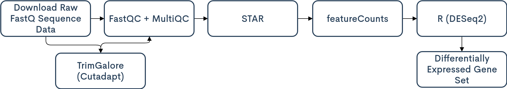

```{=html}
<style type="text/css">
.table {
    width: 80%;
    margin-left: auto;
    margin-right: auto;
}
</style>
```
```{r setup, include=FALSE}
knitr::opts_chunk$set(echo = TRUE, 
                      message = FALSE, 
                      warning = FALSE, 
                      comment = NA)
```

# **Introduction**

In this report, I will be performing a differential expression (DE) analysis of RNA-seq data that has been derived from both Alzheimer's patient and control individual Microglia.

**Graphical Abstract from [Alzheimer's Patient Microglia Exhibit Enhanced Aging and Unique Transcriptional Activation](https://pubmed.ncbi.nlm.nih.gov/32610143/)**

{width="402"}

A brief paragraph summarizing the

-   Scientific background AND/OR

-   Why that particular question is interesting

    -   **Cite at least 3-5 papers**

-   Clearly state the question you're going to investigate as well as the specific hypothesis you set out to test

Alzheimer's is an important disesease to study as so many people experience issues related to Alzheimer's, as well as how reserach has sort of stagnated as it has not been a largely profitable model to study recently, and the paper that I am going off of is very recent on June 30th 2020.

**Publication**: [Alzheimer's Patient Microglia Exhibit Enhanced Aging and Unique Transcriptional Activation](https://pubmed.ncbi.nlm.nih.gov/32610143/)

This study is very relevant as examined the expression of twenty-five genes known orpostulated to be associated with AD risk or progression and found that most AD risk genes in their cell types purified from frozen brain tissues showed preferential expression in microglia compared with other brain cell types. They have also examined whether any of these genes displayed altered expression levels in AD versus control cells, and observed that APOE, ABCA7, GPR141, PTK2B, SPI1, and ZYX appeared upregulated in AD microglia, whereas MEF2C appeared downregulated (un-adjusted p value \< 0.05).

My aim is to recapitulate the author's results (being that the prior mentioned set of genes **is** indeed upgregulaed in AD patient microglia in comparison to controls) while holding this data to very high standards of quality control, and making use of the industry-standard splice-aware RNA-seq aligner `STAR` and differential expression profiling tool `DESeq2`.

**More scientific background and paper-citing here**

APOE -- Michaelson, D.M., APOE epsilon4: the most prevalent yet understudied risk factor for Alzheimer's disease. Alzheimers Dement, 2014. 10(6): p. 861-8.

[What APOE Means for Your Health](https://www.alzdiscovery.org/cognitive-vitality/blog/what-apoe-means-for-your-health#ref-2)

-   Alzheimer's studies have proven to be difficult
-   This is a large dataset that is well annotated

# **Results**

**Key Insights**:

**Possibly include the final volcano plot / gene list table with p-values here (should help readability and eye appeal)**

```{r}
## TODO: read in previously written out gene-list data frame with p-values
```

-   The key set of genes (**gene list here**) **was** / **was not** found to be enriched in this cohort's AD vs Control Microglia derived tissue.

**Possible future experiments / analyses**:

-   Evaluating all cell types
-   More / better data
-   Include more analysis of genes from literature

Another brief paragraph summarizing:

-   key insights

-   possible future experiments

-   possible future analyses that might enhance your own analysis.

-   Discussion of the limits that your data set has!

-   Dataset is from frozen tissue, and upon further analysis it seemed as if a lot of Mitochondrial RNA and long Non-coding RNAs (which degrade slower) were more present than other transcripts

-   Lead to me having to filter my dataset to only protein coding genes in order to get decent normalization across all samples in the project.

-   A few of the samples were not annotated with sex, causing me to not use this data as I would like to control for this possibly confounding factor.

# **Methods**



## **Downloads**

### **Data Background**

Information the `fastq` files used in this study can be found [here](https://www.ncbi.nlm.nih.gov/Traces/study/?page=3&acc=PRJNA515044&o=diagnosis_sam_s%3Ad%253Bacc_s%3Bacc_s%3Aa) as well as [NCBI GEO](https://www.ncbi.nlm.nih.gov//geo/query/acc.cgi?acc=GSE125050)

### **Downloading Myeloid/Microglia Data**

For this analysis, I have chosen to proceed with one of the four available cell types, being **myeloid** / microglia cells. However, the script below can be easily be adapted to download all `cell_types` with a simple `for` loop.

```{bash, eval=FALSE}
alzheimers_dataset="/Genomic_Data_Storage/Alzheimers_Project"
mkdir ${alzheimers_dataset}/accession_tables

wget https://raw.githubusercontent.com/jakesauter/Next_Gen_Sequencing_Project/main/accession_tables/Sra_run_table.txt \
    --output-document="${alzheimers_dataset}/accession_tables/Sra_run_table.txt"

unique_cell_types=$(cat ${alzheimers_dataset}/accession_tables/Sra_run_table.txt | cut -d',' -f9 | sort | uniq)


cell_type='myeloid'
echo "Downloading dat for cell type: ${cell_type}"
output_dir=${alzheimers_dataset}/${cell_type}_fastq_files
acc_nums=$(cat ${alzheimers_dataset}/accession_tables/Sra_run_table.txt | grep $cell_type | cut -d',' -f1)

for acc_num in "${acc_nums[@]}" ; do 
  fasterq-dump --outdir $output_dir $acc_num
  gzip ${output_dir}/${acc_num}.fastq

```

Note that for microglia data specifically, author's have included the following table, found in the `Experimental model and subject details` section of the publication:


### **Downloading STAR resources**

In order to generate a `STAR` index for later mapping, we will first need to download the human reference genome, as well as the human reference annotation of genes that is compatible with this version of the human reference genome. More background on `STAR` is provided later in this report.

```{bash, eval=FALSE}
mkdir human_genome_38
cd human_genome_38
wget ftp://hgdownload.cse.ucsc.edu/goldenPath/hg38/bigZips/hg38.fa.gz
wget ftp://ftp.ebi.ac.uk/pub/databases/gencode/Gencode_human/release_36/gencode.v36.annotation.gtf.gz
gunzip * 
```

Now that we have both the reference genome and our features of interest, we can generate our `STAR` index using the command below, saving our index to the `--genomeDir` directory of `human_genome_38_STAR_index`.

```{bash, eval=FALSE}
STAR --runMode  genomeGenerate \
--runThreadN 16 \
--genomeDir human_genome_38_STAR_index \
--genomeFastaFiles human_genome_38/hg38.fa \
--sjdbGTFfile human_genome_38/gencode.v36.annotation.gtf.gz \
--sjdbOverhang 49 
```

## **Data Processing**

### **`FastQC` and `MultiQC`**

[FastQC](https://www.bioinformatics.babraham.ac.uk/projects/fastqc/) is an industry standard Next-Generation Sequencing Quality Control tool written and maintained by the Bioinformatics Group at the [Babraham Institute](http://www.babraham.ac.uk/).

We can see the goal and mission of `FastQC` from an excerpt on their [website](https://www.bioinformatics.babraham.ac.uk/projects/fastqc/):

> <font size=2.5> FastQC aims to provide a simple way to do some quality control checks on raw sequence data coming from high throughput sequencing pipelines. It provides a modular set of analyses which you can use to give a quick impression of whether your data has any problems of which you should be aware before doing any further analysis. </font>

`FastQC` in the following analyses will be used for providing a quick, easy to generate overview of FastQ file quality to indicate potential problem areas in the project data, in the form of HTML based permanent reports, containing summary graphs and tables describing different aspects of the input data.

Example [quality control passing](https://www.bioinformatics.babraham.ac.uk/projects/fastqc/good_sequence_short_fastqc.html) and [quality control failing](https://www.bioinformatics.babraham.ac.uk/projects/fastqc/bad_sequence_fastqc.html) can be found on [FastQC's website](https://www.bioinformatics.babraham.ac.uk/projects/fastqc/) as well.

[`MultiQC`](https://multiqc.info/) is a useful tool to use in this context as well, as it is a tool that aggregates results from analyses across many samples (processed by `FastQC` in this case) into a single report. As seen below, the `MultiQC` command is very simple, and if all `FastQC` results are located in the same directory, that directory can be provided as input for `MultiQC` to aggregate all reports in the directory.

**Key FastQC and MultiQC Commands**

```{bash, eval = FALSE}
fastqc $fastq_file --noextract \
     --outdir=$fastqc_outdir \
     --threads=14 \
     $fastq_files

multiqc $fastqc_outdir
```

### **`TrimGalore`**

Found later in this report, after observing the first application of `FastQC` to the raw FastQ data files, highly repeated sequences were found. In order to both detect and remove these sequences from the raw input FastQ data, we can use the [`TrimGalore`](https://www.bioinformatics.babraham.ac.uk/projects/trim_galore/). Also written an maintained by the Bioinformatics Group at the [Babraham Institute](http://www.babraham.ac.uk/).

`TrimGalore` is a wrapper tool, providing the functionality of both `Cutadapt` and `FastQC` to provided adapter trimming and quality control to FastQ files. This report does not make use of the `FastQC` functionality of `TrimGalore` in order to seperate the QC and raw data files in an easier to understand way, calling `FastQC` directly with the required arguments.

**Key TrimGalore Commands**

```{bash, eval=FALSE}
$trim_galore $fastq_files \
--output_dir="${trim_galore_outdir}" \
--cores 14 --phred33 --gzip 
```

### **`STAR`**

With over **16,787** citations on [Google Scholar](https://scholar.google.com/scholar?hl=en&as_sdt=0%2C33&q=+STAR%3A+ultrafast+universal+RNA-seq+aligner+&btnG=), `STAR` (Spliced Transcripts Alignment to a Reference) has proven to be a great tool for RNA-seq alignment.

It is best to first assemble a reference built upon your organism - gene model of interest with `STAR --runMode genomeGenerate`, followed by mapping your RNA-seq reads with `STAR --runMode alignReads`. Durning alignment, `STAR` takes as input single-end or pair-end fastq files, with the output file being in `SAM` (Spliced Alignment/Mapping) format. The `sam` file should then usually be converted into `BAM` (Binary Alignment/Mapping) file, a binary file of sam, for shortening computation time in further analyzing differential expression within RNA-seq data.

**Key STAR Commands**:

Earlier in this report, we have generated our `STAR` reference index with the following command:

```{bash, eval=FALSE}
STAR --runMode  genomeGenerate \
--runThreadN 16 \
--genomeDir human_genome_38_STAR_index \
--genomeFastaFiles human_genome_38/hg38.fa \
--sjdbGTFfile human_genome_38/gencode.v36.annotation.gtf.gz \
--sjdbOverhang 49 
```

Given the raw or adapter-trimmed FastQ files, as well as the reference index we have generated in the previous command, we can align reads in the following way:

```{bash, eval=FALSE}
STAR --runMode  alignReads \
  --runThreadN 12 \
  --genomeDir  human_genome_38_STAR_index \
  --readFilesIn  $fastq_file \
  --readFilesCommand  zcat \
  --outSAMtype  BAM  SortedByCoordinate \
  --outFileNamePrefix $prefix  \
  --outSAMattributes All \
  --outReadsUnmapped="Fastx" \
  --outTmpKeep="None"
```

### **`featureCounts`**

`featureCounts` is an ["efficient general purpose program for assigning sequence reads to genomic features"](https://pubmed.ncbi.nlm.nih.gov/24227677/) and serves as a great [software program developed for counting reads to genomic features such as genes, exons, promoters and genomic bins](http://subread.sourceforge.net/)

**Key featureCounts Command**

```{bash, eval=FALSE}
featureCounts \
-a $annot_file \
-o $out_file \
-T 14 $bam_files
```

### **Data Processing Script**

In the script below, once all of the files are trimmed and saved, `FastQC` (paired with `multiqc` aggregation) is used to facilitate sequence quality control.

**Script for data processing:**

```{bash, eval=FALSE}
#!/bin/bash 

data_storage_dir="/Genomic_Data_Storage/Alzheimers_Project"
trim_galore="/home/t730/TrimGalore/TrimGalore-0.6.6/trim_galore"

cell_type="myeloid"
fastq_files=$(ls "${data_storage_dir}/${cell_type}_fastq_files"/*.fastq.gz)

trim_galore_outdir="${data_storage_dir}/trimmed_${cell_type}_fastqs"
mkdir $trim_galore_outdir

fastqc_outdir="${data_storage_dir}/trimmed_${cell_type}_fastqc"
mkdir $fastqc_outdir

$trim_galore $fastq_files \
--output_dir="${trim_galore_outdir}" \
--cores 14 --phred33 --gzip 

trimmed_files=$(ls $trim_galore_outdir/*.fq.gz)

fastqc $trimmed_files \
--outdir=$fastqc_outdir \
--threads=14 --noextract

cd $fastqc_outdir
multiqc .

for fastq_file in $trimmed_files; do
  base=$(basename $fastq_file)
  prefix=$(echo $fastq_file | egrep -o "SRR[0-9]+")
  prefix="trimmed_${cell_type}_alignments/${prefix}_trimmed."
  
  STAR --runMode  alignReads \
  --runThreadN 12 \
  --genomeDir  human_genome_38_STAR_index \
  --readFilesIn  $fastq_file \
  --readFilesCommand  zcat \
  --outSAMtype  BAM  SortedByCoordinate \
  --outFileNamePrefix $prefix  \
  --outSAMattributes All \
  --outReadsUnmapped="Fastx" \
  --outTmpKeep="None"
  
  samtools index ${prefix}.Aligned.sortedByCoord.out.bam
done

annot_file=${data_storage_dir}/human_genome_38/gencode.v36.annotation.gtf
out_dir=${data_storage_dir}/featureCounts
alignment_dir=${data_storage_dir}/trimmed_${cell_type}_alignments
out_file=${out_dir}/featCounts_genes.txt
bam_files=$(ls ${alignment_dir}/SRR???????_trimmed.Aligned.sortedByCoord.out.bam)

mkdir $out_dir

featureCounts \
-a $annot_file \
-o $out_file \
-T 14 $bam_files
```

[Trimmed MultiQC HTML Report](https://jakesauter.github.io/Next_Gen_Sequencing_Project/trimmed_myeloid_multiqc_report.html)

## **Quality Control**

### **`FastQC` Raw Data QC**

Signs of cyclic GC content for some runs are present in the dataset, however fastq tile coordinates **are not available** in the GEO dataset to allow for selective tile filtering ([Github issue showing why SRA may not store this information](https://github.com/ncbi/sra-tools/issues/130)). Particularly these issues were seen in three of the samples, with the effects occurring with varying degree. These samples were

-   `SRR8440539` [FastQC Report](https://jakesauter.github.io/Next_Gen_Sequencing_Project/SRR8440539_fastqc.html)
-   `SRR8440524` [FastQC Report](https://jakesauter.github.io/Next_Gen_Sequencing_Project/SRR8440524_fastqc.html)
-   `SRR8440538` [FastQC Report](https://jakesauter.github.io/Next_Gen_Sequencing_Project/SRR8440538_fastqc.html)

An example of this failing behavior:

{width="50%"}

### **`STAR` Alignment QC**

In order to determine the percentage of reads mapped, we have used the `--outReadsUnmapped="Fastx"` parameter while running `STAR`, and now can compare the number of reads in our mapped files, versus the number of reads in our unmapped files. A `bash` function for performing this operation (`calculate_unampped_reads`) is applied to all of the `BAM` files generated in the `STAR` alignment phase of the report.

```{bash, eval=FALSE}
#!/bin/bash

data_storage_dir=/Genomic_Data_Storage/Alzheimers_Project

trim_fastq_dir=${data_storage_dir}/trimmed_myeloid_fastqs
trim_align_dir=${data_storage_dir}/trimmed_myeloid_alignments
bam_files=$(ls ${data_storage_dir}/trimmed_myeloid_alignments/*.bam)
parallel_tmp_dir=$(mktemp -d)

calculate_unampped_reads() {
  base=$(basename $1)
  prefix=$(echo $base | egrep -o "SRR[0-9]+")
  
  unammped_reads_file=${trim_align_dir}/${prefix}_trimmed.Unmapped.out.mate1
  total_reads_file=${trim_fastq_dir}/${prefix}_trimmed.fq.gz
  num_lines=$(cat $unammped_reads_file | wc -l)
  num_total_lines=$(zcat $total_reads_file | wc -l)
  perc_unmapped_reads=$(echo -e "(${num_lines}/${num_total_lines})*100" | bc -l | xargs printf %.2f)
  echo -e "Percentage of unmapped reads for ${prefix}: ${perc_unmapped_reads}%" > ${parallel_tmp_dir}/${prefix}.out
}

for bam_file in $bam_files; do
  calculate_unampped_reads $bam_file &
done 

cat $parallel_tmp_dir/*.out
```

Results of executing this code can be found below.

```{bash, eval=FALSE}
Percentage of unmapped reads for SRR8440443: 5.90%
Percentage of unmapped reads for SRR8440447: 4.17%
Percentage of unmapped reads for SRR8440448: 4.04%
Percentage of unmapped reads for SRR8440449: 8.38%
Percentage of unmapped reads for SRR8440463: 33.79%
Percentage of unmapped reads for SRR8440477: 5.14%
Percentage of unmapped reads for SRR8440482: 6.54%
Percentage of unmapped reads for SRR8440484: 3.65%
Percentage of unmapped reads for SRR8440486: 8.13%
Percentage of unmapped reads for SRR8440488: 5.19%
Percentage of unmapped reads for SRR8440501: 6.98%
Percentage of unmapped reads for SRR8440511: 5.47%
Percentage of unmapped reads for SRR8440513: 6.79%
Percentage of unmapped reads for SRR8440514: 4.97%
Percentage of unmapped reads for SRR8440517: 5.76%
Percentage of unmapped reads for SRR8440518: 5.02%
Percentage of unmapped reads for SRR8440524: 11.28%
Percentage of unmapped reads for SRR8440525: 9.51%
Percentage of unmapped reads for SRR8440527: 7.05%
Percentage of unmapped reads for SRR8440529: 6.67%
Percentage of unmapped reads for SRR8440531: 10.64%
Percentage of unmapped reads for SRR8440536: 7.61%
Percentage of unmapped reads for SRR8440538: 7.43%
Percentage of unmapped reads for SRR8440539: 12.34%
Percentage of unmapped reads for SRR8440542: 8.16%
```

From the above output, we see that `SRR8440463` as an unusually high amount of unmapped reads compared to all other samples in the study. When cross-referenceing our previously generated `MultiQC` report from earlier, we can see that the GC content of this sample appears to be off compared to all other samples as well, possibly indicating contamination or other library quality issues.


**Problematic cyclic GC samples from before**: `SRR8440524`, `SRR8440538`, and `SRR8440539` **NOT** `SRR8440463` that we see with GC-rich contamination above.

**FastQC Reports**:

-   [SRR8440524_fastqc.html](https://jakesauter.github.io/Next_Gen_Sequencing_Project/SRR8440524_fastqc.html)
-   [SRR8440538_fastqc.html](https://jakesauter.github.io/Next_Gen_Sequencing_Project/SRR8440538_fastqc.html)
-   [SRR8440539_fastqc.html](https://jakesauter.github.io/Next_Gen_Sequencing_Project/SRR8440539_fastqc.html)
-   [SRR8440463_fastqc.html](https://jakesauter.github.io/Next_Gen_Sequencing_Project/SRR8440463_fastqc.html)

We will keep these QC issues in mind moving forward, and remove the samples before analysis in `R`.

## **Data Analysis**

### **`DESeq2` Analysis of `featureCounts` Results**

Below we will use the `DESeq2` R package to make a `DESeqDataSet` from our resultant files from running featureCounts. At this step, I have chosen to remove our **4** samples with QC issues after preliminary analysis, as well as another **4** samples for having an undefined value (`NA`) for the **sex** attribute, a possible confounder analyzed in this report.

**Required Libraries**:

```{r}
library(tidyr)        # pivot_longer
library(knitr)        # Rmarkdown chunk options and kable
library(dplyr)        # filter, summarise
library(DESeq2)       # EDS and DE
library(ggplot2)      # Plotting
library(stringr)      # String searching and extraction
library(magrittr)     # Piping
library(patchwork)    # Image layout
library(plyranges)    # gtf file manipulation
library(rtracklayer)  # gtf file manipulation
```

```{r, echo=FALSE}
filter <- dplyr::filter
select <- dplyr::select
```

**Importing `featureCounts` Data into `DESeq2`**

```{r}
read_counts <- read.table(
  '../featCounts/featCounts_genes.txt', 
  header = TRUE, stringsAsFactors = FALSE) 

orig_names <- colnames(read_counts)
colnames(read_counts) <- gsub(".*(SRR[0-9]+).*", "\\1", orig_names)
row.names(read_counts) <- make.names(read_counts$Geneid)
read_counts <- read_counts[,-c(1:6)]
read_counts <- as.matrix(read_counts)
```

**Filtering failed QC Samples**

```{r}
keep_samples <- 
  colnames(read_counts) %in% 
  c('SRR8440524', 'SRR8440463',
    'SRR8440538', 'SRR8440539', 
    "SRR8440484", "SRR8440488", 
    "SRR8440447", "SRR8440517"
    ) %>% 
  not()

read_counts <- 
  read_counts[ , keep_samples]

read_counts %>% 
  .[1:4, 1:5] %>% 
  kable()    
```

**Converting gene count Ensembl IDs to cannoncical gene names using gene-data from gtf files**

**NOTE**: Below we are filtering for only protein-coding genes for proper size-factor normalization results, though

**NOTE** : Some gencode ids map to the same gene symbol

**TODO**: Peform parallel analysis for long-non-coding RNAs or incoroporate into this analysis?

```{r}
genes_df <- 
  read_gff("../gtf/gencode.v36.annotation.gtf.gz", 
           genome_info="hg38") %>% 
  select(gene_id, gene_type, gene_name) %>% 
  as.data.frame()


gene_info_df <-
  data.frame(gencode_id = rownames(read_counts)) %>% 
  left_join(., genes_df, 
            by = c('gencode_id' = 'gene_id')) %>% 
  select(gencode_id, gene_name, gene_type) %>% 
  filter(#not(gene_type %in% c('lncRNA', 'Mt_rRNA', 'Mt_tRNA')), 
         # TODO: going to move forward with only protein coding genes
         #      genes for now as long-non-coding RNAs and MT-rna
         #      seem to really be messing up my sizefactor normalization
         gene_type == 'protein_coding',
         !str_detect(gene_name, '^MT-')) %>%
  distinct() 

read_counts <- 
  read_counts[gene_info_df$gencode_id, ]
```

**Filtering mitochondrial reads**

Now that we have our raw read counts, lets gather information about our samples to supply to the `colData` parameter of `DESeqDataSetFromMatrix`.

```{r}
accession_table <-
  read.table('../accession_tables/Sra_run_table.txt', 
             header = TRUE, sep = ',', stringsAsFactors = FALSE) %>% 
  as.data.frame() %>% 
  filter(Cell_type == 'myeloid', 
         !is.na(sex)) %>% 
  select(Run, Diagnosis, sex,
                expired_age, APOE, pmi, 
                Cell_type) %>%
  arrange(Diagnosis, sex)

accession_table %>% 
  kable()
```

From this accession table, we can map our accession ids to any clinical variable we like, such as `Diagnosis`, which is our main experimental group condition in this analysis. `Diagnosis` in our case tells us whether or not the diseased patient showed signs of Alzheimer's disease or not (control).

```{r}
conditions <- 
  colnames(read_counts) %>% 
  lapply(function(run_name) 
      accession_table[accession_table['Run'] == run_name, ]) %>% 
  bind_rows() 


sample_info <-
  DataFrame(conditions,
            row.names = conditions$Run)


DESeq.ds <- 
  DESeqDataSetFromMatrix(
    countData = as.matrix(read_counts),
    colData = sample_info,
    rowData = gene_info_df, 
    design = ~ sex + Diagnosis)

DESeq.ds %>% 
  colData() %>% 
  head() %>% 
  kable()
```

```{r}
DESeq.ds %>% 
  counts() %>% 
  head() %>% 
  .[,1:5] %>% 
  kable()
```

**Read Mapping Quality Assessment**

**Number of reads sequenced per sample**

```{r}
colSums(counts(DESeq.ds)) %>% 
  data.frame(sample = str_extract(names(.), '[0-9]{3}$'), reads = .) %>% 
  ggplot() + 
  geom_col(aes(x = sample, y = reads)) + 
  theme(axis.text.x = element_text(angle=-35))
```

Moving forward, we will filter our `DESeqDataSet` as to only include genes that have a read mapped for at least one sample.

```{r}
n_previous_genes <- nrow(DESeq.ds)
keep_genes <- rowSums(counts(DESeq.ds)) > 0
DESeq.ds <- DESeq.ds[keep_genes, ]

cat(n_previous_genes - nrow(DESeq.ds), 'genes removed due to no non-zero counts found')
```

**Normalizing read counts for Sequencing Depth**

```{r}
DESeq.ds <- estimateSizeFactors(DESeq.ds)

plot(sizeFactors(DESeq.ds), colSums(counts(DESeq.ds)), 
     ylab = 'library sizes', xlab = 'size factors')
```

From the plot above, we can see that our key necessary assumption that *size factors should be around 1 and scale with number of reads per sample** is met. However, this was not originally the case before some data filtering. 

```{r, echo = FALSE, fig.width = 10}
par(mfrow = c(1, 3))

raw_read_counts <- read.table(
  '../featCounts/featCounts_genes.txt', 
  header = TRUE, stringsAsFactors = FALSE)

orig_names <- colnames(raw_read_counts)
colnames(raw_read_counts) <- gsub(".*(SRR[0-9]+).*", "\\1", orig_names)
row.names(raw_read_counts) <- make.names(raw_read_counts$Geneid)
raw_read_counts <- raw_read_counts[,-c(1:6)]

raw_read_counts <- 
  raw_read_counts[ , keep_samples]

raw_gene_info_df <-
  data.frame(gencode_id = rownames(raw_read_counts)) %>% 
  left_join(., genes_df, 
            by = c('gencode_id' = 'gene_id')) %>% 
  select(gencode_id, gene_name, gene_type) %>% 
  # filter(!str_detect(gene_name, '^MT-')) %>%
  distinct()

raw_read_counts <- 
  as.matrix(raw_read_counts)

rownames(raw_read_counts) <- 
        raw_gene_info_df$gene_name

raw_conditions <- 
  colnames(raw_read_counts) %>% 
  lapply(function(run_name) 
      accession_table[accession_table['Run'] == run_name, ]) %>% 
  bind_rows() 

raw_sample_info <-
  DataFrame(raw_conditions,
            row.names = raw_conditions$Run)

DESeq.ds.raw_1 <- 
  DESeqDataSetFromMatrix(
    countData = as.matrix(raw_read_counts),
    colData = raw_sample_info,
    rowData = raw_gene_info_df, 
    design = ~ sex + sex:Diagnosis + Diagnosis)

keep_genes <- rowSums(counts(DESeq.ds.raw_1)) > 0

DESeq.ds.raw_1 <- estimateSizeFactors(DESeq.ds.raw_1)

plot(sizeFactors(DESeq.ds.raw_1), colSums(counts(DESeq.ds.raw_1)), 
     ylab = 'library sizes', xlab = 'size factors', main = "Before Filtering Mitochondrial")


###################################################################

raw_read_counts <- read.table(
  '../featCounts/featCounts_genes.txt', 
  header = TRUE, stringsAsFactors = FALSE)

orig_names <- colnames(raw_read_counts)
colnames(raw_read_counts) <- gsub(".*(SRR[0-9]+).*", "\\1", orig_names)
row.names(raw_read_counts) <- make.names(raw_read_counts$Geneid)
raw_read_counts <- raw_read_counts[,-c(1:6)]

raw_read_counts <- 
  raw_read_counts[ , keep_samples]

raw_gene_info_df <-
  data.frame(gencode_id = rownames(raw_read_counts)) %>% 
  left_join(., genes_df, 
            by = c('gencode_id' = 'gene_id')) %>% 
  select(gencode_id, gene_name, gene_type) %>% 
  filter(!str_detect(gene_name, '^MT-')) %>%
  distinct()

raw_read_counts <- 
  raw_read_counts[raw_gene_info_df$gencode_id, ]

raw_read_counts <- 
  as.matrix(raw_read_counts)

rownames(raw_read_counts) <- 
        raw_gene_info_df$gene_name
 
raw_conditions <- 
  colnames(raw_read_counts) %>% 
  lapply(function(run_name) 
      accession_table[accession_table['Run'] == run_name, ]) %>% 
  bind_rows() 

raw_sample_info <-
  DataFrame(raw_conditions,
            row.names = raw_conditions$Run)

DESeq.ds.raw_2 <- 
  DESeqDataSetFromMatrix(
    countData = as.matrix(raw_read_counts),
    colData = raw_sample_info,
    rowData = raw_gene_info_df, 
    design = ~ sex + sex:Diagnosis + Diagnosis)

keep_genes <- rowSums(counts(DESeq.ds.raw_2)) > 0

DESeq.ds.raw_2 <- estimateSizeFactors(DESeq.ds.raw_2)

plot(sizeFactors(DESeq.ds.raw_2), colSums(counts(DESeq.ds.raw_2)), 
     ylab = 'library sizes', xlab = 'size factors', main = "Filtering Mitochondrial")

###################################################################

plot(sizeFactors(DESeq.ds), colSums(counts(DESeq.ds)), 
     ylab = 'library sizes', xlab = 'size factors', 
     main = 'Filtering Mitochondrial and Non-Protein Coding')
```


```{r, fig.width = 10}
p1 <-
  DESeq.ds %>% 
  counts() %>% 
  {. + 1} %>% 
  log2() %>% 
  as.data.frame() %>% 
  pivot_longer(cols = everything()) %>%
  mutate(name = str_extract(name, '[0-9]{3}$')) %>% 
  ggplot() + 
    geom_boxplot(aes(x = name, y = value)) +
    ggtitle("Non-normalized read counts") +
    xlab('Sample') + ylab("log2(read counts + 1)") + 
    theme(axis.text.x = element_text(angle = -30))


p2 <-
  DESeq.ds %>% 
  counts(normalize= TRUE) %>% 
  {. + 1} %>% 
  log2() %>% 
  as.data.frame() %>% 
  pivot_longer(cols = everything()) %>%
  mutate(name = str_extract(name, '[0-9]{3}$')) %>% 
  ggplot() + 
    geom_boxplot(aes(x = name, y = value)) +
    ggtitle("Size-factor-normalized read counts") +
    xlab('Sample') + ylab("log2(read counts + 1)") + 
    theme(axis.text.x = element_text(angle = -30))

p1 + p2
```

Again, this section has influenced the filtering I have applied


**No Gene Filtering Applied**

```{r, echo = FALSE}
p3 <-
  DESeq.ds.raw_1 %>% 
  counts() %>% 
  {. + 1} %>% 
  log2() %>% 
  as.data.frame() %>% 
  pivot_longer(cols = everything()) %>%
  mutate(name = str_extract(name, '[0-9]{3}$')) %>% 
  ggplot() + 
    geom_boxplot(aes(x = name, y = value)) +
    ggtitle("Non-normalized read counts") +
    xlab('Sample') + ylab("log2(read counts + 1)") + 
    theme(axis.text.x = element_text(angle = -30))


p4 <-
  DESeq.ds.raw_1 %>% 
  counts(normalize= TRUE) %>% 
  {. + 1} %>% 
  log2() %>% 
  as.data.frame() %>% 
  pivot_longer(cols = everything()) %>%
  mutate(name = str_extract(name, '[0-9]{3}$')) %>% 
  ggplot() + 
    geom_boxplot(aes(x = name, y = value)) +
    ggtitle("Size-factor-normalized read counts") +
    xlab('Sample') + ylab("log2(read counts + 1)") + 
    theme(axis.text.x = element_text(angle = -30))

p3 + p4
```


**Mitchondrial Gene Filtering Applied**

```{r, echo = FALSE}
p5 <-
  DESeq.ds.raw_2 %>% 
  counts() %>% 
  {. + 1} %>% 
  log2() %>% 
  as.data.frame() %>% 
  pivot_longer(cols = everything()) %>%
  mutate(name = str_extract(name, '[0-9]{3}$')) %>% 
  ggplot() + 
    geom_boxplot(aes(x = name, y = value)) +
    ggtitle("Non-normalized read counts") +
    xlab('Sample') + ylab("log2(read counts + 1)") + 
    theme(axis.text.x = element_text(angle = -30))


p6 <-
  DESeq.ds.raw_2 %>% 
  counts(normalize= TRUE) %>% 
  {. + 1} %>% 
  log2() %>% 
  as.data.frame() %>% 
  pivot_longer(cols = everything()) %>%
  mutate(name = str_extract(name, '[0-9]{3}$')) %>% 
  ggplot() + 
    geom_boxplot(aes(x = name, y = value)) +
    ggtitle("Size-factor-normalized read counts") +
    xlab('Sample') + ylab("log2(read counts + 1)") + 
    theme(axis.text.x = element_text(angle = -30))

p5 + p6
```

**Mitchondrial and Non Protein-Coding Filtering Applied**

```{r, echo = FALSE}
p1 + p2
```


```{r}
DESeq.rlog <- rlog(DESeq.ds, blind = TRUE)

log.norm.counts <-
  DESeq.ds %>% 
  counts(normalized=TRUE) %>% 
  {.+1} %>% 
  log2()


p1 <-
  data.frame('SRR8440518' = log.norm.counts[,'SRR8440518'], 
           'SRR8440529' = log.norm.counts[,'SRR8440529']) %>% 
  ggplot() + 
  geom_point(aes(x = SRR8440518, y = SRR8440529), 
             alpha = 0.01) + 
  geom_abline(slope = 1, intercept = 0, 
              lty = 2, col = 'red') + 
  ggtitle("size factor and log2-transformed") + 
  xlab('SRR8440518') + ylab('SRR8440529')

## the rlog-transformed counts are stored in the accessor "assay"
p2 <-
  data.frame('SRR8440518' = assay(DESeq.rlog)[,'SRR8440518'], 
           'SRR8440529' = assay(DESeq.rlog)[,'SRR8440529']) %>% 
  ggplot() + 
  geom_point(aes(x = SRR8440518, y = SRR8440529), 
             alpha = 0.01) + 
  geom_abline(slope = 1, intercept = 0, 
              lty = 2, col = 'red') + 
  ggtitle("rlog transformed") + 
  xlab('SRR8440518') + ylab('SRR8440529') 


p1 + p2

```

**Mean vs Stdev before and after `rlog`**

```{r}
par(mfrow = c(1, 2))

log.norm.counts <- 
  DESeq.ds %>% 
  counts(normalized=TRUE) %>% 
  log2()

par(mfrow=c(1,1))

msd_plot <- 
  vsn::meanSdPlot(log.norm.counts,
                  ranks=FALSE, 
                  plot=FALSE)
msd_plot$gg + 
  ggtitle("Sequencing depth normalized log2(read counts)") + 
  ylab("standard deviation")

rlog.norm.counts <- 
  DESeq.rlog %>% 
  assay()

msd_plot <- 
  vsn::meanSdPlot(rlog.norm.counts, 
                  ranks=FALSE, 
                  plot = FALSE)

msd_plot$gg + 
  ggtitle("rlog transformation") + 
  coord_cartesian(ylim = c(0,3))
```

### **Possible Confounders**

> <font size=2.5> To maximize the likelihood of observing differences between AD and control, we selectedonly AD specimens with high scores for amyloid and tau neuro-pathology in frontal cortex, and we selected only control specimens with negligible amounts of these pathologies in this region (see sample metadata in Data S2). AD and control groups had roughly matching distributions of age, sex, and post-mortem interval (PMI). <font>

-- [Alzheimer's Patient Microglia Exhibit Enhanced Aging and Unique Transcriptional Activation](https://pubmed.ncbi.nlm.nih.gov/32610143/)

-   **APOE**:

> <font size=2.5> There are three types of the APOE gene, called alleles: APOE2, E3 and E4. Everyone has two copies of the gene and the combination determines your APOE "genotype"---E2/E2, E2/E3, E2/E4, E3/E3, E3/E4, or E4/E4. The E2 allele is the rarest form of APOE and carrying even one copy appears to reduce the risk of developing Alzheimer's by up to 40%. APOE3 is the most common allele and doesn't seem to influence risk. The APOE4 allele, present in approximately 10-15% of people, increases the risk for Alzheimer's and lowers the age of onset. Having one copy of E4 (E3/E4) can increase your risk by 2 to 3 times while two copies (E4/E4) can increase the risk by 12 times [2]. </font>

-- [What APOE Means for Your Health](https://www.alzdiscovery.org/cognitive-vitality/blog/what-apoe-means-for-your-health#ref-2)

-   **Post-Mortem Interval (PMI)** --

-   **Expired Age**

```{r}
# TODO: histograms p1 + p2 with 
# p1 = histogram of age in controls 
# p2 = histogram of age in AD 
```

-   **Sex**

```{r}
# TODO: How many males/females in control vs AD? 
```

**Male vs Female Counfounding Analysis**

First in order to check that there isn't large differences between our male and female patient cohorts, we will generate a correlation heatmap using Pearson correlation.

The table you will see below will be in the following format

```{=html}
<style type="text/css">
.table {
    margin-left: 20%;
    width: 30%;
    margin-right: auto;
}
</style>
```
```{r, echo=FALSE}
data.frame(x = c('Heatmap will all genes', 'PCA with all genes'), 
           y = c('Heatmap with selected genes', 'PCA with selected genes')) %>% 
  set_colnames(c('All Genes', '500 Most Variable Genes')) %>% 
  kable()
```

```{=html}
<style type="text/css">
.table {
    width: 80%;
    margin-left: auto;
    margin-right: auto;
}
</style>
```


```{r}
par(mfrow = c(2, 2))

most_variable_genes <-
  assay(DESeq.rlog) %>%  
  apply(1, var) %>% 
  sort(decreasing = TRUE) %>% 
  names(.) %>% 
  head(500)

rlog_corr_coeff <- 
  DESeq.rlog %>% 
  assay() %>% 
  cor(method = "pearson") 

selected_genes_rlog_corr_coeff <- 
  DESeq.rlog %>% 
  subset(rownames(.) %in% most_variable_genes) %>% 
  assay() %>% 
  cor(method = "pearson") 

new_names <-
  rownames(rlog_corr_coeff) %>% 
  sapply(function(run_name) 
    accession_table[accession_table['Run'] == run_name, 'sex']) %>% 
  {paste0(., '_', str_extract(names(.), '[0-9]{3}$'))}

rlog_corr_coeff <- 
  rlog_corr_coeff %>% 
  set_rownames(new_names) %>% 
  set_colnames(new_names)
  
new_names <-
  rownames(selected_genes_rlog_corr_coeff) %>% 
  sapply(function(run_name) 
    accession_table[accession_table['Run'] == run_name, 'sex']) %>% 
  {paste0(., '_', str_extract(names(.), '[0-9]{3}$'))}

selected_genes_rlog_corr_coeff <- 
  selected_genes_rlog_corr_coeff %>% 
  set_rownames(new_names) %>% 
  set_colnames(new_names)
```

Now that we have our `rlog_corr_coeff` and `selected_genes_rlog_corr_coeff` variables, we can plot our results side-by-side below.

```{r, fig.show='hold', out.width="50%"}
rlog_corr_coeff %>% 
  {as.dist(1-., upper = TRUE)} %>%
  as.matrix %>% 
  pheatmap::pheatmap(., main = "Pearson correlation")

selected_genes_rlog_corr_coeff %>% 
  {as.dist(1-., upper = TRUE)} %>%
  as.matrix %>% 
  pheatmap::pheatmap(., main = "Pearson correlation")

DESeq.rlog %>% 
  plotPCA(intgroup = 'sex')

DESeq.rlog %>%
  subset(rownames(.) %in% most_variable_genes) %>% 
  plotPCA(intgroup = 'sex')
```

```{r, fig.show='hold', fig.height = 4, fig.width=10}

par(mfrow = c(1, 2), 
    mar = c(1, 3, 1, 3))

rlog_corr_coeff %>% 
  {as.dist(1-.)} %>% 
  hclust() %>%
  plot(., 
       main = "rlog transformed read counts", 
       xlab = "", ylab = "")

selected_genes_rlog_corr_coeff %>% 
  {as.dist(1-.)} %>% 
  hclust() %>%
  plot(., 
       main = "rlog transformed read counts", 
       xlab = "",  ylab = "")
```

We now see a much clearer distinction between clinical groups.

We don't see males and females clustering too closely together here, showing support that sex should not be a confounding factor moving forward.

### **Control vs AD Group Analysis**

**AD vs Control Correlation Heatmap** We can now generate the same Pearson correlation heatmap from above, though this time seperating by our true varible of interest: AD vs Control.

column 1: all genes column 2: selected genes row 1: heatmap row 2: pca

```{r}
par(mfrow = c(2, 2))

rlog_corr_coeff <- 
  DESeq.rlog %>% 
  assay() %>% 
  cor(method = "pearson") 

selected_genes_rlog_corr_coeff <- 
  DESeq.rlog %>% 
  subset(rownames(.) %in% most_variable_genes) %>% 
  assay() %>% 
  cor(method = "pearson") 

new_names <-
  rownames(rlog_corr_coeff) %>% 
  sapply(function(run_name) 
    accession_table[accession_table['Run'] == run_name, 'Diagnosis']) %>% 
  {paste0(., '_', str_extract(names(.), '[0-9]{3}$'))}

rlog_corr_coeff <- 
  rlog_corr_coeff %>% 
  set_rownames(new_names) %>% 
  set_colnames(new_names)
  
new_names <-
  rownames(selected_genes_rlog_corr_coeff) %>% 
  sapply(function(run_name) 
    accession_table[accession_table['Run'] == run_name, 'Diagnosis']) %>% 
  {paste0(., '_', str_extract(names(.), '[0-9]{3}$'))}

selected_genes_rlog_corr_coeff <- 
  selected_genes_rlog_corr_coeff %>% 
  set_rownames(new_names) %>% 
  set_colnames(new_names)
```

Now that we have our `rlog_corr_coeff` and `selected_genes_rlog_corr_coeff` variables, we can plot our results side-by-side below.

```{r, fig.show='hold', out.width="50%"}
rlog_corr_coeff %>% 
  {as.dist(1-., upper = TRUE)} %>%
  as.matrix %>% 
  pheatmap::pheatmap(., main = "Pearson correlation")

selected_genes_rlog_corr_coeff %>% 
  {as.dist(1-., upper = TRUE)} %>%
  as.matrix %>% 
  pheatmap::pheatmap(., main = "Pearson correlation")

DESeq.rlog %>% 
  plotPCA(intgroup = 'sex')

DESeq.rlog %>%
  subset(rownames(.) %in% most_variable_genes) %>% 
  plotPCA(intgroup = 'sex')
```

```{r, fig.show='hold', fig.height = 4, fig.width=10}

par(mfrow = c(1, 2), 
    mar = c(1, 3, 1, 3))

rlog_corr_coeff %>% 
  {as.dist(1-.)} %>% 
  hclust() %>%
  plot(., 
       main = "rlog transformed read counts", 
       xlab = "", ylab = "")

selected_genes_rlog_corr_coeff %>% 
  {as.dist(1-.)} %>% 
  hclust() %>%
  plot(., 
       main = "rlog transformed read counts", 
       xlab = "",  ylab = "")
```

### **Differential Expression Analysis**

[Good DESeq2 differential expression tutorial](https://dputhier.github.io/jgb71e-polytech-bioinfo-app/practical/rna-seq_R/rnaseq_diff_Snf2.html)

```{r}
# determine DE genes
DESeq.ds <- DESeq(DESeq.ds)

DGE.results <-
  results(DESeq.ds, # extract gene-wise metrics
          independentFiltering = TRUE, 
          alpha = 0.05)


# shrink logFC values
DGE.results <-
  lfcShrink(DESeq.ds, 
            coef = length(resultsNames(DESeq.ds)), 
            res = DGE.results,
            # BiocManager::install('apeglm')
            type = "apeglm")

DGEgenes <- 
  DGE.results %>% 
  subset(padj < 0.05) %>% 
  rownames()

head(DGEgenes)
```

```{r}
dds.disp <- estimateDispersions(DESeq.ds)
plotDispEsts(dds.disp)
```

[A great resource about how to interpret this plot](https://hbctraining.github.io/DGE_workshop/lessons/04_DGE_DESeq2_analysis.html)

We see that there 

```{r}
waldTestResult <- nbinomWaldTest(dds.disp)

resultDESeq2 <- 
          results(waldTestResult,
                   alpha = 0.05, 
                   pAdjustMethod="BH")

ensembl_id_to_gene_symbol <- 
  function(ensembl_id) {
    gene_info_df %>% 
      .[.$gencode_id == ensembl_id, 
        'gene_name'] 
  }


resultDESeq2 %>% 
  .[order(.$padj), ] %>% 
  head() %>% 
  set_rownames(sapply(rownames(.), 
                      ensembl_id_to_gene_symbol)) %>% 
  kable()

```

```{r, fig.width=10}
p1 <- resultDESeq2 %>% 
  as.data.frame() %>% 
  filter(padj <= 0.99) %>% 
  ggplot() + 
    geom_histogram(aes(x = padj), 
                   color = 'black', 
                   fill = 'skyblue') + 
    xlab('Nominal P-value') + 
    ylab('Number of genes') + 
    ggtitle('DESeq2 P-value Distribution [0-0.99]')

p2 <- resultDESeq2 %>% 
  as.data.frame() %>% 
  filter(padj < 0.05) %>% 
  ggplot() + 
    geom_histogram(aes(x = padj), 
                   color = 'black', 
                   fill = 'skyblue') + 
    xlab('Nominal P-value') + 
    ylab('Number of genes') + 
    ggtitle('DESeq2 P-value Distribution [0-0.05]')

p1 + p2
```

```{r}
diff_exp_df <- 
  resultDESeq2 %>% 
  as.data.frame() %>% 
  mutate(gene_name = 
           sapply(rownames(.), ensembl_id_to_gene_symbol)) 

diff_exp_df %>% 
  filter(padj < 0.05) %>% 
  set_rownames(.$gene_name) %>% 
  select(padj, log2FoldChange) %>% 
  arrange(padj) %>% 
  mutate(padj = format(padj, digits = 2, scientific = FALSE), 
         log2FoldChange = format(log2FoldChange, digits = 3)) %>% 
  kable()
```

**Where do the study-selected genes fall in our differential expression table?**

```{r}
study_selected_genes <- c(
    'LOC102724661', 'ANKRD26P3', 'MOV10L1', 'HIST2H2BA', 
    'ZBTB8B', 'GLT1D1', 'TNFRSF21', 'CECR2', 'PDD6IPP2', 
    'PTPRZ1', 'IGSF10', 'GRIA2', 'MEIS1', 'SELENBP1', 
    'SERPINF1', 'RIMS2', 'ASTN1', 'TLN2', 'ZNF532', 
    'ZNF662', 'NIN', 'ULK3', 'SLC38A7', 'FOXP1', 'ARSA', 
    'CTBP1-AS', 'LOC102725328', 'CBX6', 'GYPC', 'FBRSL1', 
    'SMAD7', 'PLXNC1', 'CLDN15', 'TSHZ3', 'KCNJ5', 
    'DPYD', 'STEAP3', 'RUNX3', 'PTPRG', 'ACD', 'TTYH3', 
    'LOC100133445', 'LOC102724549', 'VENTX', 'TM9SF1', 
    'SMIM3', 'ZNF703', 'TGFBI', 'EMP2', 'PSTPIP1', 
    'ZNF696', 'RFX2', 'APOE', 'ATOH8', 'ADAM8', 'GAS2L1', 
    'CHCHD5', 'ADAMTS13', 'A1BG', 'IL15', 'SECTM1', 
    'FAM109A', 'LOC100507639', 'ZNF843', 'S100A4', 'LSR')


diff_exp_df %>%
  filter(gene_name %in% study_selected_genes) %>% 
  # picking top-pvalue ensmbl-gene for each
  # hgnc gene-symbol identified gene
  group_by(gene_name) %>% 
  arrange(pvalue) %>% 
  filter(row_number() == 1) %>% 
  ungroup() %>%
  as.data.frame() %>% 
  set_rownames(.$gene_name) %>% 
  arrange(padj) %>% 
  select(padj, log2FoldChange) %>% 
  mutate(padj = format(padj, digits = 2, scientific = FALSE), 
         log2FoldChange = format(log2FoldChange, digits = 3)) %>%           
  kable()
```


**Which genes have we confirmed from the study-selected genes to be differentially expressed?**

```{r}
diff_exp_df %>% 
  filter(gene_name %in% study_selected_genes, 
         padj < 0.05) %>% 
  .$gene_name %>% unname()
```

```{r, fig.width=11, fig.height=8}
alpha <- 0.05

cols <- densCols(resultDESeq2$log2FoldChange, 
                 -log10(resultDESeq2$padj))

plot(resultDESeq2$log2FoldChange, 
     -log10(resultDESeq2$padj), 
     col=cols, panel.first=grid(),
     main="Differential Expression Volcano plot", 
     xlab="Effect size: log2(fold-change)",
     ylab="-log10(adjusted p-value)",
     pch=resultDESeq2$pch, cex=0.4, 
     xlim = c(-6,6), 
     ylim = c(0, 1.05 * 
                max(-log10(resultDESeq2$padj), 
                  na.rm = TRUE))
     )

abline(v=0)
abline(v=c(-2,2), lty = 2, col = 'red')
abline(h=-log10(alpha), lty = 2, col = 'red')

# Plot the names of a reasonable number of genes, 
# by selecting those begin not only significant but 
# also having a strong effect size
genes_to_plot <- 
  sapply(abs(resultDESeq2$log2FoldChange) > 2 & 
          resultDESeq2$padj < alpha, isTRUE)

labels <-
  genes_to_plot %>% 
  {rownames(resultDESeq2)[.]} %>% 
  data.frame(query_gencode_id = .) %>% 
  left_join(gene_info_df, by = c('query_gencode_id' = 'gencode_id')) %>% 
  .$gene_name
  

if (length(labels) > 0) {
  text(resultDESeq2$log2FoldChange[genes_to_plot] + 
                  runif(length(which(genes_to_plot)), 0, 0.3),
       -log10(resultDESeq2$padj[genes_to_plot]) +  
                runif(length(which(genes_to_plot)), 0.01, 1.3),
       lab=labels, cex = 0.6)
}
```

**Results**

# **Discussion**

## **Issues, Problems and Limitations**

Discussion A brief description/list of issues/problems/limitations you encountered along the way and how you addressed them.

A brief description/list of issues/problems/limitations you encountered along the way and how you addressed them. A table that summarizes the key data sets that you have generated during the analyses and decided to keep.

## **Key Datasets Generated**

```{r, echo=FALSE}
data.frame(Dataset_Name = c('Dataset 1', 
                            'Dataset 2', 
                            'Dataset 3', 
                            'Dataset 4'), 
           Generated_By = c('TrimGalore', 
                            'STAR', 
                            'featureCounts', 
                            'DESeq2'), 
           Dataset_Type = c('Trimmed Reads', 
                            'Aligned Samples', 
                            'featureCounts', 
                            'Differentially Expressed Genes'), 
           Description = c('Description 1', 
                           'Description 2', 
                           'Description 3', 
                           'Description 4')) %>% 
  kable()
```
