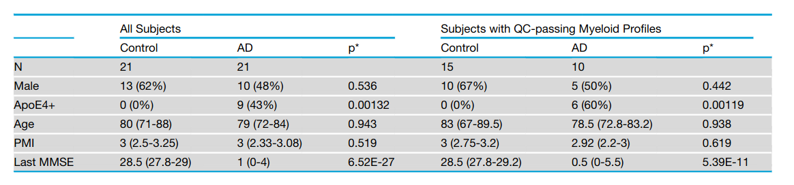
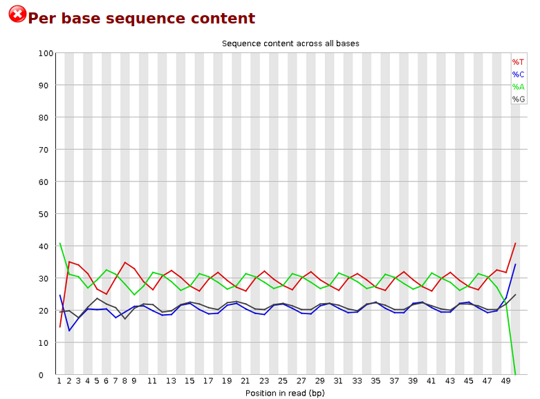
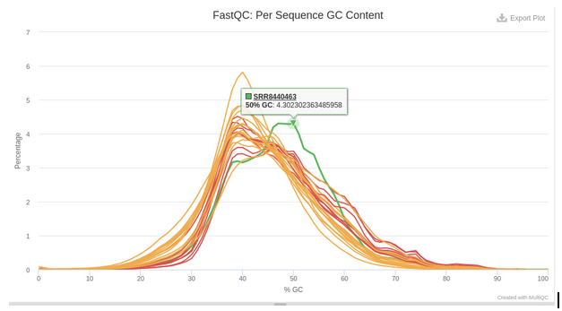

```{r setup, include=FALSE}
knitr::opts_chunk$set(echo = TRUE, 
                      message = FALSE, 
                      warning = FALSE, 
                      comment = NA)
```

## **Background**

Information the `fastq` files used in this study can be found [here](https://www.ncbi.nlm.nih.gov/Traces/study/?page=3&acc=PRJNA515044&o=diagnosis_sam_s%3Ad%253Bacc_s%3Bacc_s%3Aa) as well as [NCBI GEO](https://www.ncbi.nlm.nih.gov//geo/query/acc.cgi?acc=GSE125050)

**Publication**: [Alzheimer's Patient Microglia Exhibit Enhanced Aging and Unique Transcriptional Activation](https://pubmed.ncbi.nlm.nih.gov/32610143/)

> <font size=2.5> All subjects had been characterized clinically and neuropathologically by the Arizona Study of Aging and Neurodegenerative Dis-ease/Brain and Body Donation Program (Beach et al., 2015). All AD subjects were clinically diagnosed with AD in life and brains wereneuropathologically confirmed to have ''frequent'' CERAD neuritic plaque densities (Mirra et al., 1991) and Braak score V or VI (Braakand Braak, 1991). Controls did not have dementia, AD or other neurological disease diagnoses in life. </font>

## **Downloading Myeloid/Microglia Data**

For the first iteration, I have chosen to proceed with one of the four available cell types, being **myeloid** / microglia cells. However, the script below can be easily be adapted to download all `cell_types` with a simple `for` loop.

```{bash, eval=FALSE}
# I got a 2TB SSD for genomic datasets!
alzheimers_dataset="/Genomic_Data_Storage/Alzheimers_Project"

mkdir ${alzheimers_dataset}/accession_tables

wget https://raw.githubusercontent.com/jakesauter/Next_Gen_Sequencing_Project/main/accession_tables/Sra_run_table.txt \
    --output-document="${alzheimers_dataset}/accession_tables/Sra_run_table.txt"

unique_cell_types=$(cat ${alzheimers_dataset}/accession_tables/Sra_run_table.txt | cut -d',' -f9 | sort | uniq)


cell_type='myeloid'
echo "Downloading dat for cell type: ${cell_type}"
output_dir=${alzheimers_dataset}/${cell_type}_fastq_files
acc_nums=$(cat ${alzheimers_dataset}/accession_tables/Sra_run_table.txt | grep $cell_type | cut -d',' -f1)

for acc_num in "${acc_nums[@]}" ; do 
  fasterq-dump --outdir $output_dir $acc_num
  gzip ${output_dir}/${acc_num}.fastq

```

Note that for microglia data specifically, author's have included the following table, found in the `Experimental model and subject details` section of the publication:



## **Downloading STAR resources**

In order to generate a STAR index for later mapping, we will first need to download the human reference genome, as well as the human reference annotation of genes that is compatible with this version of the human reference genome.

```{bash, eval=FALSE}
mkdir human_genome_38
cd human_genome_38
wget ftp://hgdownload.cse.ucsc.edu/goldenPath/hg38/bigZips/hg38.fa.gz
wget ftp://ftp.ebi.ac.uk/pub/databases/gencode/Gencode_human/release_36/gencode.v36.annotation.gtf.gz
gunzip * 
```

Now that we have both the reference genome and our features of interest, we can generate our `STAR` index using the command below, saving our index to the `--genomeDir` directory of `human_genome_38_STAR_index`.

```{bash, eval=FALSE}
STAR --runMode  genomeGenerate \
     --runThreadN 16 \
     --genomeDir human_genome_38_STAR_index \
     --genomeFastaFiles human_genome_38/hg38.fa \
     --sjdbGTFfile human_genome_38/gencode.v36.annotation.gtf.gz \
     --sjdbOverhang 49 
```

## **TrimGalore short read trimming --\> FastQC --\> STAR**

Adapter sequences were found to be present during initial studies of this dataset, so it is best to use `trim_galore` in order to remove these sequences first.

In the script below, once all of the files are trimmed and saved, `FastQC` (paired with `multiqc` aggregation) is used to facilitate sequence quality control.**Script for data processing:**

```{bash, eval=FALSE}
#!/bin/bash 

trim_galore="/home/t730/TrimGalore/TrimGalore-0.6.6/trim_galore"

cell_type="myeloid"
fastq_files=$(ls "${cell_type}_fastq_files"/*.fastq.gz)

trim_galore_outdir="trimmed_${cell_type}_fastqs"
fastqc_outdir="trimmed_${cell_type}_fastqc"
mkdir $fastqc_outdir
mkdir $trim_galore_outdir

$trim_galore $fastq_files \
  --output_dir="${trim_galore_outdir}" \
  --cores 14 --phred33 --gzip

trimmed_files=$(ls $trim_galore_outdir/*.fq.gz)
fastqc $trimmed_files \
 --outdir=$fastqc_outdir \
 --threads=14 --noextract

cd $fastqc_outdir
multiqc .

cell_type="myeloid"
trim_galore_outdir="trimmed_${cell_type}_fastqs"
trimmed_files=$(ls $trim_galore_outdir/*.fq.gz)

for fastq_file in $trimmed_files; do
  base=$(basename $fastq_file)
  prefix=$(echo $fastq_file | egrep -o "SRR[0-9]+")
  prefix="trimmed_${cell_type}_alignments/${prefix}_trimmed."

  STAR --runMode  alignReads \
       --runThreadN 12 \
       --genomeDir  human_genome_38_STAR_index \
       --readFilesIn  $fastq_file \
       --readFilesCommand  zcat \
       --outSAMtype  BAM  SortedByCoordinate \
       --outFileNamePrefix $prefix  \
       --outSAMattributes All \
       --outReadsUnmapped="Fastx" \
       --outTmpKeep="None"
       
  samtools index ${prefix}.Aligned.sortedByCoord.out.bam
done
```

## **QC Issues**

Signs of cyclic GC content for some runs, are present in the dataset, however fastq tile coordinates **are not available** in the GEO dataset to allow for selective tile filtering.

[Github issue showing that SRA does not store this information](https://github.com/ncbi/sra-tools/issues/130)

Particularly these issues were seen in three of the samples, with the effects occurring with varying degree. These samples were `SRR8440539`, `SRR8440524`, and `SRR8440538`.

{width="50%"}

## **Calculating Percent Unmapped Reads**

```{bash, eval=FALSE}
#!/bin/bash

data_storage_dir=/Genomic_Data_Storage/Alzheimers_Project

trim_fastq_dir=${data_storage_dir}/trimmed_myeloid_fastqs
trim_align_dir=${data_storage_dir}/trimmed_myeloid_alignments
bam_files=$(ls ${data_storage_dir}/trimmed_myeloid_alignments/*.bam)
parallel_tmp_dir=$(mktemp -d)

calculate_unampped_reads() {
  base=$(basename $1)
  prefix=$(echo $base | egrep -o "SRR[0-9]+")
  
  unammped_reads_file=${trim_align_dir}/${prefix}_trimmed.Unmapped.out.mate1
  total_reads_file=${trim_fastq_dir}/${prefix}_trimmed.fq.gz
  num_lines=$(cat $unammped_reads_file | wc -l)
  num_total_lines=$(zcat $total_reads_file | wc -l)
  perc_unmapped_reads=$(echo -e "(${num_lines}/${num_total_lines})*100" | bc -l | xargs printf %.2f)
  echo -e "Percentage of unmapped reads for ${prefix}: ${perc_unmapped_reads}%" > ${parallel_tmp_dir}/${prefix}.out
}

for bam_file in $bam_files; do
  calculate_unampped_reads $bam_file &
done 

cat $parallel_tmp_dir/*.out
```

```{bash, eval=FALSE}
Percentage of unmapped reads for SRR8440443: 5.90%
Percentage of unmapped reads for SRR8440447: 4.17%
Percentage of unmapped reads for SRR8440448: 4.04%
Percentage of unmapped reads for SRR8440449: 8.38%
Percentage of unmapped reads for SRR8440463: 33.79%
Percentage of unmapped reads for SRR8440477: 5.14%
Percentage of unmapped reads for SRR8440482: 6.54%
Percentage of unmapped reads for SRR8440484: 3.65%
Percentage of unmapped reads for SRR8440486: 8.13%
Percentage of unmapped reads for SRR8440488: 5.19%
Percentage of unmapped reads for SRR8440501: 6.98%
Percentage of unmapped reads for SRR8440511: 5.47%
Percentage of unmapped reads for SRR8440513: 6.79%
Percentage of unmapped reads for SRR8440514: 4.97%
Percentage of unmapped reads for SRR8440517: 5.76%
Percentage of unmapped reads for SRR8440518: 5.02%
Percentage of unmapped reads for SRR8440524: 11.28%
Percentage of unmapped reads for SRR8440525: 9.51%
Percentage of unmapped reads for SRR8440527: 7.05%
Percentage of unmapped reads for SRR8440529: 6.67%
Percentage of unmapped reads for SRR8440531: 10.64%
Percentage of unmapped reads for SRR8440536: 7.61%
Percentage of unmapped reads for SRR8440538: 7.43%
Percentage of unmapped reads for SRR8440539: 12.34%
Percentage of unmapped reads for SRR8440542: 8.16%
```

From the about output, we see that `SRR8440463` as an unusually high amount of unmapped reads compared to all other samples in the study. When cross-referenceing our previously generated `MultiQC` report from earlier, we can see that the GC content of this sample appears to be off compared to all other samples as well, possibly indicating contamination or other library quality issues.



**Problematic cyclic GC samples from before**: `SRR8440524`, `SRR8440538`, and `SRR8440539` **NOT** `SRR8440463` that we see with GC-rich contamination above.

We will keep these QC issues in mind moving forward, and possibly remove the samples before analysis in `R`

## **Generating FeatureCounts**

```{bash, eval=FALSE}
#!/bin/bash

cell_type='myeloid'
data_storage_dir=/Genomic_Data_Storage/Alzheimers_Project

annot_file=${data_storage_dir}/human_genome_38/gencode.v36.annotation.gtf
out_dir=${data_storage_dir}/featureCounts
alignment_dir=${data_storage_dir}/trimmed_${cell_type}_alignments
out_file=${out_dir}/featCounts_genes.txt
bam_files=$(ls ${alignment_dir}/SRR???????_trimmed.Aligned.sortedByCoord.out.bam)

mkdir $out_dir

featureCounts \
  -a $annot_file \
  -o $out_file \
  -T 14 $bam_files
```

## **Forming a DESeq2 object from featureCounts data**

Below we will use the `DESeq2` R package to make a `DESeqDataSet` from our resultant files from running featureCounts. At this step, I have chosen to remove our **4** samples with QC issues after preliminary analysis.

```{r}
library(knitr)
library(purrr)
library(dplyr)
library(DESeq2)
library(ggplot2)
library(magrittr)

read_counts <- read.table(
  '../featCounts/featCounts_genes.txt', 
  header = TRUE, stringsAsFactors = FALSE)

orig_names <- colnames(read_counts)
colnames(read_counts) <- gsub(".*(SRR[0-9]+).*", "\\1", orig_names)
row.names(read_counts) <- make.names(read_counts$Geneid)
read_counts <- read_counts[,-c(1:6)]

##FILTERING OUT QC FAILED SAMPLES
keep_samples <- 
  colnames(read_counts) %in% 
            c('SRR8440524', 'SRR8440463',
            'SRR8440538', 'SRR8440539') %>% 
  not()

read_counts <- 
  read_counts[ , keep_samples]

read_counts %>% 
  head() %>% 
  .[1:4] %>% 
  kable()
```

Now that we have our raw read counts, lets gather information about our samples to supply to the `colData` parameter of `DESeqDataSetFromMatrix`.

```{r}
accession_table <-
  read.table('../accession_tables/Sra_run_table.txt', 
             header = TRUE, sep = ',', stringsAsFactors = FALSE) %>% 
  as.data.frame() %>% 
  filter(Cell_type == 'myeloid') %>% 
  dplyr::select(Run, Diagnosis, sex, 
         expired_age, Cell_type) %>% 
  arrange(Diagnosis)
  
accession_table %>% 
  kable()
```

From this accession table, we can map our accession ids to any clinical variable we like, such as `Diagnosis`, which is our main experimental group condition in this analysis. `Diagnosis` in our case tells us whether or not the diseased patient showed signs of Alzheimer's disease or not (control).

```{r}
conditions <- 
  colnames(read_counts) %>% 
  map(~accession_table[
            accession_table['Run'] == .x, 
                               'Diagnosis']) %>% 
  unlist()
  

sample_info <- 
  DataFrame(condition = conditions,
            row.names = names(read_counts))

DESeq.ds <- 
  DESeqDataSetFromMatrix(
    countData = as.matrix(read_counts),
    colData = sample_info,
    design = ~ condition)

DESeq.ds %>% 
  counts() %>% 
  head() %>% 
  .[,1:5] %>% 
  kable()
```

## **Read Mapping Quality Assessment**

**Number of reads sequenced per sample**

```{r}
library(stringr) 

colSums(counts(DESeq.ds)) %>% 
  data.frame(sample = str_extract(names(.), '[0-9]{3}$'), reads = .) %>% 
  ggplot() + 
  geom_col(aes(x = sample, y = reads)) + 
  theme(axis.text.x = element_text(angle=-35))
```

Moving forward, we will filter our `DESeqDataSet` as to only include genes that have a read mapped for at least one sample.

```{r}
dim(DESeq.ds)

keep_genes <- rowSums(counts(DESeq.ds)) > 0
DESeq.ds <- DESeq.ds[keep_genes, ]
dim(DESeq.ds)
```

**Normalizing read counts for Sequencing Depth**

```{r}
DESeq.ds <- estimateSizeFactors(DESeq.ds)

plot(sizeFactors(DESeq.ds), colSums(counts(DESeq.ds)), 
     ylab = 'library sizes', xlab = 'size factors', cex = 0.6)
```

Assumptions:

-   Most genes are not changing across conditions

-   Size factors should be around 1

We see that our size factors are varying a bit more than around 1, though at this time we will continue with `rlog` normaliztion.

```{r}
par(mfrow = c(1,2))
boxplot(log2(counts(DESeq.ds)+1), notch=TRUE,main = "Non-normalized read counts",ylab="log2(read counts)", cex = .6)

## bp of size-factor normalized values
boxplot(log2(counts(DESeq.ds, normalize= TRUE)+1), notch=TRUE,main = "Size-factor-normalized read counts",ylab="log2(read counts)", cex = .6)
```

```{r}
if (!exists('DESeq.rlog')) {
  DESeq.rlog <- rlog(DESeq.ds, blind = TRUE)
}

par(mfrow = c(1,2))

log.norm.counts <-
  DESeq.ds %>% 
  counts(normalized=TRUE) %>% 
  {.+1} %>% 
  log2()

plot(log.norm.counts[,c('SRR8440518', 'SRR8440529')], cex=.1,
     main = "size factor and log2-transformed")

## the rlog-transformed counts are stored in the accessor "assay"
plot(assay(DESeq.rlog)[,'SRR8440518'],
     assay(DESeq.rlog)[,'SRR8440529'],
     main = "rlog transformed",
     cex=.1, 
     xlab ='SRR8440518',
     ylab ='SRR8440529')
```

**Mean vs Stdev before `rlog`**

```{r}
log.norm.counts <- 
  DESeq.ds %>% 
  counts(normalized=TRUE) %>% 
  log2()

par(mfrow=c(1,1))

msd_plot <- 
  vsn::meanSdPlot(log.norm.counts,
                  ranks=FALSE, 
                  plot=FALSE)
msd_plot$gg + 
  ggtitle("Sequencing depth normalized log2(read counts)") + 
  ylab("standard deviation")
```

**Mean vs Stdev after `rlog`**

```{r}
rlog.norm.counts <- 
  DESeq.rlog %>% 
  assay()

msd_plot <- 
  vsn::meanSdPlot(rlog.norm.counts, 
                  ranks=FALSE, 
                  plot = FALSE)

msd_plot$gg + 
  ggtitle("rlog transformation") + 
  coord_cartesian(ylim = c(0,3))
```

## **Male vs Female Correlation Heatmap**

First in order to check that there isn't large differences between our male and female patient cohorts, we will generate a correlation heatmap using Pearson correlation.

```{r}
library(stringr)
corr_coeff <- cor(rlog.norm.counts, method = "pearson")

new_names <- rownames(corr_coeff) %>% 
  map(~accession_table[
          accession_table['Run'] == .x, 
                             'sex']) %>% 
  unlist()

new_names <- 
  paste0(new_names, '_', 
         str_extract(rownames(corr_coeff), '[0-9]{3}$'))

rownames(corr_coeff) <- new_names
colnames(corr_coeff) <- new_names

as.dist(1-corr_coeff, upper = TRUE) %>%
  as.matrix %>% 
  pheatmap::pheatmap(., main = "Pearson correlation")
```

We don't see males and females clustering too closely together here, showing support that sex should not be a confounding factor moving forward.

## **AD vs Control Correlation Heatmap**

We can now generate the same Pearson correlation heatmap from above, though this time seperating by our true varible of interest: AD vs Control.

```{r}
corr_coeff <- cor(rlog.norm.counts, method = "pearson")

new_names <- rownames(corr_coeff) %>% 
  map(~accession_table[
          accession_table['Run'] == .x, 
                             'Diagnosis']) %>% 
  unlist()

new_names <- 
  paste0(new_names, '_', 
         str_extract(rownames(corr_coeff), '[0-9]{3}$'))

rownames(corr_coeff) <- new_names
colnames(corr_coeff) <- new_names

as.dist(1-corr_coeff, upper = TRUE) %>%
  as.matrix %>% 
  pheatmap::pheatmap(., main = "Pearson correlation")
```

We can also evaluate the similarity of samples with simple hierarchical clustering:

```{r}
rlog_corr_coeff <- 
  rlog.norm.counts %>% 
  cor(method = "pearson") %>% 
  set_rownames(new_names) %>% 
  set_colnames(new_names)

as.dist(1-rlog_corr_coeff) %>% 
  hclust() %>%
  plot(., 
       main = "rlog transformed read counts")
```

From the heatmap and clustering results above, it does not seem like our patient samples are easily seperable by overall expression profiles. In order to ensure that our conditions truly do show different gene expression profiles, we will only select genes that were found to be differentially expressed between the conditions in the paper. We can convert our `ensemblID` s to Gene-Ontology format through the use of the `biomaRt` Bioconductor package.

```{r}
library(biomaRt)

mart <- useMart("ensembl", dataset="hsapiens_gene_ensembl")

genes <- 
  c('LOC102724661', 'ANKRD26P3', 'MOV10L1', 'HIST2H2BA', 'ZBTB8B', 'GLT1D1', 'TNFRSF21', 'CECR2', 'PDD6IPP2', 'PTPRZ1', 'IGSF10', 'GRIA2', 'MEIS1', 'SELENBP1', 'SERPINF1', 'RIMS2', 'ASTN1', 'TLN2', 'ZNF532', 'ZNF662', 'NIN', 'ULK3', 'SLC38A7', 'FOXP1', 'ARSA', 'CTBP1-AS', 'LOC102725328', 'CBX6', 'GYPC', 'FBRSL1', 'SMAD7', 'PLXNC1', 'CLDN15', 'TSHZ3', 'KCNJ5', 'DPYD', 'STEAP3', 'RUNX3', 'PTPRG', 'ACD', 'TTYH3', 'LOC100133445', 'LOC102724549', 'VENTX', 'TM9SF1', 'SMIM3', 'ZNF703', 'TGFBI', 'EMP2', 'PSTPIP1', 'ZNF696', 'RFX2', 'APOE', 'ATOH8', 'ADAM8', 'GAS2L1', 'CHCHD5', 'ADAMTS13', 'A1BG', 'IL15', 'SECTM1', 'FAM109A', 'LOC100507639', 'ZNF843', 'S100A4', 'LSR')

attributes <- c('ensembl_gene_id','ensembl_transcript_id','hgnc_symbol')

ensembl_df <- 
  getBM(attributes=attributes, 
        filters="hgnc_symbol",
        values=genes,
        mart=mart, 
        uniqueRows=T)

ensembl_df %>% 
  head() %>% 
  kable()
```

```{r}
ensembl_ids <- gsub(".[0-9]+$", "", rownames(log.norm.counts))

gene_names <-
  ensembl_ids %>% 
  sapply(., function(ensembl_id) {
    gene_name <- ensembl_df[ensembl_df$ensembl_gene_id == ensembl_id, 
                                     'hgnc_symbol'][1]
    if (is.na(gene_name)) {
      gene_name <- "NO_GENE_NAME_MAPPING"
    }
    
    return(gene_name)
  })

rownames(rlog.norm.counts) <- gene_names

study_counts <- 
  rlog.norm.counts[rownames(rlog.norm.counts) %in% genes, ]

new_names <- colnames(study_counts) %>% 
  map(~accession_table[
          accession_table['Run'] == .x, 
                             'Diagnosis']) %>% 
  unlist()

new_names <- 
  paste0(new_names, '_', 
         str_extract(rownames(corr_coeff), '[0-9]{3}$'))


corr_coeff <- 
  study_counts %>% 
  cor(method = "pearson") %>%
  set_rownames(new_names) %>% 
  set_colnames(new_names)


as.dist(1-corr_coeff, upper = TRUE) %>%
  as.matrix() %>% 
  pheatmap::pheatmap(., main = "Pearson correlation")
```

```{r}
rlog_corr_coeff <- 
  study_counts %>% 
  cor(method = "pearson") %>% 
  set_rownames(new_names) %>% 
  set_colnames(new_names)

as.dist(1-rlog_corr_coeff) %>% 
  hclust() %>%
  plot(., 
       main = "rlog transformed read counts")
```

Now we see much more distict grouping between our clinical groups, a good sign for differential expression analysis down the line.

## **PCA**

Lastly, in order to determine the magnitude in the differences between our samples, we make use of Principle Components Analysis

```{r}
plotPCA(DESeq.rlog)
```

Again, we see performing PCA on all genes does not yield a large amount of seperation between our clinical groups. Below we perform the same analysis with the study-highlighted genes from before.

**Gene-specific**

```{r}
ensembl_ids <- gsub(".[0-9]+$", "", rownames(DESeq.rlog))

gene_names <-
  ensembl_ids %>% 
  sapply(., function(ensembl_id) {
    gene_name <- ensembl_df[ensembl_df$ensembl_gene_id == ensembl_id, 
                                     'hgnc_symbol'][1]
    if (is.na(gene_name)) {
      gene_name <- "NO_GENE_NAME_MAPPING"
    }
    
    return(gene_name)
  })


rownames(DESeq.rlog) <- gene_names
DESeq.rlog.subset <- subset(DESeq.rlog, rownames(DESeq.rlog) != "NO_GENE_NAME_MAPPING")

plotPCA(DESeq.rlog.subset)
```

We now see a much clearer distinction between clinical groups.
