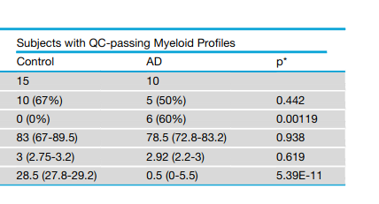

```{r setup, include=FALSE}
knitr::opts_chunk$set(echo = TRUE)
```
# **Things to Remember When Writing This Report**

## **4 Main points to hit on**

**1. Have a question**:

I noticed when reading the paper that different methods than we learned were used to determine gene enrichment data from a fairly large AD cohort with an interesting cell extraction method, and was curious if I could recapitulate the findings with the methods we have learned in the course, such findings are:

-   APOE and other differentially expressed genes define thehuman Alzheimer's microglia state
-   A notable caveat of our methodis the low quality of the RNA after its purification from thecollected cell types because of unavoidable aspects of preparing fixed cell suspensions from frozen and thawed post-mortemtissue samples.
-   Despite this caveat, we succeeded in usingfrozen specimens of human frontal cortex to characterize a human Alzheimer's microglia (HAM) profile, which bore almost no resemblance to the damage-associated microglia (DAM) profiledefined in mouse AD models.
-   Only APOE upregulation in microglia remained significant after correction for genome-wide testing (foldchange = 4.1, adjusted p = 0.0004)
-   AD Microglia Display an Enhanced Human Aging Phenotype (As defined by what?) 
- RNA-Seq data processing and QC for whole tissue samples and bulk cell type samples: Sorted cell and whole tissue RNA-Seq data were analyzed using the `GSNAP` aligner and `HTSeqGenie` -- not familiar with these QC methods, wondering how FastQC will handle the data when I look closely at QC results 


‘‘Pass’’ or ‘‘Fail’’ status for our sorted cell RNA-Seq profiles was determined primarily using tSNE analysis (perplexity = 14, theta =0.4) colored by cell type to visualize how profiles clustered (Figure S2A). tSNE clustering of profiles was generally confirmed by sam-ple similarity heatmaps (not shown). Interpretation of tSNE clusters was informed by gene versus sample heatmaps (similar to theheatmap inFigure S2B but with unbiased hierarchical clustering of the 500 most variable genes, and blinded to AD diagnosis), whichenabled us to see which tSNE clusters contained libraries with neat cell type-specific expression profiles and which clusters con-tained libraries with degenerate features including reduced specificity of cell type expression markers (seeFigure S2B). Comparedto ‘‘Pass’’ libraries, ‘‘Fail’’ libraries generally showed higher percentages of intergenic reads and lower percentages of exonic andintronic reads (seeFigure S2C). We discarded 1/43 neuron libraries, 19/38 astrocyte libraries, 14/41 endothelial cell libraries, and18/43 microglia libraries from original frozen tissues, and 16/16 microglia libraries from twice frozen tissues (which underscoredthe liabilities of the freeze-thaw process).Principal Component Analysis (Figure 1C) was performed on Z-score normalized matrix of 1000 most variable genes by IQR usingthe R function prcomp().

DE between AD and controls for this study’s sorted cell populations was first attempted using voom+limma, which identified only 12DE genes (adjusted p%0.05) in myeloid cells and none in the other cell types. We then used DESeq2 instead (adjusted p%0.05), butwe used the DESeq2-provided Cook’s distances to filter out genes likely driven by outlier samples. Any gene for which the Cook’sdistance was greater than thea= 0.01 critical value of theFdistribution was omitted from our DE genes lists. The Cook’s distancefilter eliminated 6/10 neuronal DE genes, 9/75 myeloid DE genes, and 382/517 endothelial DE genes from consideration, leaving 4 DEgenes in neurons, 66 in myeloid cells, and 135 in endothelial cells. The absence of any voom+limma hits for neurons and endothelialcells, the high fraction of DESeq2 hits driven by outliers in these two cell types, and the lack of other human AD datasets available atthe time for cross-comparison led us to set these cell types aside (taking a conservative position) and focus on the whether thechanges in myeloid cells could be validated. In the myeloid cells, 11/12 DE genes identified by voom+limma were also identifiedby DESeq2, withCD44being the only exception (p = 0.113 in DESeq2). We includedCD44in our panel of genes tested by qPCRin FuG myeloid cell sorts, and it was again increased in the AD samples (unadjusted p = 0.041), so we consider its DE to be genuinethough we did not include it in our HAM-Up gene set analyses, other than visualizing it inFigure S6A

**Other covariates: Post-mortem interval, sex, APOE genotype**

Differential expression analysis (Data S4, panel 1) revealed that the expression of about 80 genes was significantly increased in microglia from subjects with larger post-mortem interval (PMI). This seemed to be largely driven by elevated mitochondrial gene expression in a subset of the samples with large PMI. However, the distribution of PMI in our AD and control samples was similar (Figure S2C;Data S4, panel 1A, inset), there was no overlap between the AD-related DE genes and the PMI-associated genes, and adding PMI to our statistical model for AD-associated DE gave very similar results. Therefore, we did not include PMI in subsequent analyses. Sex-associated DE in microglia was almost entirely restricted to X and Y chromosome genes. For APOE genotype, we only detected one DE gene, ACY3, in AD microglia between APOE-ε4 carriers versus non-carriers. It showed variable expression levels in the Controls (all non-carriers), so it may be a false positive.




**2. Have an idea of how to answer it**

I could answer this question by:

-   Downloading the data
-   Performing QC at every step of analysis
-   Use `DESeq2` on `featureCounts` data to perform differential expression analysis and gene-set enrichment analysis.

**3. Generate the answer(s) in a way that others can reproduce your analsysis and results**

Yes, have been doing this all along.

Might be better to store scripts on Github and link to them from the report, only including the very important aspects of the code like calling `STAR` or QC analysis. I think I will favor a longer report with more code in it than usual

**4. Put a strong emphasis on data processing, QC, and how the way the data was processed and QC results contribute to our understanding of the data**

## **Sections of the report**

**Introduction**: A brief paragraph summarizing the scientific background and/or why that particular question is interesting (you should cite at least 3-5 papers). Of course, you should clearly state the question you're going to investigate as well as the specific hypothesis you set out to test.

**Results**: Another brief paragraph summarizing your key insights and possible future experiments/analyses that might enhance your own analysis. Make sure to include a discussion of the limits that your data set has!

**Methods**: A detailed verbose description of all the steps you took to arrive at the conclusion including how and where the data was downloaded, pre-processed and analyzed. This should also include some brief reasoning of why you chose certain tools/solutions and what the results of the QC tell you about the data at hand.

**Discussion** A brief description/list of issues/problems/limitations you encountered along the way and how you addressed them.

**Table**: A table that summarizes the key data sets that you have generated during the analyses and decided to keep.

## **Figures**

The report should have at least 3 figures that illustrate some aspects of your analysis, either the ones you find most difficult to explain without a graph or the points that are most important in your opinion -- there is no upper limit on the number of figures to include, but make sure to describe/reference every single one! In addition, we want all the code (and data) that one would need to recreate those images.

Consider what information or story you are trying to communicate with your figure

-   Have color/shape legends
-   Properly labeled axes
-   Legible labels (big enough!)
-   Informative labels (sample names/gene names/etc)
-   Appropriate color schemes (avoid red/green combinations) 
  -   ColorBrewer2 is a great resource for appropriate color combinations
    

## **Presentation**

You will give a 10-15 minute presentation that should be a condensed version of your report. Be prepared to answer questions at the end (5 minutes Q&A).


## Introduction 

> <font size=2.5> All subjects had been characterized clinically and neuropathologically by the Arizona Study of Aging and Neurodegenerative Dis-ease/Brain and Body Donation Program (Beach et al., 2015). All AD subjects were clinically diagnosed with AD in life and brains wereneuropathologically confirmed to have ''frequent'' CERAD neuritic plaque densities (Mirra et al., 1991) and Braak score V or VI (Braakand Braak, 1991). Controls did not have dementia, AD or other neurological disease diagnoses in life. </font>

> <font size=2.5> We began with frozen samples of frontal cortex, which is affected by tau pathology in the later stages of disease (Braak stages Vand VI) that roughly coincide with onset and progression of dementia. Tissue samples were excised from the superior frontalgyrus (SFG), which has been linked with visuospatial cognition both in AD and in lesion studies (du Boisgueheneuc et al.,2006; Valde ́s Herna ́ndez et al., 2018). To maximize the likelihood of observing differences between AD and control, we selectedonly AD specimens with high scores for amyloid and tau neuropathology in frontal cortex, and we selected only control specimens with negligible amounts of these pathologies in this region (see sample metadata in Data S2). AD and control groups hadroughly matching distributions of age, sex, and post-mortem interval (PMI). </font>

> <font size=2.5> Although the fixation adversely affects RNA integrity (RIN), italso permeabilizes the cells and enables labeling of intracellularmarkers for sorting. Labeling nuclei with DAPI helps ensure thatonly singlet cell bodies are collected, because doublets with ahigher DAPI signal and cell fragments that lack nuclei are easilyexcluded. Using this method, we established a FACS gatingstrategy for collecting NeuN+neurons, GFAP+astrocytes, CD31+endothelial cells, and CD11b+ microglia/myeloid cells </font>

> <font size=2.5> However, the RIN of the collected populationswas poor, with Bioanalyzer RIN scores in the range of 1--3. Attempts to obtain better-quality RNA samples using alternativeconditions for tissue digestion and cell fixation (see STAR Methods) were unsuccessful and usually counterproductive. We presume that damage from the freeze-thaw process led to cellular disintegration when cells remained unfixed for toolong or were incubated at 37C. Only brief dissociation at 4C and fixation immediately thereafter permitted cell populationsto suitably endure the subsequent immunolabeling and FACSprocedures. We completed this process for 22 AD and 21 control SFG tissues <font>

> <font size=2.5> We next prepared cDNA libraries using a kit with randomprimers, because the RNA was highly fragmented. After prepar-ing and sequencing the libraries, we examined the RNA-seq datato determine whether our method had generated usable expres-sion profiles. Although several unacceptable RNA profiles had tobe discarded (seeFigure S2, Data S1, andSTAR Methods), weobtained 113 cell-type-specific expression profiles, includingmicroglia cell profiles from 15 control and 10 AD subjects (Fig-ures 1B and 1C;Data S2). Cell-type-specific marker expressionsuggested that the RNA-seq profiles we retained representedthe intended cell populations with reasonable fidelity (Figure 1D).Comparisons with recently published datasets indicated that ourbulk-sorted microglia profiles from frozen tissues displayedcoverage of the transcriptome similar to that of bulk-sorted mi-croglia from fresh post-mortem tissues (Galatro et al., 2017;Gosselin et al., 2017) and better coverage than snRNA-seq pro-files (combining all microglial nuclei from a given patient into apseudobulk profile) obtained from frozen tissues (Mathys et al.,2019)(Figure 1E). </font>

> <font size=2.5> We examined the expression of twenty-five genes known orpostulated to be associated with AD risk or progression ... Similar to our analysis of a pub-lished human RNA-seq dataset that profiled cell types purifiedfrom freshly resected brain tissue ..., most AD risk genes in our cell types purified from frozen brain tissues showed preferential expression in microglia compared with other brain cell types (Figure 2A). We also examined whether any of these genes displayed altered expression levels in AD versus control cells, and we observed that APOE, ABCA7, GPR141, PTK2B, SPI1, and ZYX appeared upregulated in AD microglia, whereas MEF2C appeared downregulated (un-adjusted p \< 0.05) (Figure 2B). Using these criteria, we also observed downregulation of CD2AP and SORL1 in AD neurons and of CR1 in AD endothelial cells (Figure 2B).Genome-wide analysis of DE using DESeq2 identified 45 genes increased and 21 genes decreased in AD microglia relative to controls (Figure 3A; for genome-wide expression valuesand DE statistics, see Data S2 and S3 for individual samplesand group summaries, respectively). Of the changes in AD riskgenes mentioned earlier, **only APOE upregulation in microglia remained significant after correction for genome-wide testing (foldchange = 4.1, adjusted p = 0.0004)**. We tested for contributions of age, sex, PMI, and APOE genotype to the DE profile, but none of these covariates accounted for the DE observed between AD and control groups (although a small number of other genes un-related to AD status showed DE with age, sex, PMI, or APOE genotype) (see Data S4 and STAR Methods). We refer to the pattern of DE as the HAM profile. </font>

<style type="text/css">
.table {
    margin-left: 20%;
    width: 40%;
}
</style>

```{r table2, echo=FALSE, message=FALSE, warnings=FALSE, results='asis'}
tabl <- 
"| Tables        | Are           | Cool  |
|---------------|:-------------:|------:|
| col 3 is      | right-aligned | $1600 |
| col 2 is      | centered      |   $12 |
| zebra stripes | are neat      |    $1 |
"
cat(tabl) # output the table in a format good for HTML/PDF/docx conversion
```