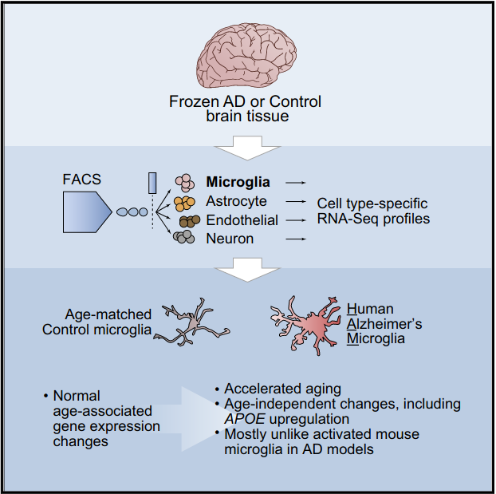

## **NGS RNA-Seq Project**

A report by: **Jake Sauter**

date: 3/19/2021

### **HTML Report Location**

Please see HMTL Report here: <https://jakesauter.github.io/Next_Gen_Sequencing_Project/>

### **Graphical Abstract of Reference Publication**

Graphical Abstract of [Alzheimer's Patient Microglia Exhibit Enhanced Aging and Unique Transcriptional Activation](https://pubmed.ncbi.nlm.nih.gov/32610143/):

### **Differential Expression Volcano Plot Result**

### **Gene-Ontology Treemap Plot** 

For the genes that I have found to be differentially expressed between AD and control in this study, I have generated a treemap with [Revigo](http://revigo.irb.hr/). 

